# 디자인 패턴 단계별 학습 가이드

이 문서는 22개 패턴을 같은 기준으로 검토한 결과입니다. 각 패턴을 읽을 때 `정의 -> 협력 구조 -> Lua 표현 -> 예제 진행 -> 도입 판단` 순서로 확인합니다.

## 이 문서의 구성

- **상세 개념 설명**: 패턴이 해결하는 문제와 적용 목적
- **역할과 협력 구조**: Client, Context, Product, Observer처럼 참여자 사이의 책임과 호출 방향
- **Mermaid 다이어그램**: Lua의 테이블·함수·모듈 협력을 시각화한 흐름
- **Lua 구현 원칙**: 함수, 테이블, 클로저, 메타테이블, 모듈을 활용하는 기준
- **패턴별 적용 판단**: 중요도·난이도와 LÖVE2D 적용 시점
- **예제 검토 기준**: 5개 예제가 개념과 경계 사례를 충분히 전달하는지 확인하는 질문

## 예제 검토 기준

- **개념 전달**: 무엇을 분리하고, 누가 누구에게 책임을 위임하는지 설명되어 있는가?
- **예제 대표성**: 단순히 비슷한 함수나 테이블이 아니라 패턴의 핵심 협력이 실행되는가?
- **Lua 적합성**: 클래스 상속을 흉내 내기보다 함수, 테이블, 클로저, 메타테이블, 모듈의 장점을 사용하는가?
- **실전 가치**: LÖVE2D에서 실제 변경 지점이나 결합도 문제를 해결하는가?
- **시각화 필요성**: 클래스 계층보다 실행 흐름이나 객체 협력이 이해에 더 중요한가?

## 상세 개념 설명

각 패턴의 상세 설명은 해당 패턴 폴더의 README에서 확인합니다. 패턴 README는 다음 순서로 읽습니다.

1. 해결하려는 문제와 핵심 정의를 읽습니다.
2. 참여자의 책임과 호출 방향을 확인합니다.
3. Lua에서 함수·테이블·클로저·메타테이블·모듈 중 어떤 표현을 선택했는지 봅니다.
4. `example_01.lua`에서 최소 협력 구조를 실행합니다.
5. 도입하지 않는 편이 나은 경우와 LÖVE2D 적용 사례를 비교합니다.

## 역할과 협력 구조

패턴의 이름보다 중요한 것은 각 역할이 무엇을 알고 무엇을 모르는가입니다. Client가 구체 구현을 직접 선택하는지, Context가 전략이나 상태에 위임하는지, Subject가 여러 Observer에 알리는지 확인합니다.

## Mermaid 다이어그램

### Lua에서 다이어그램을 읽는 법

GoF 패턴의 클래스 다이어그램을 Lua 코드에 그대로 옮기면 상속 구조만 남고 함수 주입과 테이블 위임이라는 핵심이 사라질 수 있습니다. 이 저장소에서는 다음처럼 읽습니다.

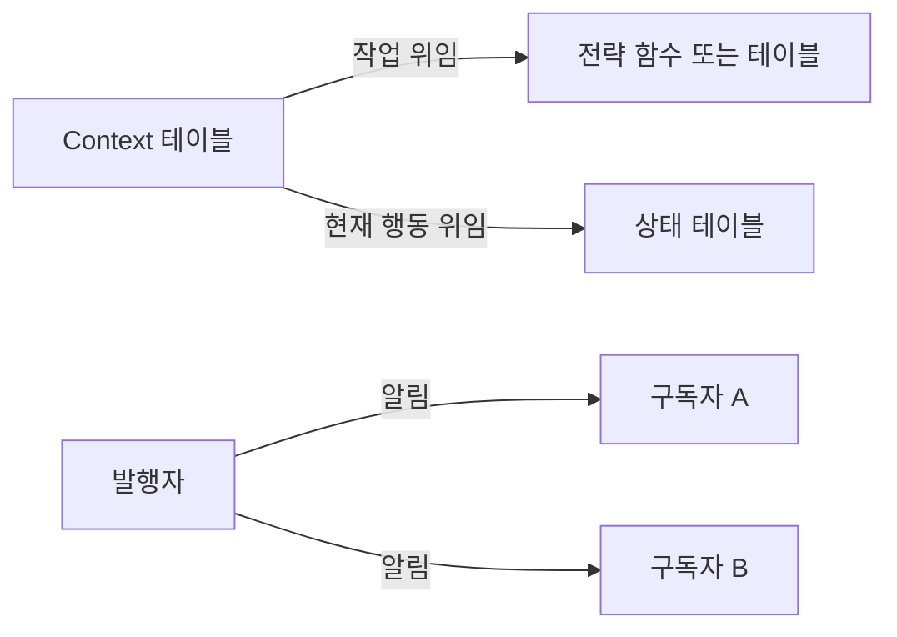

- 상자는 Lua 테이블, 모듈, 함수 묶음 중 하나입니다.
- 화살표의 동사는 호출 방향과 책임 위임을 나타냅니다.
- 클래스가 없는 예제에서는 `implements`보다 `같은 함수 계약을 지킴`이 중요합니다.

## Lua 구현 원칙

- 클래스 계층을 만들기 전에 함수 주입과 테이블 위임으로 충분한지 확인합니다.
- 공유 상태는 모듈 경계나 명시적인 객체로 감싸고 암묵적 전역을 피합니다.
- 클로저가 캡처하는 상태의 수명과 부작용을 확인합니다.
- 테이블 복사에서는 얕은 복사와 깊은 복사의 범위를 명시합니다.
- `nil`, 빈 테이블, 잘못된 타입, 실패 반환값을 패턴 계약에 포함합니다.
- LÖVE2D에서는 `update`와 `draw` 책임을 분리하고 프레임마다 불필요한 할당을 줄입니다.
- 패턴을 구현하기 위해 상속을 흉내 내기보다 Lua의 단순한 표현이 더 읽기 쉬운지 비교합니다.

## 공통 패턴군 그림

### 생성 패턴

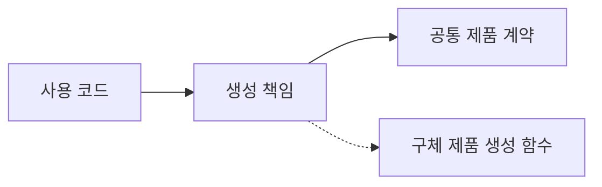

생성 패턴의 질문은 “제품을 누가 만들고, 제품 종류가 바뀔 때 사용 코드가 얼마나 영향을 받는가?”입니다.

### 구조 패턴

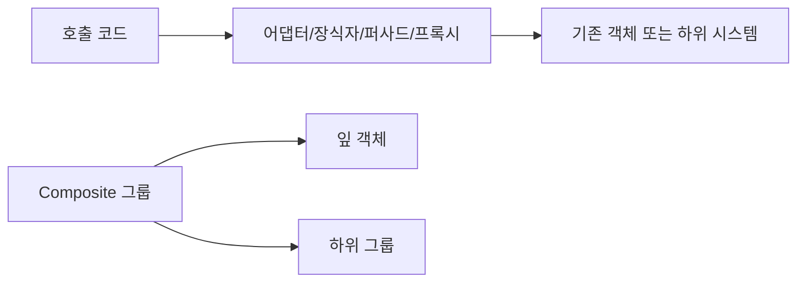

구조 패턴의 질문은 “기존 객체를 수정하지 않고 어떻게 조합·접근·확장할 것인가?”입니다.

### 행동 패턴

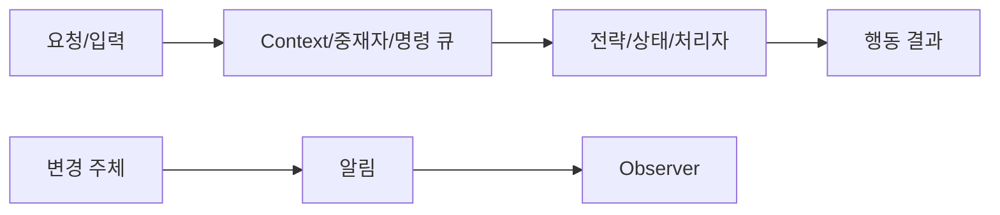

행동 패턴의 질문은 “행동의 책임과 변경되는 알고리즘을 어디에 둘 것인가?”입니다.

## 패턴별 적용 판단

| 패턴 | 핵심 개념 전달 | 대표 협력 구조 | Lua 표현 | 중요도 | 난이도 | 그림 필요성 | 예제에서 반드시 보여줄 것 |
| --- | --- | --- | --- | --- | --- | --- | --- |
| Abstract Factory | 제품군의 일관된 생성 | Factory -> Button/Panel | 생성 함수 테이블 | 보통 | 높음 | 높음 | 같은 Factory의 제품 호환성 |
| Builder | 단계별 구성과 최종화 | Builder -> Config | 내부 결과 테이블 + 체이닝 | 낮음 | 보통 | 보통 | 설정 메서드와 `build`의 반환 분리 |
| Factory Method | 생성 책임의 다형성 | Creator -> Product | Creator 테이블 + 메서드 주입 | 높음 | 보통 | 높음 | 사용 흐름은 같고 생성자만 교체 |
| Prototype | 기존 객체 복제 | Prototype -> Clone | 얕은/깊은 복사 함수 | 보통 | 보통 | 낮음 | 원본과 복제본의 독립성 |
| Singleton | 공유 인스턴스의 단일성 | Module -> One instance | `require` 모듈/지연 생성 | 낮음 | 보통 | 낮음 | 같은 참조와 전역 변수의 차이 |
| Adapter | 호환되지 않는 계약 변환 | Client -> Adapter -> Legacy | 래퍼 함수/테이블 | 높음 | 낮음 | 보통 | 호출부는 새 계약만 사용 |
| Bridge | 추상화와 구현의 독립 변경 | Abstraction -> Implementor | 구현 테이블 주입 | 보통 | 높음 | 높음 | 두 축을 각각 교체 |
| Composite | 잎과 그룹의 동일 취급 | Group -> Leaf/Group | `children` 재귀 테이블 | 높음 | 보통 | 높음 | 공통 연산의 재귀 위임 |
| Decorator | 원본 수정 없는 기능 조합 | Wrapper -> Wrapped | 클로저 래핑 | 보통 | 보통 | 보통 | 래퍼 순서와 원본 유지 |
| Facade | 복잡한 하위 시스템 단순화 | Facade -> Subsystems | 공개 모듈 API | 높음 | 낮음 | 보통 | 내부 순서를 호출부에서 숨김 |
| Flyweight | 공유 본질 상태 분리 | Cache -> Shared definition | 키 기반 캐시 | 보통 | 높음 | 보통 | 공유 상태와 외부 상태 분리 |
| Proxy | 실제 객체 접근 제어 | Client -> Proxy -> Real | 래퍼 객체/클로저 | 보통 | 보통 | 높음 | 캐시·권한·지연 로딩 중 하나 |
| Chain of Responsibility | 처리자를 순서로 연결 | Handler -> Next Handler | 다음 콜백 | 보통 | 보통 | 높음 | 처리하면 종료, 아니면 다음으로 전달 |
| Command | 요청을 값으로 저장 | Queue -> Command -> Receiver | `execute`/`undo` 테이블 | 높음 | 보통 | 높음 | 지연 실행·기록·취소 |
| Iterator | 내부 구조 없는 순회 | Iterator -> Collection | 상태를 닫은 클로저 | 보통 | 낮음 | 보통 | 다음 값과 종료 시점 |
| Mediator | 참가자 간 직접 참조 제거 | Colleague -> Mediator | 조정 모듈 | 보통 | 보통 | 높음 | 참가자끼리 직접 호출하지 않음 |
| Memento | 상태 스냅샷 저장/복원 | Originator -> Snapshot | 복사 테이블 | 보통 | 보통 | 보통 | 참조 공유가 아닌 복원 가능한 복사 |
| Observer | 하나의 변화와 여러 구독자 | Subject -> Observers | 콜백 목록 | 매우 높음 | 보통 | 높음 | 다중 알림과 구독 해제 |
| State | 상태별 행동과 전이 | Context -> State | `handle` 상태 테이블 | 매우 높음 | 보통 | 높음 | 같은 입력의 상태별 행동 차이 |
| Strategy | 알고리즘 교체 | Context -> Strategy | 함수 주입 | 매우 높음 | 낮음 | 높음 | 같은 계약의 전략 교체 |
| Template Method | 고정 순서와 교체 단계 | Template -> Hooks | 고차 함수/콜백 | 낮음 | 높음 | 보통 | 순서는 고정, 단계만 교체 |
| Visitor | 구조와 연산 분리 | Element -> Visitor | `accept` + `visit_*` | 낮음 | 높음 | 높음 | 새 연산 추가가 구조를 바꾸지 않음 |

## 패턴별 협력 그림

아래 그림은 클래스 상속 계층이 아니라 Lua 코드에서 실제로 관찰해야 할 협력 방향을 나타냅니다.

### 생성 패턴

#### Abstract Factory

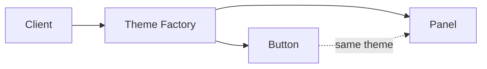

#### Builder

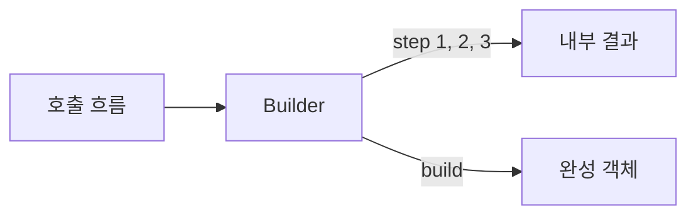

#### Factory Method

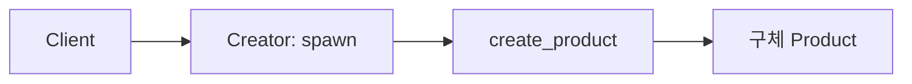

#### Prototype

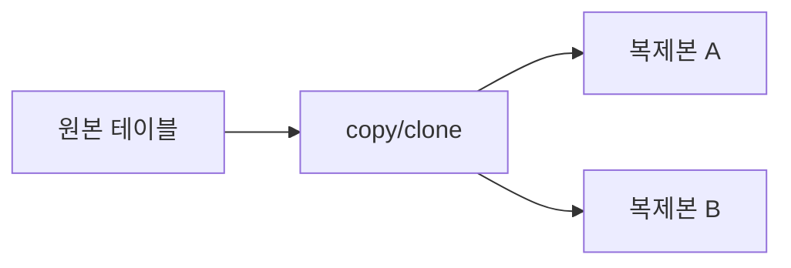

#### Singleton

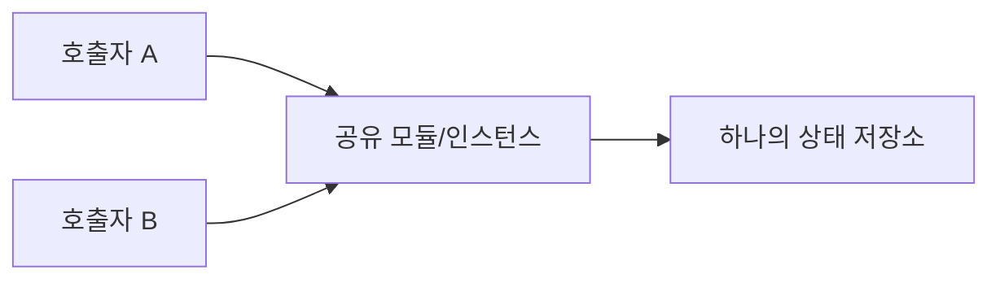

### 구조 패턴

#### Adapter

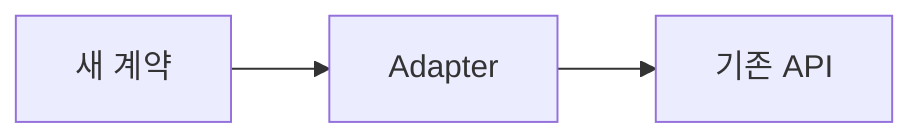

#### Bridge

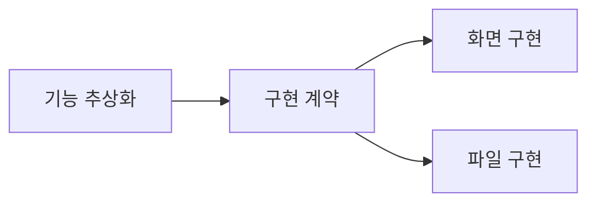

#### Composite

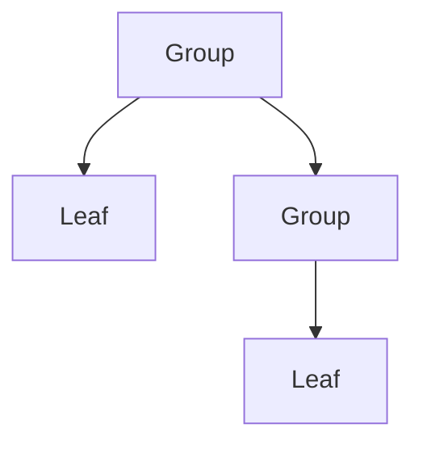

#### Decorator

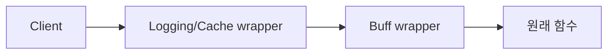

#### Facade

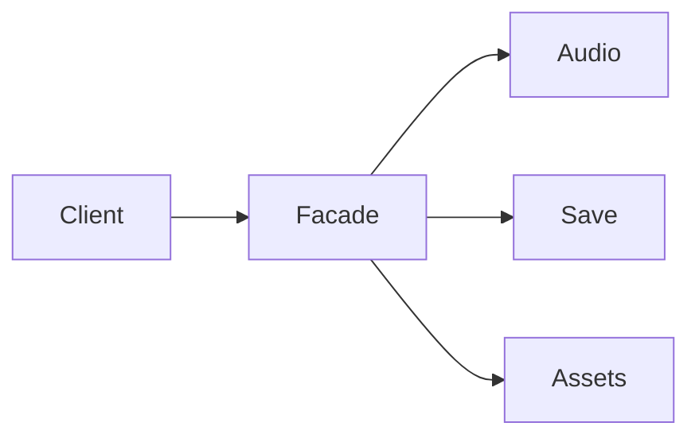

#### Flyweight

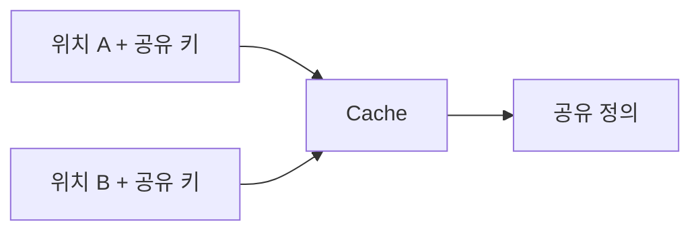

#### Proxy

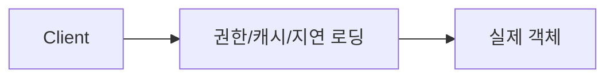

### 행동 패턴

#### Chain of Responsibility

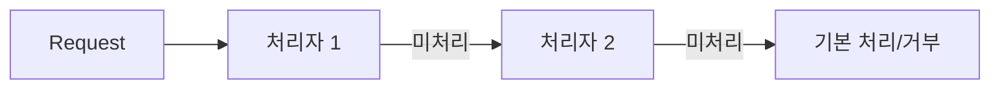

#### Command

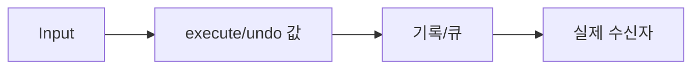

#### Iterator

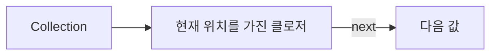

#### Mediator

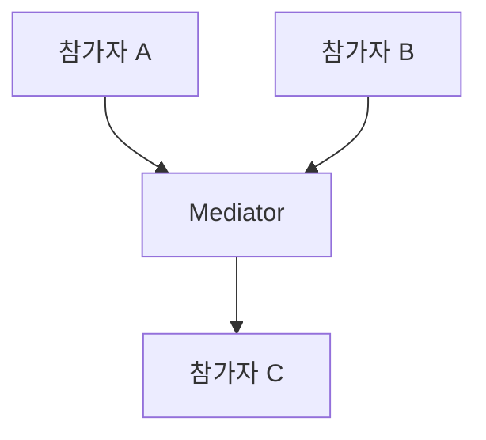

#### Memento

```mermaid
flowchart LR
    Originator[원본 객체] -->|save| Snapshot[스냅샷]
    Snapshot -->|restore| Originator
```

#### Observer

```mermaid
flowchart LR
    Subject[변경 주체] -->|notify| UI[UI Observer]
    Subject -->|notify| Log[Log Observer]
    Subject -->|notify| Achievement[Achievement Observer]
```

#### State

```mermaid
flowchart LR
    Context -->|handle| Current[현재 State]
    Current -->|행동 수행| Result[상태별 결과]
    Current -->|필요 시 전이| Next[다음 State]
```

#### Strategy

```mermaid
flowchart LR
    Caller[선택 코드] --> Context
    Context -->|같은 계약| StrategyA[전략 A]
    Context -->|교체 가능| StrategyB[전략 B]
```

#### Template Method

```mermaid
flowchart LR
    Template[고정 순서] --> StepA[공통 단계]
    StepA --> Hook[교체 콜백]
    Hook --> StepB[공통 마무리]
```

#### Visitor

```mermaid
flowchart LR
    Element[데이터 구조] -->|accept| Visitor[연산 묶음]
    Visitor --> Operation[새 연산 결과]
```

## 패턴별 상세 검토

### 1. 생성 패턴

- **Abstract Factory**: `example_01`의 테마 제품군을 먼저 읽고, 제품 하나만 바뀌는 Factory Method와 비교합니다. Lua에서는 생성 함수 테이블이 가장 자연스럽지만 제품군 간 호환성이 핵심입니다.
- **Builder**: `example_02`부터 메서드가 빌더를 반환하고 `build`가 결과를 반환하는지 확인합니다. 단순 설정 테이블보다 검증·선택적 필드가 실제로 필요한지 판단합니다.
- **Factory Method**: `example_01`의 Creator와 구체 Creator를 먼저 읽습니다. 나머지는 Lua식 생성 함수 레지스트리이므로 Simple Factory와 혼동하지 않습니다.
- **Prototype**: 원본의 중첩 테이블을 복제할 때 얕은 복사와 깊은 복사의 차이를 확인합니다. 복제본의 변경이 원본에 영향을 주면 예제는 불완전합니다.
- **Singleton**: 공유 인스턴스가 정말 하나여야 하는지 먼저 묻습니다. Lua에서는 모듈 반환 테이블이 대체 표현이며, 테스트 가능한 의존성 주입을 우선합니다.

### 2. 구조 패턴

- **Adapter**: 기존 API와 새 API의 함수명·인자·반환값 차이를 한 곳에서 변환하는지 확인합니다.
- **Bridge**: 기능 축과 구현 축을 각각 바꿀 수 있어야 합니다. 구현 하나만 바꿀 수 있다면 단순 위임일 가능성이 큽니다.
- **Composite**: 잎과 그룹이 같은 연산 계약을 갖고, 그룹이 자식에게 재귀 위임하는지 확인합니다.
- **Decorator**: 원본 함수의 계약을 보존하면서 로깅·캐시·버프를 겹쳐 쓸 수 있는지 확인합니다.
- **Facade**: 내부 모듈을 단순히 다시 노출하는 것이 아니라 초기화나 처리 순서를 감싸는지 확인합니다.
- **Flyweight**: 공유 정의와 위치·HP 같은 개별 상태가 분리되어야 합니다. 공유 테이블에 개별 상태를 넣으면 버그입니다.
- **Proxy**: 호출부가 실제 객체 대신 Proxy를 사용하며, Proxy가 권한·캐시·지연 로딩을 담당하는지 확인합니다.

### 3. 행동 패턴

- **Chain of Responsibility**: 각 처리자가 처리 여부를 결정하고 미처리 요청만 다음 처리자로 전달하는지 확인합니다.
- **Command**: 행동을 값으로 저장해 나중에 실행·기록·취소할 수 있는지 확인합니다.
- **Iterator**: 호출자가 컬렉션의 인덱스나 내부 테이블을 몰라도 순회할 수 있는지 확인합니다.
- **Mediator**: 참가자들이 서로 직접 호출하지 않고 중재자를 통해 협력하는지 확인합니다.
- **Memento**: 스냅샷이 원본의 내부 참조를 그대로 공유하지 않고 필요한 상태를 복원하는지 확인합니다.
- **Observer**: 하나의 Subject 변화가 여러 Observer에 전달되고, 구독 수명이 관리되는지 확인합니다.
- **State**: 전이표만 있는지, 아니면 각 State가 행동을 정의하고 Context가 위임하는지 확인합니다.
- **Strategy**: Context가 전략을 주입받아 같은 계약으로 실행하고, 실행 중 교체할 수 있는지 확인합니다.
- **Template Method**: 알고리즘의 큰 순서는 고정되고 일부 콜백만 바뀌는지 확인합니다. Lua에서는 상속보다 고차 함수가 자연스럽습니다.
- **Visitor**: 구조와 연산이 분리되어 새 연산을 추가할 수 있는지 확인합니다. 단순 타입 분기라면 Visitor라고 과장하지 않습니다.

## 예제 학습 방법

각 패턴의 5개 예제는 모두 외우는 대상이 아닙니다.

1. `example_01.lua`에서 핵심 협력 구조를 찾습니다.
2. `example_02.lua`와 `example_03.lua`에서 다른 입력과 도메인으로 같은 원리를 확인합니다.
3. `example_04.lua`에서 경계 조건이나 교체 가능성을 확인합니다.
4. `example_05.lua`에서 실전 적용 시의 축약형 또는 주의점을 확인합니다.
5. 마지막으로 해당 패턴을 쓰지 않고 함수·테이블만으로 작성한 대안과 비교합니다.

## 보완이 필요한 예제의 공통 기준

예제가 다음 질문에 답하지 못하면 설명이나 코드를 보완해야 합니다.

- 어떤 역할이 고정되고 어떤 역할이 교체되는가?
- 객체 또는 함수 사이의 호출 방향은 무엇인가?
- 패턴을 제거하면 어떤 결합도가 다시 생기는가?
- Lua의 단순한 함수·테이블로도 충분하지 않은 이유는 무엇인가?
- LÖVE2D에서는 입력, 게임 상태, 렌더링, 오디오 중 어디에 적용되는가?
