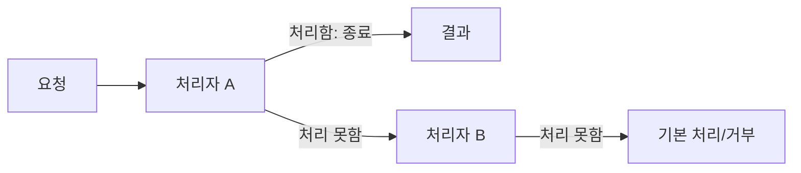

# Chain of Responsibility

[전체 검토 기준과 학습 순서](../../STUDY_GUIDE.md)

## 핵심 개념

Chain of Responsibility는 요청을 여러 처리자의 연결에 전달하고, 각 처리자가 **자신이 처리할 수 있으면 처리하고, 아니면 다음 처리자에게 넘기는** 패턴입니다. 호출자는 어떤 처리자가 최종으로 처리했는지 몰라도 됩니다.



### 역할

- **Client**: 요청을 만들고 체인의 첫 처리자에게 전달합니다.
- **Handler**: 요청을 처리할지 판단하고, 처리하지 않으면 다음 Handler를 호출합니다.
- **Concrete Handler**: 특정 조건의 요청을 실제로 처리합니다.
- **Fallback**: 아무도 처리하지 못했을 때의 결과를 결정합니다.

## Lua에서의 표현

Lua에서는 `next`를 가진 테이블이나 다음 처리자를 캡처한 클로저로 체인을 구성합니다.

```lua
local function make_handler(can_handle, next_handler)
	return function(request)
		if can_handle(request) then
			return "handled"
		end
		return next_handler(request)
	end
end
```

처리 결과로 `nil`을 반환하면 다음 처리자로 전달한다는 식으로 계약을 정할 수 있습니다. 단, `false`나 빈 문자열도 유효한 결과라면 `nil`만 “미처리”로 사용해야 합니다.

## 예제별 학습 순서

- `example_01.lua`: 명령 종류를 처리자 체인에 연결하고 기본 결과까지 정의합니다.
- `example_02.lua`: 관리자·회원·게스트 권한을 순서대로 확인합니다.
- `example_03.lua`: 숫자 검증이 실패하면 다음 검증으로 가지 않고 즉시 중단합니다.
- `example_04.lua`: 지원 등급을 다음 담당자에게 에스컬레이션합니다.
- `example_05.lua`: 보너스 처리자가 처리하지 못하면 기본 보상 처리자로 넘깁니다.

## Pipeline과의 차이

Pipeline은 보통 모든 단계가 순서대로 실행되며 값을 변환합니다. Chain of Responsibility는 처리 가능한 한 단계가 요청을 소비하면 체인을 종료할 수 있습니다. 모든 단계가 항상 실행되어야 한다면 Pipeline이나 함수 합성이 더 적합합니다.

## Lua와 LÖVE2D에서의 유용성

- 키 입력을 UI 처리자, 게임 처리자, 전역 처리자 순으로 전달할 때
- 네트워크·세이브 데이터의 검증 단계를 연결할 때
- 고객 지원이나 적 AI의 우선순위 처리기를 구성할 때
- 충돌 이벤트를 UI, 플레이어, 월드 순서로 전달할 때

처리자 순서가 바뀌면 결과도 바뀌므로 체인 구성 코드를 한 곳에 두는 것이 좋습니다. 체인이 지나치게 길어지면 디버깅용 처리자 이름과 로그를 두고, 순환 연결이 생기지 않도록 주의합니다.
