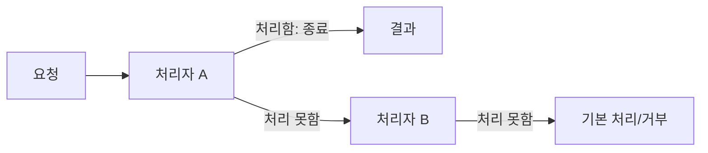
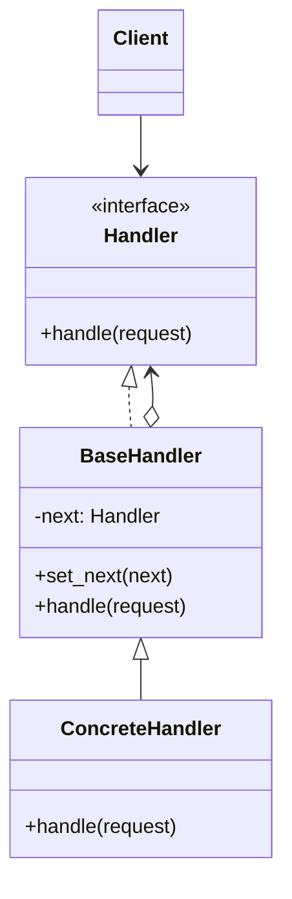

# Chain of Responsibility

[전체 검토 기준과 학습 순서](../../STUDY_GUIDE.md)

## 핵심 개념

Chain of Responsibility는 요청을 여러 처리자의 연결에 전달하고, 각 처리자가 **자신이 처리할 수 있으면 처리하고, 아니면 다음 처리자에게 넘기는** 패턴입니다. 호출자는 어떤 처리자가 최종으로 처리했는지 몰라도 됩니다.

## 해결하려는 문제

입력 이벤트, 권한 검사, 명령 파싱처럼 여러 조건을 정해진 순서로 시도해야 할 때 하나의 함수에 모든 `if`를 넣으면 검사가 커지고 재사용하기 어려워집니다. 어떤 요청에는 일부 검사만 필요하거나 순서를 바꿔야 하는데, 조건문을 직접 수정하면 이미 동작하는 흐름에도 영향을 줍니다.

Chain of Responsibility는 각 검증·처리 규칙을 독립 Handler로 나누고 `next` 연결로 조합합니다. Handler는 요청을 처리해 체인을 끝낼 수도 있고, 처리하지 못하면 다음 Handler에 위임할 수도 있습니다.





### 역할

- **Client**: 요청을 만들고 체인의 첫 처리자에게 전달합니다.
- **Handler**: 요청을 처리할지 판단하고, 처리하지 않으면 다음 Handler를 호출합니다.
- **Concrete Handler**: 특정 조건의 요청을 실제로 처리합니다.
- **Fallback**: 아무도 처리하지 못했을 때의 결과를 결정합니다.

이 패턴에는 두 가지 사용 방식이 있습니다. 인증·검증처럼 모든 Handler가 통과 여부를 확인해야 하는 경우에는 각 Handler가 처리 후 다음으로 넘깁니다. UI 입력이나 도움말처럼 첫 번째로 처리 가능한 Handler가 소비해야 하는 경우에는 처리한 순간 전달을 중단합니다. 문서와 코드에서 어느 계약을 쓰는지 명확히 해야 합니다.

## Lua에서의 표현

Lua에서는 `next`를 가진 테이블이나 다음 처리자를 캡처한 클로저로 체인을 구성합니다.

```lua
local function make_handler(can_handle, next_handler)
	return function(request)
		if can_handle(request) then
			return "handled"
		end
		return next_handler(request)
	end
end
```

처리 결과로 `nil`을 반환하면 다음 처리자로 전달한다는 식으로 계약을 정할 수 있습니다. 단, `false`나 빈 문자열도 유효한 결과라면 `nil`만 “미처리”로 사용해야 합니다.

체인의 끝까지 도달했는데도 처리되지 않은 요청을 `"unhandled"`, 오류, 기본 처리 중 무엇으로 표현할지 정합니다. 체인은 첫 Handler에서 시작할 필요가 없지만, 일반적으로 Client가 전체 순서와 시작점을 관리합니다.

## 도입 절차

1. 순서가 있는 조건문이나 처리 단계를 독립적인 Handler 후보로 나눕니다.
2. 모든 Handler가 지킬 `handle(request)` 계약과 처리·위임·미처리 결과를 정합니다.
3. 다음 Handler 참조를 가진 기본 Handler 또는 클로저 조합 함수를 만듭니다.
4. Concrete Handler마다 처리할 조건과 다음으로 넘길 조건을 구현합니다.
5. Client나 별도 Builder가 환경에 맞는 Handler 순서로 체인을 구성합니다.
6. 처리된 요청, 체인 끝까지 미처리된 요청, 중간에서 중단된 요청을 각각 테스트합니다.

## 예제별 학습 순서

- `example_01.lua`: 명령 종류를 처리자 체인에 연결하고 기본 결과까지 정의합니다.
- `example_02.lua`: 관리자·회원·게스트 권한을 순서대로 확인합니다.
- `example_03.lua`: 숫자 검증이 실패하면 다음 검증으로 가지 않고 즉시 중단합니다.
- `example_04.lua`: 지원 등급을 다음 담당자에게 에스컬레이션합니다.
- `example_05.lua`: 보너스 처리자가 처리하지 못하면 기본 보상 처리자로 넘깁니다.

`example_01.lua`와 `example_05.lua`는 처리 가능한 Handler가 요청을 소비하는 변형을, `example_02.lua`와 `example_03.lua`는 다음 Handler로 넘기는 검증·권한 체인을 보여 줍니다.

## Pipeline과의 차이

Pipeline은 보통 모든 단계가 순서대로 실행되며 값을 변환합니다. Chain of Responsibility는 처리 가능한 한 단계가 요청을 소비하면 체인을 종료할 수 있습니다. 모든 단계가 항상 실행되어야 한다면 Pipeline이나 함수 합성이 더 적합합니다.

## 장점과 비용

- Handler 순서를 바꾸거나 새 Handler를 삽입해도 Client의 요청 호출 방식은 유지됩니다.
- 각 Handler를 한 가지 책임으로 분리해 재사용과 테스트가 쉬워집니다.
- 요청 처리 순서를 런타임에 구성할 수 있습니다.
- 어떤 Handler도 처리하지 않는 요청이 생길 수 있으므로 fallback이나 명시적 오류 정책이 필요합니다.
- 체인이 길어지면 호출 흐름과 비용을 추적하기 어렵고, 순서가 바뀌면 결과가 달라질 수 있습니다.

## 관련 패턴과의 차이

- **Chain of Responsibility와 Command**: Command는 요청 자체를 값으로 만들어 저장·지연·취소하고, Chain of Responsibility는 여러 후보 Handler에 요청을 순차 전달합니다.
- **Chain of Responsibility와 Mediator**: Chain은 다음 Handler로 흐르는 선형 위임이고, Mediator는 여러 참가자 사이의 상호작용 규칙을 중앙에서 조정합니다.
- **Chain of Responsibility와 Observer**: Chain은 처리하거나 다음으로 넘기며 보통 흐름이 제한되지만, Observer는 여러 구독자에게 사건을 방송합니다.
- **Chain of Responsibility와 Decorator**: Decorator는 공통 동작을 확장하며 요청 흐름을 유지하고, Chain Handler는 처리하면 흐름을 중단할 수 있습니다.

## 게임 개발 시나리오

요청을 처리할 핸들러를 명시하지 않고 체인을 따라 넘길 때 Chain of Responsibility가 유용합니다.

- **입력 이벤트 처리 순서**: 터치/키 입력을 UI → 플레이어 → 월드 순으로 넘기다가, 모달이나 버튼이 입력을 소비하면 거기서 중단합니다.
- **데미지 계산 파이프라인**: 방어구 → 속성 저항 → 버프 → 치명타 순으로 핸들러를 연결해 최종 피해량을 계산하고, 중간에 무효화되면 멈춥니다.
- **치트/콘솔 명령 파서**: 입력된 명령어를 여러 핸들러가 순서대로 시도해, 자신이 처리할 수 있는 명령만 처리합니다.
- **충돌 처리 체인**: 충돌 이벤트를 트리거·피해·사운드 핸들러가 순차적으로 처리합니다.

## Lua와 LÖVE2D에서의 유용성

- 키 입력을 UI 처리자, 게임 처리자, 전역 처리자 순으로 전달할 때
- 네트워크·세이브 데이터의 검증 단계를 연결할 때
- 고객 지원이나 적 AI의 우선순위 처리기를 구성할 때
- 충돌 이벤트를 UI, 플레이어, 월드 순서로 전달할 때

처리자 순서가 바뀌면 결과도 바뀌므로 체인 구성 코드를 한 곳에 두는 것이 좋습니다. 체인이 지나치게 길어지면 디버깅용 처리자 이름과 로그를 두고, 순환 연결이 생기지 않도록 주의합니다.

게임의 입력·피해·검증 체인은 프레임마다 실행될 수 있으므로 Handler 객체 생성과 문자열 비교 비용을 측정하고, 고정된 체인은 초기화 시 한 번 구성합니다. 네트워크·세이브 검증처럼 실패가 중요한 체인은 모든 요청이 끝에서 명확한 결과를 받도록 합니다.
