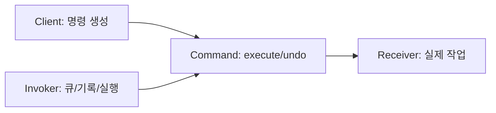

# Command

[전체 검토 기준과 학습 순서](../../STUDY_GUIDE.md)

## 핵심 개념

Command는 **요청을 하나의 값으로 캡슐화하는 패턴**입니다. 호출자는 지금 바로 Receiver의 메서드를 부르는 대신 Command를 만들고, Invoker에게 전달합니다. Invoker는 요청의 내용은 몰라도 실행·예약·기록·취소를 수행할 수 있습니다.



### 역할

- **Client**: 어떤 동작을 만들지 결정하고 필요한 인자를 Command에 넣습니다.
- **Command**: `execute`를 제공하고, 필요하면 `undo`에 되돌리기 방법을 저장합니다.
- **Receiver**: 실제 게임 상태를 변경하는 객체입니다.
- **Invoker**: Command를 실행하거나 큐에 저장하는 객체입니다. Receiver의 내부를 몰라야 합니다.

## Lua에서의 표현

Lua에서는 클래스보다 테이블이나 클로저가 자연스럽습니다.

```lua
local command = {
	execute = function() receiver:move(1) end,
	undo = function() receiver:move(-1) end
}
```

명령을 만드는 함수가 인자를 클로저에 캡처하면 같은 실행기를 재사용하면서 서로 다른 요청을 저장할 수 있습니다. 아주 단순한 일회성 콜백에는 Command 테이블이 과할 수 있으므로, `execute`/`undo`/메타데이터가 필요할 때 도입합니다.

## 예제별 학습 순서

- `example_01.lua`: Receiver를 감싼 Command를 실행하고 취소하는 최소 구조입니다.
- `example_02.lua`: Invoker가 여러 Command를 큐에 저장했다가 순서대로 실행합니다.
- `example_03.lua`: 클로저가 매개변수와 실행 시점의 요청을 캡처합니다.
- `example_04.lua`: 실행한 Command의 역연산을 history에 저장해 Undo를 구현합니다.
- `example_05.lua`: 여러 Command를 하나의 Macro Command로 묶어 한 번에 실행합니다.

## Strategy, Callback과의 차이

- **Strategy**는 같은 목적을 위한 알고리즘을 교체하는 데 초점을 둡니다.
- **Callback**은 나중에 호출할 함수를 전달하는 데 초점을 둡니다.
- **Command**는 요청 자체를 값으로 만들어 실행 시점, 큐, 기록, 취소 같은 수명 관리를 가능하게 합니다.

## Lua와 LÖVE2D에서의 유용성

- 입력을 즉시 처리하지 않고 다음 프레임이나 큐에서 처리할 때
- 리플레이와 네트워크 입력을 동일한 명령 형식으로 재생할 때
- 퍼즐·에디터·턴제 게임에서 Undo/Redo를 구현할 때
- `love.keypressed` 입력과 실제 게임 상태 변경을 분리할 때

주의할 점은 명령이 어떤 상태를 캡처하는지입니다. 실행 시점의 상태를 읽을지, 생성 시점의 값을 고정할지 결정해야 하며, Undo가 필요한 경우에는 역연산에 필요한 이전 값을 명령 안에 보관해야 합니다.
