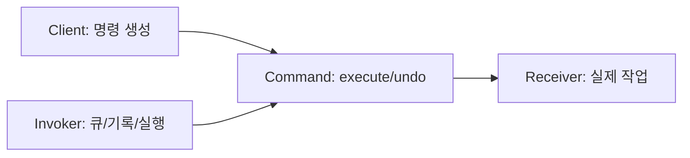
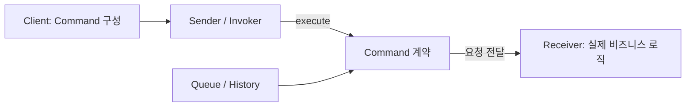

# Command

[전체 검토 기준과 학습 순서](../../STUDY_GUIDE.md)

## 핵심 개념

Command는 **요청을 하나의 값으로 캡슐화하는 패턴**입니다. 호출자는 지금 바로 Receiver의 메서드를 부르는 대신 Command를 만들고, Invoker에게 전달합니다. Invoker는 요청의 내용은 몰라도 실행·예약·기록·취소를 수행할 수 있습니다.



## 해결하려는 문제

버튼, 메뉴, 키보드 단축키처럼 서로 다른 입력 장치가 같은 비즈니스 동작을 실행해야 할 때, 각 UI 코드가 Receiver를 직접 호출하면 동작 코드가 여러 곳에 복제되거나 UI가 구체적인 게임 로직에 결합됩니다. 나중에 실행 예약, 큐잉, 리플레이, 기록, 취소를 추가하려 해도 호출 지점마다 다시 설계해야 합니다.

Command는 Receiver, 메서드, 인자를 하나의 객체나 클로저에 담습니다. UI 같은 Sender는 Command의 `execute`만 호출하고, 실제 작업은 Receiver가 수행합니다.



### 역할

- **Client**: 어떤 동작을 만들지 결정하고 필요한 인자를 Command에 넣습니다.
- **Command**: `execute`를 제공하고, 필요하면 `undo`에 되돌리기 방법을 저장합니다.
- **Receiver**: 실제 게임 상태를 변경하는 객체입니다.
- **Invoker**: Command를 실행하거나 큐에 저장하는 객체입니다. Receiver의 내부를 몰라야 합니다.

Sender는 보통 Command를 직접 생성하지 않습니다. Client가 Receiver와 요청 인자를 넣어 Command를 구성한 뒤 Sender에 연결합니다. Command의 실행 메서드는 인자를 받지 않고, 필요한 값은 Command 필드나 클로저에 저장하는 구성이 실행 지연과 큐잉에 유리합니다.

## Lua에서의 표현

Lua에서는 클래스보다 테이블이나 클로저가 자연스럽습니다.

```lua
local command = {
	execute = function() receiver:move(1) end,
	undo = function() receiver:move(-1) end
}
```

명령을 만드는 함수가 인자를 클로저에 캡처하면 같은 실행기를 재사용하면서 서로 다른 요청을 저장할 수 있습니다. 아주 단순한 일회성 콜백에는 Command 테이블이 과할 수 있으므로, `execute`/`undo`/메타데이터가 필요할 때 도입합니다.

## 도입 절차

1. 여러 입력 지점에서 반복 호출되는 작업과 그 작업을 수행하는 Receiver를 찾습니다.
2. 모든 Command가 지킬 최소 계약을 정합니다. 보통 `execute()` 하나이며, 필요하면 `undo()`를 추가합니다.
3. 요청의 Receiver와 인자를 Concrete Command의 필드 또는 클로저에 저장합니다.
4. Sender/Invoker가 Receiver를 직접 호출하지 않고 Command만 실행하도록 바꿉니다.
5. Client가 Receiver 생성, Command 구성, Sender 연결 순서로 객체를 조립합니다.
6. 큐, 기록, 재실행, 네트워크 전송을 추가할 때 Command의 실행 시점 상태와 직렬화 가능성을 확인합니다.

## 실행과 취소의 계약

모든 Command가 반드시 취소 가능한 것은 아닙니다. 읽기나 복사처럼 Receiver 상태를 바꾸지 않는 Command는 `undo`가 필요 없고, 되돌릴 Command만 이전 값이나 역연산을 저장하면 됩니다. `undo`를 지원한다면 한 Command를 여러 번 실행할 때 이전 상태를 덮어쓰지 않는지, 실행 실패 뒤 history에 추가하지 않는지 정해야 합니다.

## 장점과 비용

- 호출자와 실제 작업을 수행하는 Receiver를 분리합니다.
- 요청을 인자로 전달하고, 큐에 저장하고, 예약하거나 기록할 수 있습니다.
- 실행 이력과 상태 백업을 이용해 Undo/Redo를 구현할 수 있습니다.
- 여러 간단한 Command를 Macro Command로 조합할 수 있습니다.
- 반대로 단순한 즉시 콜백 하나에 Command 객체와 Invoker를 추가하면 구조만 복잡해집니다.
- Undo는 백업 메모리, 역연산의 정확성, 외부 시스템 작업의 복구 가능성을 함께 고려해야 합니다.

## 예제별 학습 순서

- `example_01.lua`: Receiver를 감싼 Command를 실행하고 취소하는 최소 구조입니다.
- `example_02.lua`: Invoker가 여러 Command를 큐에 저장했다가 순서대로 실행합니다.
- `example_03.lua`: 클로저가 매개변수와 실행 시점의 요청을 캡처합니다.
- `example_04.lua`: 실행한 Command의 역연산을 history에 저장해 Undo를 구현합니다.
- `example_05.lua`: 여러 Command를 하나의 Macro Command로 묶어 한 번에 실행합니다.

## Strategy, Callback과의 차이

- **Strategy**는 같은 목적을 위한 알고리즘을 교체하는 데 초점을 둡니다.
- **Callback**은 나중에 호출할 함수를 전달하는 데 초점을 둡니다.
- **Command**는 요청 자체를 값으로 만들어 실행 시점, 큐, 기록, 취소 같은 수명 관리를 가능하게 합니다.

## 관련 패턴과의 차이

- **Strategy**는 같은 목적을 달성하는 알고리즘을 교체합니다. Command는 특정 요청과 인자를 객체로 만들어 나중에 실행하거나 기록합니다.
- **Observer**는 하나의 사건을 여러 구독자에게 알립니다. Command는 Sender와 Receiver 사이의 단일 요청을 캡슐화합니다.
- **Memento**는 객체의 상태를 저장하고 복원합니다. Command와 함께 사용하면 Command는 작업을 수행하고 Memento는 실행 전 상태를 보관합니다.
- **Macro Command**는 여러 Command를 하나의 Command처럼 실행하는 조합입니다.

## Lua와 LÖVE2D에서의 유용성

- 입력을 즉시 처리하지 않고 다음 프레임이나 큐에서 처리할 때
- 리플레이와 네트워크 입력을 동일한 명령 형식으로 재생할 때
- 퍼즐·에디터·턴제 게임에서 Undo/Redo를 구현할 때
- `love.keypressed` 입력과 실제 게임 상태 변경을 분리할 때

주의할 점은 명령이 어떤 상태를 캡처하는지입니다. 실행 시점의 상태를 읽을지, 생성 시점의 값을 고정할지 결정해야 하며, Undo가 필요한 경우에는 역연산에 필요한 이전 값을 명령 안에 보관해야 합니다.
