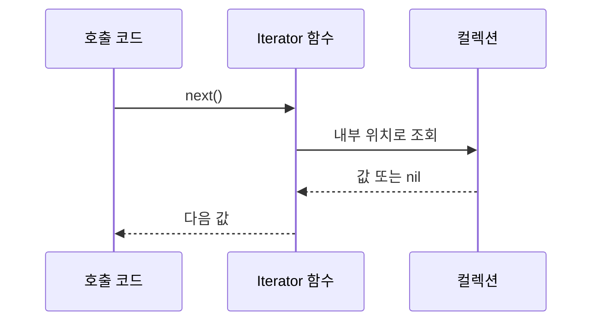

# Iterator

[전체 검토 기준과 학습 순서](../../STUDY_GUIDE.md)

## 핵심 개념

Iterator는 컬렉션의 내부 구조를 노출하지 않고, 호출자에게 원소를 하나씩 제공하는 패턴입니다. 호출자는 배열 인덱스, 트리 노드, 큐 포인터를 직접 관리하지 않고 “다음 값”만 요청합니다.



### 역할

- **Collection**: 순회할 데이터와 내부 구조를 보관합니다.
- **Iterator**: 현재 위치를 보관하고 다음 값을 반환합니다.
- **Client**: 내부 인덱스나 저장 구조를 알지 않고 Iterator를 소비합니다.

## Lua의 순회 규칙

Lua에서는 Iterator를 직접 호출할 수도 있고 일반화된 `for`에 넣을 수도 있습니다.

```lua
for value in iterator do
	print(value)
end
```

이때 Iterator 함수가 `nil`을 첫 번째 반환값으로 내놓으면 순회가 끝납니다. `for key, value in iterator do` 형태에서는 첫 번째 반환값이 `key`, 두 번째 반환값이 `value`가 됩니다. `pairs`와 `ipairs`도 이 규칙을 따르는 표준 Iterator 생성 함수입니다.

클로저에 현재 위치를 저장하면 여러 Iterator가 서로 독립적으로 순회할 수 있습니다. 반대로 전역 인덱스나 컬렉션 자체의 인덱스를 직접 바꾸면 동시에 두 번 순회하기 어렵고 호출자와 구현이 강하게 결합됩니다.

## 예제별 학습 순서

- `example_01.lua`: 배열 인덱스를 숨긴 가장 작은 `next` Iterator입니다.
- `example_02.lua`: 상태를 클로저에 저장하고 일반화된 `for`로 지연 생성합니다.
- `example_03.lua`: Queue의 내부 포인터를 Iterator 내부에 두고 소비합니다.
- `example_04.lua`: `key, value` 두 반환값을 사용하는 Lua 순회 계약을 보여줍니다.
- `example_05.lua`: 원본 목록을 한 번에 만들지 않고 조건을 만족하는 값만 지연 반환합니다.

## 다른 패턴과의 차이

- **Iterator와 Composite**: Composite는 트리의 구조와 재귀 연산을 다루고, Iterator는 그 구조를 순회하는 방법을 숨깁니다.
- **Iterator와 Strategy**: Iterator는 다음 값을 제공하는 순회 상태를 캡슐화하고, Strategy는 알고리즘 자체를 교체합니다.
- **Iterator와 단순 `for`**: 단순 `for`가 충분한 경우에는 Iterator를 별도로 만들 필요가 없습니다. 여러 자료구조에 같은 소비 코드를 적용하거나 지연·필터·페이지 단위 순회가 필요할 때 유용합니다.

## Lua와 LÖVE2D에서의 유용성

- 많은 엔티티 중 조건에 맞는 엔티티만 지연 처리할 때
- 타일맵, 인벤토리, 이벤트 큐를 내부 표현과 분리해 순회할 때
- 한 프레임에 처리할 수만큼만 작업하는 예산형 업데이트를 만들 때
- 큰 데이터나 스트림을 모두 메모리에 복사하지 않고 소비할 때

순회 중 컬렉션을 추가·삭제하면 Iterator가 누락이나 중복을 만들 수 있습니다. 순회 중 수정이 필요한 경우 별도 변경 목록에 기록한 뒤 순회가 끝난 후 적용하거나, Iterator 계약에 수정 정책을 명시해야 합니다. `pairs`의 키 순서는 보장되지 않으므로 순서가 필요한 예제는 배열이나 정렬된 키 목록을 사용합니다.
