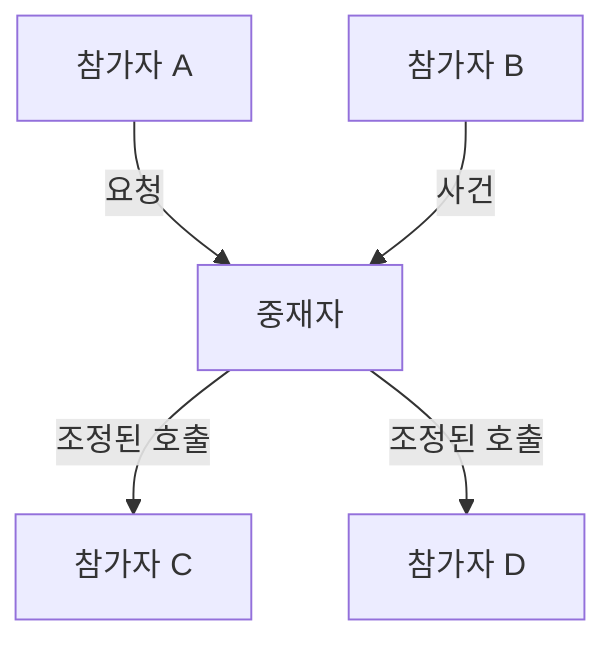
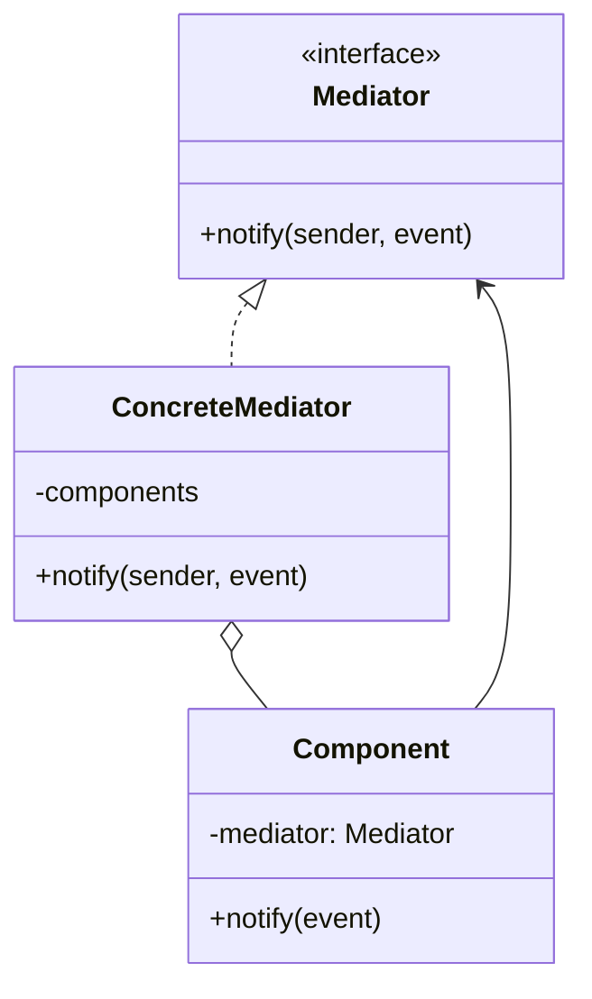

# Mediator

[전체 검토 기준과 학습 순서](../../STUDY_GUIDE.md)

## 핵심 개념

Mediator는 여러 객체가 서로를 직접 참조하지 않고 **하나의 중재 객체를 통해 협력하도록 만드는 패턴**입니다. 참가자는 자신의 책임을 수행하고, 참가자 사이의 순서·연결·규칙은 Mediator가 조정합니다.

## 해결하려는 문제

UI 위젯, 유닛, 네트워크 참가자처럼 여러 객체가 서로의 메서드를 직접 호출하기 시작하면 참조 관계가 그물처럼 늘어납니다. 한 객체의 규칙을 바꾸려면 여러 동료 클래스를 함께 수정해야 하고, 특정 화면이나 전투에서만 필요한 동료 의존성 때문에 컴포넌트를 다른 곳에서 재사용하기도 어려워집니다.

Mediator는 동료 간 직접 통신을 끊고, 사건을 Mediator에 알리는 단일 통신 경로를 만듭니다. Mediator가 조건과 순서를 판단해 필요한 동료를 호출하므로, 동료는 다른 동료의 구체 타입을 몰라도 됩니다.





### 역할

- **Colleague**: 자신의 기능만 알고 Mediator에 사건이나 요청을 전달합니다.
- **Mediator**: 참가자 사이의 협력 순서와 전달 대상을 알고 조정합니다.
- **Client**: 참가자와 Mediator를 연결하고 각자의 역할을 설정합니다.

Mediator는 참가자의 공통 통신 계약만 알면 되며, Concrete Mediator가 실제 협력 규칙과 필요하면 참가자의 생성·등록·해제를 관리합니다. 참가자는 사건을 알릴 뿐 다른 참가자를 직접 찾아 호출하지 않습니다.

## Lua에서의 표현

Lua에서는 Mediator를 메서드가 있는 테이블이나 기능별 모듈로 만들고, 참가자는 생성 시 Mediator를 주입받습니다.

```lua
local function create_player(name, mediator)
	return {
		say = function(self, message)
			mediator:send(self, message)
		end
	}
end
```

참가자가 다른 참가자를 직접 참조하지 않는 것이 핵심입니다. 다만 Mediator가 모든 데이터와 게임 로직을 가지면 거대한 신 객체가 되므로, 조정과 도메인 책임을 분리해야 합니다.

## 도입 절차

1. 서로를 많이 참조해 변경과 재사용을 어렵게 만드는 동료 그룹을 찾습니다.
2. 동료가 Mediator에 알릴 사건과 공통 `notify(sender, event, data)` 계약을 정합니다.
3. Concrete Mediator에 동료 등록과 협력 규칙을 옮깁니다.
4. 동료가 다른 동료를 직접 호출하지 않고 Mediator에 사건만 전달하도록 바꿉니다.
5. Mediator가 필요하면 동료의 생성·등록·해제를 관리하되, 각 동료의 핵심 도메인 행동은 동료에게 남깁니다.
6. Mediator가 너무 커지면 전투·로비·UI·네트워크처럼 상호작용 영역별로 나눕니다.

## 예제별 학습 순서

- `example_01.lua`: Chat이 발신자 메시지를 다른 참가자에게 전달합니다.
- `example_02.lua`: Network 사건을 Mediator가 UI 참가자에게 연결합니다.
- `example_03.lua`: 공격 참가자와 피격 참가자 사이의 전투 흐름을 조정합니다.
- `example_04.lua`: Lobby가 참가자 등록과 준비 완료 알림을 조정합니다.
- `example_05.lua`: Match가 모든 참가자의 준비를 확인한 뒤 시작을 지시합니다.

`example_03.lua`의 Battle은 공격 요청을 받아 대상의 체력을 변경하고 로그를 남기는 전투 규칙을 한 곳에서 조정합니다. `example_04.lua`와 `example_05.lua`는 참가자 등록, 준비 상태 수집, 전체 시작 통지를 Mediator가 담당하는 흐름을 보여 줍니다.

## Observer와의 차이

Observer는 Subject의 변화를 여러 구독자에게 방송하는 데 초점을 둡니다. Mediator는 여러 참가자 사이의 **상호작용 규칙과 순서**를 조정하는 데 초점을 둡니다. Mediator가 특정 참가자에게 조건부로 호출하거나 여러 참가자의 결과를 조합한다면 Observer보다 Mediator에 가깝습니다.

Observer처럼 Mediator를 이벤트 발행자로 구현할 수도 있지만, Mediator의 핵심은 단순 방송이 아니라 “이 사건이 일어나면 어떤 동료를 어떤 순서와 조건으로 호출할지”를 중앙에서 결정하는 것입니다.

## 장점과 비용

- 동료 간 결합을 줄여 개별 컴포넌트를 다른 화면·전투·매치에서도 재사용하기 쉽습니다.
- 상호작용 규칙을 한 곳에서 읽고 수정할 수 있으며, 새로운 Concrete Mediator로 다른 협력 방식을 만들 수 있습니다.
- 반대로 모든 규칙을 하나의 Mediator에 넣으면 God Object가 되어 또 다른 복잡한 중심점이 됩니다.
- 동료가 Mediator를 통해서만 통신하면 호출 흐름이 간접적이므로 이벤트 이름과 순서를 문서화하고 테스트해야 합니다.

## 게임 개발 시나리오

여러 참가자의 상호작용을 한 곳에서 조정할 때 Mediator가 유용합니다.

- **전투 매니저**: 유닛끼리 직접 참조하지 않고 전투 매니저를 거쳐 타게팅·사거리·턴 순서를 조정해, 유닛 간 결합을 줄입니다.
- **UI 매니저**: 버튼·패널·팝업이 서로를 직접 호출하지 않고 UI 매니저가 "설정 열림→게임 일시정지" 같은 상호작용을 중재합니다.
- **로비/매치 조정**: 참가자 준비 상태·팀 밸런스·시작 조건을 매니저가 모아 게임 시작 시점을 결정합니다.
- **튜토리얼 조정자**: 입력·UI 하이라이트·진행 단계를 매니저가 순서대로 연결합니다.

Mediator는 Facade와 달리 단순한 공개 진입점만 제공하는 것이 아니라, 등록된 참가자들의 상호작용 규칙을 계속 조정합니다. 게임에서는 시스템 전체를 하나의 Mediator로 묶기보다 전투·로비·UI처럼 경계가 분명한 단위로 나누는 편이 안전합니다.

## Lua와 LÖVE2D에서의 유용성

- 플레이어·적·UI·오디오가 서로 직접 참조하기 시작할 때
- 로비·매치메이킹·전투 시스템의 상호작용을 한 곳에서 조정할 때
- 네트워크 사건을 게임 상태와 UI에 연결할 때
- 여러 UI 위젯의 선택·해제·갱신 규칙을 조정할 때

참가자가 늘어날수록 Mediator의 조건문도 커질 수 있습니다. 기능별 Mediator를 나누고, 단순 방송은 Observer/Event Bus로 남기는 판단이 중요합니다.
