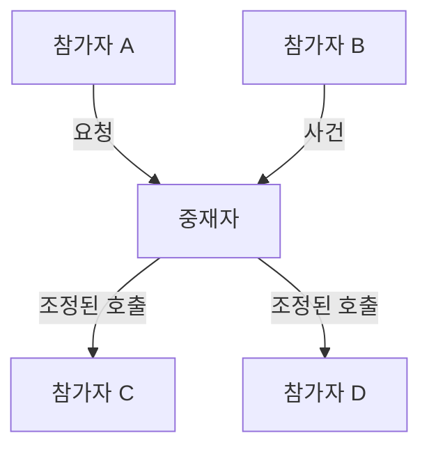

# Mediator

[전체 검토 기준과 학습 순서](../../STUDY_GUIDE.md)

## 핵심 개념

Mediator는 여러 객체가 서로를 직접 참조하지 않고 **하나의 중재 객체를 통해 협력하도록 만드는 패턴**입니다. 참가자는 자신의 책임을 수행하고, 참가자 사이의 순서·연결·규칙은 Mediator가 조정합니다.



### 역할

- **Colleague**: 자신의 기능만 알고 Mediator에 사건이나 요청을 전달합니다.
- **Mediator**: 참가자 사이의 협력 순서와 전달 대상을 알고 조정합니다.
- **Client**: 참가자와 Mediator를 연결하고 각자의 역할을 설정합니다.

## Lua에서의 표현

Lua에서는 Mediator를 메서드가 있는 테이블이나 기능별 모듈로 만들고, 참가자는 생성 시 Mediator를 주입받습니다.

```lua
local function create_player(name, mediator)
	return {
		say = function(self, message)
			mediator:send(self, message)
		end
	}
end
```

참가자가 다른 참가자를 직접 참조하지 않는 것이 핵심입니다. 다만 Mediator가 모든 데이터와 게임 로직을 가지면 거대한 신 객체가 되므로, 조정과 도메인 책임을 분리해야 합니다.

## 예제별 학습 순서

- `example_01.lua`: Chat이 발신자 메시지를 다른 참가자에게 전달합니다.
- `example_02.lua`: Network 사건을 Mediator가 UI 참가자에게 연결합니다.
- `example_03.lua`: 공격 참가자와 피격 참가자 사이의 전투 흐름을 조정합니다.
- `example_04.lua`: Lobby가 참가자 등록과 준비 완료 알림을 조정합니다.
- `example_05.lua`: Match가 모든 참가자의 준비를 확인한 뒤 시작을 지시합니다.

## Observer와의 차이

Observer는 Subject의 변화를 여러 구독자에게 방송하는 데 초점을 둡니다. Mediator는 여러 참가자 사이의 **상호작용 규칙과 순서**를 조정하는 데 초점을 둡니다. Mediator가 특정 참가자에게 조건부로 호출하거나 여러 참가자의 결과를 조합한다면 Observer보다 Mediator에 가깝습니다.

## Lua와 LÖVE2D에서의 유용성

- 플레이어·적·UI·오디오가 서로 직접 참조하기 시작할 때
- 로비·매치메이킹·전투 시스템의 상호작용을 한 곳에서 조정할 때
- 네트워크 사건을 게임 상태와 UI에 연결할 때
- 여러 UI 위젯의 선택·해제·갱신 규칙을 조정할 때

참가자가 늘어날수록 Mediator의 조건문도 커질 수 있습니다. 기능별 Mediator를 나누고, 단순 방송은 Observer/Event Bus로 남기는 판단이 중요합니다.
