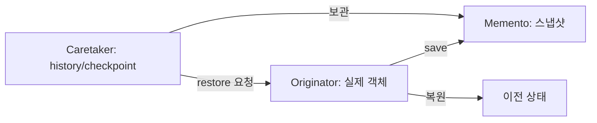
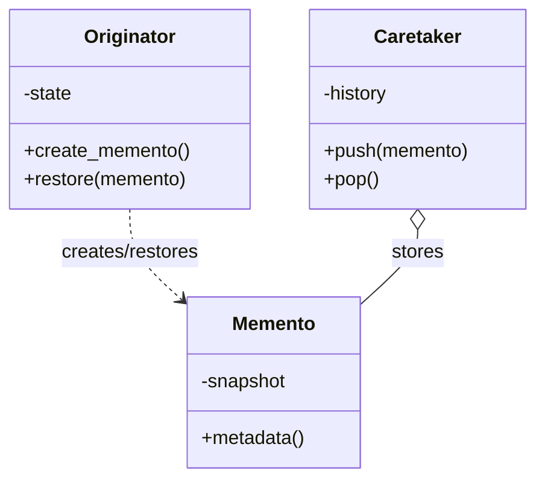

# Memento

[전체 검토 기준과 학습 순서](../../STUDY_GUIDE.md)

## 핵심 개념

Memento는 객체의 상태를 스냅샷으로 저장했다가 나중에 복원하는 패턴입니다. 중요한 점은 상태를 복원할 수 있게 하면서도, 상태의 내부 표현을 관리하는 책임은 원본 객체에 남기는 것입니다.

## 해결하려는 문제

Undo, 체크포인트, 세이브/로드를 구현하려고 외부 객체가 Originator의 모든 필드를 직접 복사하면 내부 표현이 노출되고, 필드가 바뀔 때마다 복사 코드도 함께 수정해야 합니다. 또한 현재 상태 테이블을 그대로 history에 넣으면 이후 변경이 과거 스냅샷까지 바꿀 수 있습니다.

Memento는 Originator가 자신의 상태를 알고 직접 스냅샷을 만들게 합니다. Caretaker는 스냅샷을 저장하고 언제 복원할지만 결정하며 내부 상태를 해석하거나 수정하지 않습니다.





### 역할

- **Originator**: 자신의 상태를 `save`하고 Memento를 사용해 `restore`합니다.
- **Memento**: 특정 시점의 복원 데이터입니다. 필요한 필드만 보관해야 합니다.
- **Caretaker**: Memento를 history나 checkpoint 목록에 보관하지만 내부 필드를 해석하지 않습니다.

Memento는 가능한 한 생성 후 바뀌지 않는 값 객체로 취급합니다. Lua는 private 필드를 강제하지 않으므로 `snapshot` 테이블을 외부 규약상 읽기 전용으로 다루고, 복원은 Originator의 `restore`를 통해서만 수행하는 관례를 둡니다.

## Lua에서의 표현

Lua에서는 Memento를 별도 클래스보다 필요한 값만 담은 새 테이블로 표현합니다.

```lua
function player:save()
	return { hp = self.hp }
end

function player:restore(snapshot)
	self.hp = snapshot.hp
end
```

`save`가 새 테이블을 만들지 않고 원본의 중첩 테이블을 그대로 넣으면 스냅샷과 현재 상태가 같은 참조를 공유할 수 있습니다. 숫자·문자열 같은 값은 그대로 복사해도 되지만, 배열·객체는 필요한 깊이만큼 복사해야 합니다.

스냅샷에는 복원에 필요한 데이터와 선택적인 메타데이터(생성 시각, 체크포인트 이름, 버전)만 저장합니다. 렌더링 캐시, 사운드 핸들, 파일 핸들처럼 복원할 수 없는 외부 리소스는 저장하지 말고 복원 가능한 ID나 논리 상태만 저장합니다.

## 예제별 학습 순서

- `example_01.lua`: Originator의 `save/restore`를 이용한 단일 상태 복원입니다.
- `example_02.lua`: Caretaker가 Editor 스냅샷을 history에 쌓고 Undo합니다.
- `example_03.lua`: 여러 게임 상태를 checkpoint 목록으로 저장하고 특정 시점으로 돌아갑니다.
- `example_04.lua`: 설정 객체의 공개 동작은 유지하면서 백업을 복원합니다.
- `example_05.lua`: 중첩 배열을 깊게 복사해 보드 스냅샷의 독립성을 보장합니다.

예제의 history와 checkpoint는 Caretaker 역할입니다. Originator가 스냅샷을 만들고 복원하며, Caretaker는 보관 순서와 되돌아갈 시점만 관리합니다.

## 도입 절차

1. 복원해야 할 상태를 소유한 Originator를 정합니다.
2. Originator가 `save`/`create_memento`에서 필요한 내부 값을 복사하도록 합니다.
3. 스냅샷을 생성 후 변경하지 않는 Memento로 취급하고, 중첩 테이블은 필요한 깊이까지 복사합니다.
4. Originator에 Memento를 받아 상태를 복원하는 `restore`를 둡니다.
5. Caretaker가 스냅샷을 스택, 체크포인트 목록, 링 버퍼로 관리하게 합니다.
6. 저장 포맷이나 게임 상태 구조가 바뀔 수 있으면 Memento 버전과 호환성·마이그레이션 정책을 정합니다.

## 다른 패턴과의 차이

- **Memento와 Command**: Command는 실행할 요청을 저장하고, Memento는 복원할 상태를 저장합니다. Undo는 두 패턴을 함께 사용할 수 있습니다.
- **Memento와 Prototype**: Prototype은 새 객체를 복제하는 생성 방식이고, Memento는 같은 객체를 과거 상태로 되돌리는 방식입니다.
- **Memento와 Singleton**: Memento는 상태의 시간적 버전을 저장하며, 공유 인스턴스를 만드는 패턴이 아닙니다.
- **Memento와 Observer**: Observer는 상태 변화를 여러 수신자에게 알리고, Memento는 특정 시점의 상태를 저장해 나중에 복원합니다.

## 게임 개발 시나리오

상태를 캡처해 나중에 복원해야 할 때 Memento가 유용합니다.

- **세이브/로드**: 플레이어 위치·체력·인벤토리·진행도를 스냅샷으로 저장하고, 로드 시 그 스냅샷을 그대로 복원합니다.
- **되돌리기(Undo)**: 레벨 에디터나 턴제 게임에서 각 단계의 상태를 메멘토로 저장해, 한 단계씩 이전 상태로 되돌립니다.
- **체크포인트/리스폰**: 체크포인트 통과 시점의 상태를 저장해뒀다가, 사망 시 그 지점의 상태로 부활시킵니다.
- **리플레이 캐처**: 프레임별 상태 스냅샷을 저장해 경기 다시보기에 활용합니다.

## Lua와 LÖVE2D에서의 유용성

- 게임 checkpoint와 저장/불러오기
- 퍼즐·맵 에디터의 Undo/Redo
- 설정 변경 전 백업
- 리플레이나 디버그용 상태 복원

스냅샷을 매 프레임 만들면 메모리와 복사 비용이 커집니다. 저장할 필드만 선택하고, 큰 게임 상태는 전체 복사 대신 변경 목록·링 버퍼·직렬화 포맷을 검토해야 합니다. 복원 시에는 현재 상태와 스냅샷의 버전이 호환되는지도 확인해야 합니다.

## 장점과 비용

- Originator가 자신의 내부 상태를 저장하므로 캡슐화를 지킬 수 있습니다.
- Caretaker가 history를 관리해 Originator가 Undo 목록까지 알 필요가 없습니다.
- 게임의 세이브, 체크포인트, 에디터 Undo, 트랜잭션 롤백을 같은 원리로 구현할 수 있습니다.
- 스냅샷을 자주 만들면 메모리와 CPU 비용이 커지고, 외부 리소스나 큰 참조 그래프는 안전하게 복사하기 어렵습니다.
- Caretaker는 오래된 스냅샷을 제거하고 Originator의 수명보다 오래된 참조를 정리해야 합니다.
