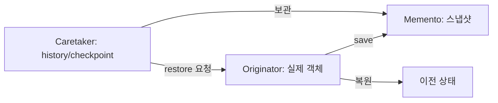

# Memento

[전체 검토 기준과 학습 순서](../../STUDY_GUIDE.md)

## 핵심 개념

Memento는 객체의 상태를 스냅샷으로 저장했다가 나중에 복원하는 패턴입니다. 중요한 점은 상태를 복원할 수 있게 하면서도, 상태의 내부 표현을 관리하는 책임은 원본 객체에 남기는 것입니다.



### 역할

- **Originator**: 자신의 상태를 `save`하고 Memento를 사용해 `restore`합니다.
- **Memento**: 특정 시점의 복원 데이터입니다. 필요한 필드만 보관해야 합니다.
- **Caretaker**: Memento를 history나 checkpoint 목록에 보관하지만 내부 필드를 해석하지 않습니다.

## Lua에서의 표현

Lua에서는 Memento를 별도 클래스보다 필요한 값만 담은 새 테이블로 표현합니다.

```lua
function player:save()
	return { hp = self.hp }
end

function player:restore(snapshot)
	self.hp = snapshot.hp
end
```

`save`가 새 테이블을 만들지 않고 원본의 중첩 테이블을 그대로 넣으면 스냅샷과 현재 상태가 같은 참조를 공유할 수 있습니다. 숫자·문자열 같은 값은 그대로 복사해도 되지만, 배열·객체는 필요한 깊이만큼 복사해야 합니다.

## 예제별 학습 순서

- `example_01.lua`: Originator의 `save/restore`를 이용한 단일 상태 복원입니다.
- `example_02.lua`: Caretaker가 Editor 스냅샷을 history에 쌓고 Undo합니다.
- `example_03.lua`: 여러 게임 상태를 checkpoint 목록으로 저장하고 특정 시점으로 돌아갑니다.
- `example_04.lua`: 설정 객체의 공개 동작은 유지하면서 백업을 복원합니다.
- `example_05.lua`: 중첩 배열을 깊게 복사해 보드 스냅샷의 독립성을 보장합니다.

## 다른 패턴과의 차이

- **Memento와 Command**: Command는 실행할 요청을 저장하고, Memento는 복원할 상태를 저장합니다. Undo는 두 패턴을 함께 사용할 수 있습니다.
- **Memento와 Prototype**: Prototype은 새 객체를 복제하는 생성 방식이고, Memento는 같은 객체를 과거 상태로 되돌리는 방식입니다.
- **Memento와 Singleton**: Memento는 상태의 시간적 버전을 저장하며, 공유 인스턴스를 만드는 패턴이 아닙니다.

## Lua와 LÖVE2D에서의 유용성

- 게임 checkpoint와 저장/불러오기
- 퍼즐·맵 에디터의 Undo/Redo
- 설정 변경 전 백업
- 리플레이나 디버그용 상태 복원

스냅샷을 매 프레임 만들면 메모리와 복사 비용이 커집니다. 저장할 필드만 선택하고, 큰 게임 상태는 전체 복사 대신 변경 목록·링 버퍼·직렬화 포맷을 검토해야 합니다. 복원 시에는 현재 상태와 스냅샷의 버전이 호환되는지도 확인해야 합니다.
