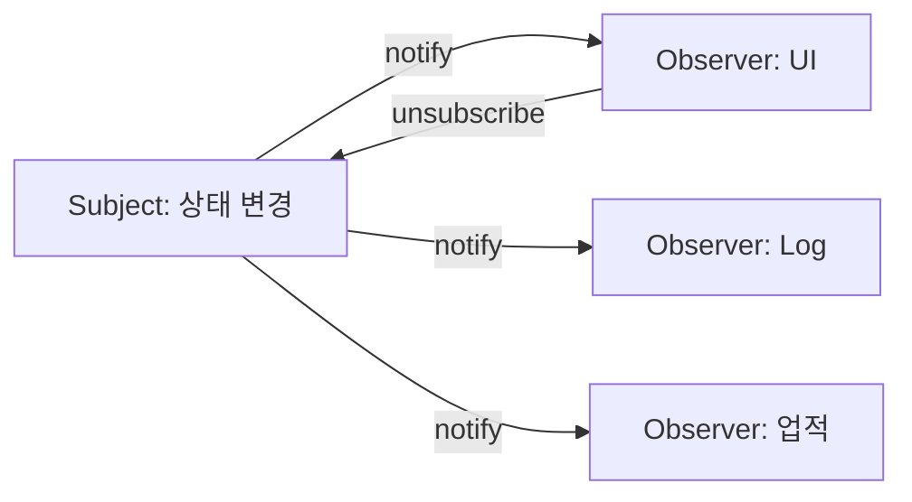

# Observer

[전체 검토 기준과 학습 순서](../../STUDY_GUIDE.md)

## 핵심 정의

Observer는 Subject(발행자)의 상태 변화나 사건을 여러 Observer(구독자)에게 자동으로 전달해 발행자와 수신자를 느슨하게 연결하는 패턴입니다. Subject는 구독자가 UI인지 로그인지 알지 않고, 정해진 알림 계약만 호출합니다.

### 역할

- **Subject**: 구독 목록을 관리하고 상태 변화가 일어나면 Observer에 알립니다.
- **Observer**: 알림을 받아 자신의 표현이나 작업을 갱신합니다.
- **Client**: Subject와 필요한 Observer를 연결하고 구독 해제를 관리합니다.

## Lua에서의 표현

Lua에서는 Observer 객체를 별도 클래스보다 함수 콜백 또는 `update` 메서드를 가진 테이블로 표현합니다. Subject의 `subscribe`가 해제 함수를 반환하게 하면 구독자의 수명을 호출자가 관리하기 쉽습니다.

### Push와 Pull

- **Push**: Subject가 변경된 값이나 payload를 Observer에게 직접 전달합니다.
- **Pull**: Subject 자신을 전달하고 Observer가 필요한 값을 getter로 읽습니다.

Push는 간단하지만 이벤트 계약이 커질 수 있고, Pull은 Observer가 필요한 정보만 가져가지만 Subject 참조가 노출됩니다.

## 예제별 학습 순서

- `example_01.lua`: 하나의 온도 변화가 화면과 로그 Observer에 전달되고 로그 구독을 해제합니다.
- `example_02.lua`: `update` 메서드를 가진 UI·업적 Observer를 등록합니다.
- `example_03.lua`: Pull 방식으로 Observer가 Inventory의 현재 상태를 조회합니다.
- `example_04.lua`: 같은 업적 이벤트의 중복 알림을 Subject가 차단합니다.
- `example_05.lua`: 이벤트 이름별 채널과 개별 리스너 해제를 구현합니다.

## 다른 패턴과의 차이

- **Observer와 Mediator**: Observer는 한 Subject의 변화를 여러 구독자에게 방송하고, Mediator는 여러 참가자의 상호작용 순서와 조건을 조정합니다.
- **Observer와 State**: State는 Context가 현재 상태에 행동을 위임하고, Observer는 상태 변화의 수신자들을 갱신합니다.
- **Observer와 직접 호출**: 구독자가 늘어도 Subject의 코드를 바꾸지 않아야 Observer의 이점이 생깁니다.

## Lua와 LÖVE2D에서의 유용성

- 점수·체력·인벤토리 변경을 UI, 사운드, 업적에 전달할 때
- `love.keypressed`나 게임 이벤트를 여러 시스템에 연결할 때
- 게임 상태 변화와 렌더링 상태를 분리할 때
- 모듈 간 직접 참조를 줄일 때

콜백이 객체를 강하게 캡처하면 객체가 사라진 뒤에도 Subject가 참조를 유지할 수 있습니다. 반드시 `unsubscribe` 계약을 제공하고, 알림 중 구독 목록을 수정할 때는 복사본을 순회하거나 변경을 다음 프레임으로 미뤄야 합니다. 콜백 하나의 오류가 나머지 Observer를 막을지 여부도 정책으로 정해야 합니다.
- 적합한 경우: UI 갱신, 점수판, 이벤트 버스
- 주의점: 구독 해제, 호출 순서, 콜백 중 오류 처리, 알림 중 구독 목록 변경을 설계하기

## 읽는 포인트

- Subject가 Observer의 이름이나 구체적인 메서드를 직접 호출하지 않는가?
- Observer를 여러 개 등록해도 Subject의 변경 코드는 바뀌지 않는가?
- 구독 해제 없이 객체가 사라져 콜백이 남는 문제를 어떻게 막는가?
- 단순 함수 호출 목록이면 충분한지, 이벤트 이름과 수명 관리가 필요한지 판단하는가?

## State와의 차이

State는 하나의 Context가 현재 상태 객체에 행동을 위임하는 패턴입니다. Observer는 하나의 Subject 변화가 여러 독립적인 Observer에게 전달되는 패턴입니다. State의 전이와 Observer의 알림을 함께 사용할 수도 있지만 두 책임은 다릅니다.
