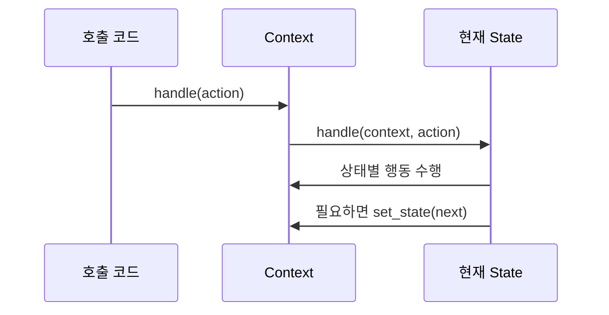

# State

[전체 검토 기준과 학습 순서](../../STUDY_GUIDE.md)

## 예제별 학습 포인트

- `example_01.lua`: 신호등 State가 입력에 따라 색상 행동과 전이를 결정합니다.
- `example_02.lua`: 플레이어 State가 점프·중력·애니메이션을 수행합니다.
- `example_03.lua`: 문서 State가 제출·승인·반려 행동을 소유합니다.
- `example_04.lua`: 문 State가 열기·닫기와 거부 메시지를 결정합니다.
- `example_05.lua`: 다운로드 State가 진행·완료·실패 행동을 분리합니다.

## 핵심 정의

객체의 내부 상태에 따라 **같은 요청의 의미와 행동을 바꾸는 패턴**입니다. 예를 들어 `update`라는 같은 요청이 Idle에서는 대기 애니메이션을 실행하고, Airborne에서는 중력을 적용할 수 있습니다.

State 패턴에서는 다음 역할을 분리합니다.

- `context`: 현재 상태를 보관하고 요청을 현재 상태에 위임함
- `state`: 현재 상태에서 가능한 행동, 거부할 행동, 다음 상태를 정의함
- `transition`: 상태 객체가 필요할 때 context의 현재 상태를 변경함
- `on_enter/on_exit`: 상태에 들어오거나 나갈 때 한 번 실행할 효과를 담당할 수 있음

## Lua 표현

각 상태를 `handle(context, action)` 함수를 가진 테이블로 만들고, context는 `self.state:handle(self, action)`처럼 위임합니다. 상태 함수 안에서 행동을 수행한 뒤 `context:set_state(next_state)`를 호출할 수 있습니다.

`set_state`를 Context의 한 곳에 두면 현재 상태 교체, `on_exit`, `on_enter` 호출 순서를 관리하기 쉽습니다. 상태 객체가 Context의 모든 필드를 직접 바꾸기보다 Context의 작은 도메인 메서드를 호출하게 하면 결합도도 낮아집니다.

## 예제에서 볼 것

- 같은 입력이라도 상태에 따라 실제 행동이 달라지는가?
- 상태 객체가 허용·거부 행동을 정의하는가?
- context에 상태별 `if` 문이 계속 늘어나지 않는가?
- 전이뿐 아니라 진입·이탈 또는 상태 고유 효과가 드러나는가?
- 같은 입력이 서로 다른 상태에서 실제로 다른 행동을 하는가?

## 적합한 경우

메뉴, 플레이, 일시정지, 게임 오버, 캐릭터 이동, 문서 흐름처럼 상태에 따라 행동 규칙이 크게 달라지는 경우에 적합합니다.

## 주의점

단순한 전이 몇 개만 필요하면 전이표가 더 간단합니다. 상태별 행동이 복잡해질 때 State 패턴으로 승격하고, 전이 규칙과 행동을 한 테이블에 섞을 때는 각 상태의 책임이 흐려지지 않는지 확인합니다.

## State와 FSM의 관계

FSM은 상태와 전이 규칙을 표현하는 모델입니다. State 패턴은 그 FSM의 상태별 행동과 전이 책임을 객체·테이블로 분리해 Context의 조건문 폭발을 줄이는 구현 기법입니다. 따라서 전이표만 있는 예제는 FSM으로는 유효하지만 State 패턴의 설명으로는 부족할 수 있습니다.

## Lua와 LÖVE2D에서의 유용성

- 메뉴, 플레이, 일시정지, 게임 오버 등 화면 흐름
- Idle, Run, Jump, Hit 같은 캐릭터 행동
- 다운로드·충전·쿨다운처럼 시간에 따라 행동이 바뀌는 시스템
- 문서 승인이나 퀘스트 진행처럼 허용 행동이 상태마다 다른 흐름

Lua에서는 작은 상태 수라면 단순 함수 테이블이나 전이표가 더 읽기 쉽습니다. 상태 수와 상태별 행동이 함께 늘어나 `if self.state == ...`가 여러 함수에 반복될 때 State 패턴을 고려합니다. 상태가 순환 참조할 때는 Lua 5.1의 지역 변수 전방 선언이 필요합니다.
