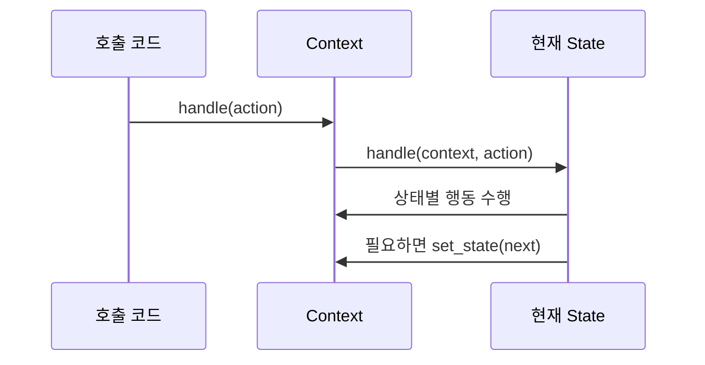

# State

[전체 검토 기준과 학습 순서](../../STUDY_GUIDE.md)

## 예제별 학습 포인트

- `example_01.lua`: 신호등 State가 입력에 따라 색상 행동과 전이를 결정합니다.
- `example_02.lua`: 플레이어 State가 점프·중력·애니메이션을 수행합니다.
- `example_03.lua`: 조건문 기반 문서 흐름과 State로 분리한 흐름을 비교합니다.
- `example_04.lua`: 문 State가 열기·닫기와 거부 메시지를 결정합니다.
- `example_05.lua`: 다운로드 State가 진행·완료·실패 행동을 분리합니다.
- `fsm_example.lua`: 전이표만 사용하는 간단한 FSM과 State 패턴의 경계를 확인합니다.

## 핵심 정의

객체의 내부 상태에 따라 **같은 요청의 의미와 행동을 바꾸는 패턴**입니다. 상태가 바뀌면 객체의 클래스가 바뀐 것처럼 보일 수 있습니다. 예를 들어 `update`라는 같은 요청이 Idle에서는 대기 애니메이션을 실행하고, Airborne에서는 중력을 적용할 수 있습니다.

## 해결하려는 문제

처음에는 `state` 필드와 몇 개의 `if` 또는 `elseif`만으로 FSM을 구현할 수 있습니다. 하지만 상태와 상태별 요청이 늘어나면 여러 Context 메서드에 같은 상태 분기와 전이 규칙이 반복됩니다. 새 상태나 전이를 추가할 때마다 이 조건문들을 함께 수정해야 하므로, 이미 동작하는 상태의 규칙까지 깨뜨리기 쉽습니다.

State는 상태별 행동과 전이 규칙을 각 상태 테이블로 옮깁니다. Context는 현재 상태만 보관하고 공통 계약으로 위임하므로, 새 상태를 추가하거나 기존 상태의 행동을 바꿀 때 영향 범위를 해당 상태에 가깝게 유지할 수 있습니다.

State 패턴에서는 다음 역할을 분리합니다.

- `context`: 현재 상태를 보관하고 요청을 현재 상태에 위임함
- `state`: 현재 상태에서 가능한 행동, 거부할 행동, 다음 상태를 정의함
- `transition`: Context, State, Client 중 전이 규칙을 소유한 코드가 context의 현재 상태를 변경함
- `on_enter/on_exit`: 상태에 들어오거나 나갈 때 한 번 실행할 효과를 담당할 수 있음

## Lua 표현

각 상태를 `handle(context, action)` 함수를 가진 테이블로 만들고, context는 `self.state:handle(self, action)`처럼 위임합니다. 상태 함수 안에서 행동을 수행한 뒤 `context:set_state(next_state)`를 호출할 수 있습니다. `handle`처럼 모든 상태에 의미 있는 요청만 공통 계약으로 두고, 특정 상태에서 절대 호출되지 않을 메서드를 억지로 추가하지 않습니다.

`set_state`를 Context의 한 곳에 두면 현재 상태 교체, `on_exit`, `on_enter` 호출 순서를 관리하기 쉽습니다. 상태 객체가 Context의 모든 필드를 직접 바꾸기보다 Context의 작은 도메인 메서드를 호출하게 하면 결합도도 낮아집니다. 외부에서 `handle`을 호출하기 전에 초기 상태를 반드시 설정해 `self.state`가 `nil`이 되지 않게 합니다.

## 도입 절차

1. 상태에 따라 달라지는 행동이 모여 있는 Context를 찾습니다.
2. 모든 상태에 의미 있는 요청만 골라 공통 계약으로 정합니다. 이 저장소의 예제에서는 `handle(context, action)`이 그 계약입니다.
3. 상태별 조건문과 전이 규칙을 각 상태 테이블로 추출합니다.
4. Context에 현재 상태 필드와 `set_state`를 두고, 기존의 상태 분기를 현재 상태 위임으로 바꿉니다.
5. 전이를 Context, 상태, 호출부 중 어디에서 만들지 정합니다. 상태가 다음 상태를 직접 생성하거나 참조하면 그 상태는 구체 상태에 의존한다는 점을 명시합니다.

## 예제에서 볼 것

- `example_03.lua`의 조건문 버전에서 상태가 늘어나면 `apply`가 커지는 이유와, State 버전에서 각 상태의 책임이 분리되는 모습을 비교합니다.
- 같은 입력이라도 상태에 따라 실제 행동이 달라지는가?
- 상태 객체가 허용·거부 행동을 정의하는가?
- context에 상태별 `if` 문이 계속 늘어나지 않는가?
- 전이뿐 아니라 진입·이탈 또는 상태 고유 효과가 드러나는가?
- 같은 입력이 서로 다른 상태에서 실제로 다른 행동을 하는가?

## 적합한 경우

메뉴, 플레이, 일시정지, 게임 오버, 캐릭터 이동, 문서 흐름처럼 상태에 따라 행동 규칙이 크게 달라지는 경우에 적합합니다. 특히 하나의 객체에 상태별 큰 조건문이 반복되거나, 비슷한 상태와 전이 코드가 여러 곳에서 중복될 때 효과가 큽니다.

## 주의점

단순한 전이 몇 개만 필요하면 전이표가 더 간단합니다. 상태별 행동이 복잡해질 때 State 패턴으로 승격하고, 전이 규칙과 행동을 한 테이블에 섞을 때는 각 상태의 책임이 흐려지지 않는지 확인합니다.

상태별 코드를 분리하면 상태 단위의 책임과 변경 범위를 줄일 수 있고, 기존 Context를 고치지 않고 새 상태를 추가하기 쉬워집니다. 반대로 상태 수가 적고 거의 변하지 않는다면 상태 테이블과 공통 계약 자체가 불필요한 복잡도가 될 수 있습니다.

## State와 FSM의 관계

FSM은 상태와 전이 규칙을 표현하는 모델입니다. State 패턴은 그 FSM의 상태별 행동과 전이 책임을 객체·테이블로 분리해 Context의 조건문 폭발을 줄이는 구현 기법입니다. 따라서 전이표만 있는 예제는 FSM으로는 유효하지만 State 패턴의 설명으로는 부족할 수 있습니다.

`fsm_example.lua`는 `현재 상태 + 이벤트 -> 다음 상태`만 전이표에 저장합니다. 전이가 적고 상태별 행동이 거의 없을 때는 이 방식이 가장 단순합니다. 반면 `example_01.lua`는 상태 테이블이 `enter`와 `handle`을 소유하므로, 색상 변경 같은 상태별 행동과 전이를 함께 분리한 State 패턴 예제입니다.

## State와 Strategy의 차이

State와 Strategy는 모두 Context가 다른 객체 또는 테이블에 작업을 위임하므로 코드 모양이 비슷합니다. 하지만 해결하려는 문제와 교체를 결정하는 주체가 다릅니다.

| 관점 | State | Strategy |
| --- | --- | --- |
| 목적 | 현재 상태에 따라 같은 요청의 의미를 바꿈 | 같은 목적을 달성하는 알고리즘을 선택함 |
| 교체 주체 | 보통 현재 State가 규칙에 따라 다음 State로 전이함 | 보통 Client 또는 설정 코드가 적절한 전략을 선택함 |
| 구현끼리의 관계 | 상태는 다음 상태를 알고 전이할 수 있음 | 전략은 서로 독립적이고 서로를 알 필요가 없음 |
| 대표 요청 | `context:handle(action)` | `context:execute(input)` |
| 예시 | 다운로드가 완료되면 Complete 상태로 전이 | 같은 거리에서 걷기·대시 이동 알고리즘을 선택 |

`example_05.lua`에서 다운로드가 `finish` 이벤트를 받으면 `downloading` State가 `complete` State로 전이합니다. 이후 같은 `start` 요청도 Complete 상태에서는 `already complete`라는 다른 의미를 갖습니다. 이것은 객체의 현재 생명주기가 요청의 의미를 바꾸므로 State에 적합합니다.

반대로 Strategy에서는 선택한 알고리즘이 다음 알고리즘을 정하지 않습니다. 예를 들어 Player가 걷기와 대시 중 무엇을 사용할지는 입력 설정, 장비, 호출부 정책이 결정하고, 이동 전략은 다른 전략으로 전이하지 않은 채 자신의 계산만 수행합니다. 따라서 상태들 사이의 전이 규칙이 핵심이면 State를, 교체 가능한 계산 방법이 핵심이면 Strategy를 선택합니다.

## 게임 개발 시나리오

Context가 현재 상태 객체에 행동을 위임해 상태별 로직을 분리할 때 State가 유용합니다.

- **플레이어 상태**: 대기·이동·점프·피격 상태마다 입력 처리와 애니메이션이 다를 때, 거대한 if 분기 대신 상태 객체로 나눠 전이를 명확히 합니다.
- **게임 흐름**: 메뉴·플레이·일시정지·게임오버 상태를 각각의 update/draw로 분리해, 화면 전환을 예측 가능하게 관리합니다.
- **적 AI 상태**: 순찰·추적·공격·도주 상태를 전환하며 각 상태의 행동과 전이 조건을 독립적으로 정의합니다.
- **무기 상태**: 장전·발사·재장전 상태를 분리해 입력 반응을 구분합니다.

## Lua와 LÖVE2D에서의 유용성

- 메뉴, 플레이, 일시정지, 게임 오버 등 화면 흐름
- Idle, Run, Jump, Hit 같은 캐릭터 행동
- 다운로드·충전·쿨다운처럼 시간에 따라 행동이 바뀌는 시스템
- 문서 승인이나 퀘스트 진행처럼 허용 행동이 상태마다 다른 흐름

Lua에서는 작은 상태 수라면 단순 함수 테이블이나 전이표가 더 읽기 쉽습니다. 상태 수와 상태별 행동이 함께 늘어나 `if self.state == ...`가 여러 함수에 반복될 때 State 패턴을 고려합니다. 상태가 순환 참조할 때는 Lua 5.1의 지역 변수 전방 선언이 필요합니다.
