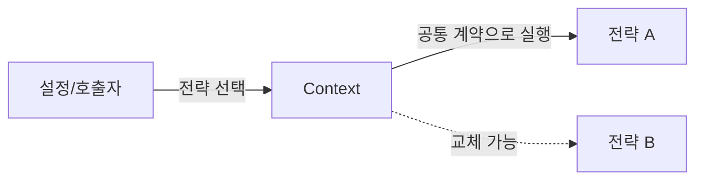

# Strategy

[전체 검토 기준과 학습 순서](../../STUDY_GUIDE.md)

## 핵심 정의

Strategy는 같은 목적을 달성하는 여러 알고리즘을 서로 교체 가능한 전략으로 분리하고, Context가 선택된 전략에 작업을 위임하는 패턴입니다. Context는 전략 내부의 계산 방법을 알지 않고도 같은 방식으로 실행합니다.



### 역할

- **Strategy**: 같은 입력·출력 계약을 지키는 알고리즘입니다.
- **Concrete Strategy**: 오름차순, VIP 할인, Dash 이동처럼 구체적인 계산을 구현합니다.
- **Context**: 전략을 보관하고 공통 작업 흐름을 실행합니다.
- **Selector/Client**: 설정이나 게임 상황에 따라 어떤 전략을 사용할지 결정합니다.

## Lua에서의 표현

Lua에서는 전략 인터페이스나 추상 클래스를 만들기보다 함수를 인자로 전달하는 방식이 가장 자연스럽습니다.

```lua
local function execute(context, strategy, input)
	return strategy(context, input)
end
```

전략 함수는 같은 인자·반환값 계약을 지켜야 하며, Context의 내부 상태를 몰래 바꾸기보다 결과를 반환하거나 Context의 명시적 메서드를 호출하는 편이 안전합니다. 전략 선택은 설정 코드나 호출부에 두고, Context 안에 전략 이름별 `if`를 다시 만들지 않습니다.

- Lua 표현: 같은 입력과 결과 규약을 가진 함수를 전달하거나 전략 테이블을 주입함
- 예제에서 볼 것: Context의 흐름은 유지하면서 정렬·할인·이동·결제 방식을 교체함
- 전략 선택: 호출부나 설정 코드가 전략을 선택하고 Context는 선택 로직을 담당하지 않음
- 적합한 경우: AI, 조준, 보너스 계산, 정렬 정책
- 주의점: 전략 선택과 전략 실행을 한 함수에 섞지 않기

## 예제별 학습 순서

- `example_01.lua`: 같은 Sorter Context에 오름차순·내림차순 비교 전략을 주입합니다.
- `example_02.lua`: 가격 Context에 회원·VIP 할인 전략을 교체해 적용합니다.
- `example_03.lua`: Player의 이동 전략을 실행 중 교체합니다.
- `example_04.lua`: 결제 Context와 결제 처리 알고리즘을 분리합니다.
- `example_05.lua`: Renderer Context에 텍스트 변환 전략을 주입합니다.

## 점검 질문

- 전략들이 같은 입력·출력 계약을 지키는가?
- Context가 구체적인 전략의 내부 구현을 몰라도 되는가?
- 실행 중 전략을 바꿔도 Context의 사용 방식은 변하지 않는가?
- 전략이 하나뿐이거나 조건이 두 개뿐이면 단순 함수나 `if`가 더 읽기 쉽지 않은가?

## State와의 차이

Strategy는 같은 작업에 사용할 **알고리즘을 선택**하는 패턴입니다. 전략끼리 다음 상태를 관리하거나 전이할 필요가 없습니다. 반면 State는 현재 상태가 요청의 의미와 행동을 바꾸고, 상태 객체가 다음 상태로 전이할 수 있습니다.

- Strategy: `context:execute(input)` -> 선택된 전략의 알고리즘 실행
- State: `context:handle(action)` -> 현재 상태의 행동 실행 및 필요 시 상태 전이

## Lua와 LÖVE2D에서의 유용성

- 적 AI의 추적·도망·순찰 알고리즘 교체
- 조준 방식, 이동 방식, 보너스 계산 정책 교체
- 그래픽 품질이나 플랫폼별 렌더링 방식 선택
- 테스트에서 실제 결제·저장 대신 가짜 전략 주입

전략이 하나뿐이거나 조건이 두 개뿐이면 단순 함수나 `if`가 더 읽기 쉬울 수 있습니다. 전략이 외부 상태를 캡처하면 Context의 실행 결과가 숨은 상태에 의존할 수 있으므로, 캡처 범위와 부작용을 문서화해야 합니다.
