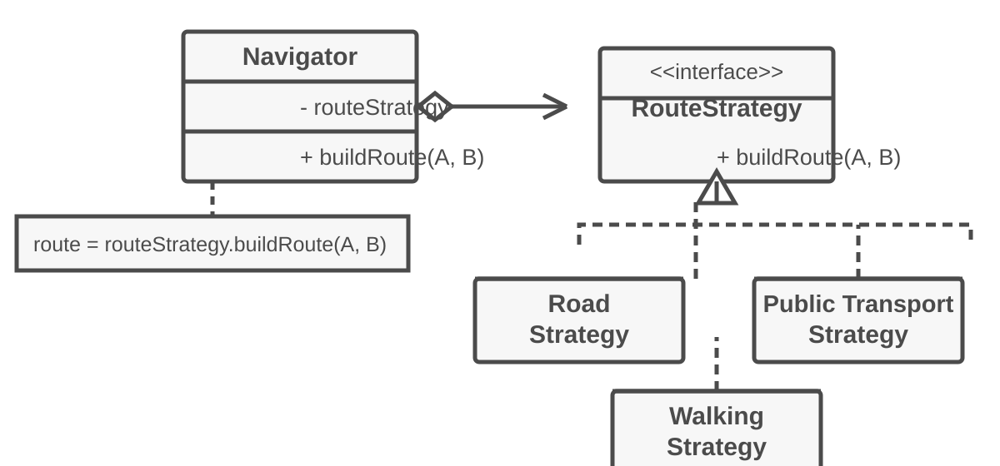
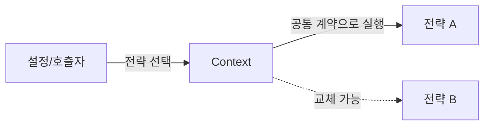
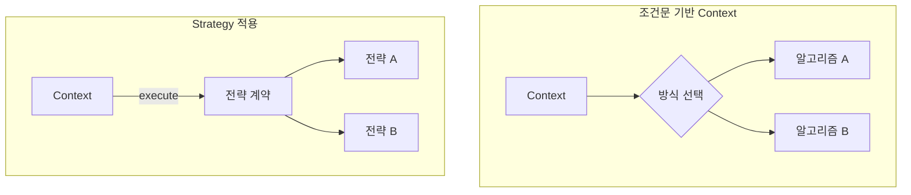

# Strategy

[전체 검토 기준과 학습 순서](../../STUDY_GUIDE.md)

## 핵심 정의

Strategy는 같은 목적을 달성하는 여러 알고리즘을 서로 교체 가능한 전략으로 분리하고, Context가 선택된 전략에 작업을 위임하는 패턴입니다. Context는 전략 내부의 계산 방법을 알지 않고도 같은 방식으로 실행합니다.

### 협력 구조

아래 그림은 클래스 기반으로 표현한 Strategy의 협력 구조입니다. `Navigator`는 경로 계산을 직접 구현하지 않고 `RouteStrategy`에 위임하며, 상황에 맞게 구체 전략을 교체합니다.



Lua에서는 이 인터페이스를 상속 계층으로 만들기보다, 같은 호출 계약을 지키는 함수 또는 전략 테이블로 표현합니다.



## 해결하려는 문제

처음에는 Context 안의 `if` 또는 `elseif`로 같은 작업의 여러 방식을 선택해도 충분합니다. 하지만 새 알고리즘을 추가할 때마다 Context의 조건문과 계산 코드가 함께 커지고, 알고리즘 하나를 수정해도 다른 분기까지 다시 확인해야 합니다. 여러 사람이 같은 Context를 수정하면 변경 충돌도 집중됩니다.

Strategy는 자주 바뀌는 알고리즘을 Context에서 추출하고, Context는 선택된 전략의 공통 계약만 호출하게 합니다. 따라서 새 전략을 추가하거나 기존 계산을 변경해도 Context의 작업 흐름을 바꾸지 않습니다.



### 역할

- **Strategy**: 같은 입력·출력 계약을 지키는 알고리즘입니다.
- **Concrete Strategy**: 오름차순, VIP 할인, Dash 이동처럼 구체적인 계산을 구현합니다.
- **Context**: 전략을 보관하고 공통 작업 흐름을 실행합니다.
- **Selector/Client**: 설정이나 게임 상황에 따라 어떤 전략을 사용할지 결정합니다.

## Lua에서의 표현

Lua에서는 전략 인터페이스나 추상 클래스를 만들기보다 함수를 인자로 전달하는 방식이 가장 자연스럽습니다.

```lua
local function execute(context, strategy, input)
	return strategy(context, input)
end
```

전략 함수는 같은 인자·반환값 계약을 지켜야 하며, Context의 내부 상태를 몰래 바꾸기보다 결과를 반환하거나 Context의 명시적 메서드를 호출하는 편이 안전합니다. 전략 선택은 설정 코드나 호출부에 두고, Context 안에 전략 이름별 `if`를 다시 만들지 않습니다.

- Lua 표현: 같은 입력과 결과 규약을 가진 함수를 전달하거나 전략 테이블을 주입함
- 예제에서 볼 것: Context의 흐름은 유지하면서 정렬·할인·이동·결제 방식을 교체함
- 전략 선택: 호출부나 설정 코드가 전략을 선택하고 Context는 선택 로직을 담당하지 않음
- 적합한 경우: AI, 조준, 보너스 계산, 정렬 정책
- 주의점: 전략 선택과 전략 실행을 한 함수에 섞지 않기

## 도입 절차

1. 같은 목적을 여러 방식으로 수행하고 자주 변경되는 알고리즘 또는 큰 조건문을 찾습니다.
2. 모든 전략이 지킬 입력·출력 계약을 정합니다.
3. 각 알고리즘을 함수 또는 전략 테이블로 추출합니다.
4. Context에 현재 전략 필드와 교체 메서드를 두고, 알고리즘 분기를 전략 호출로 바꿉니다.
5. Client 또는 설정 코드가 상황에 맞는 전략을 선택해 Context에 주입합니다.

전략이 Context의 데이터를 읽어야 한다면 필요한 값만 인자로 전달합니다. Context 전체를 넘겨야 할 때는 상태를 직접 변경하기보다 작은 도메인 메서드만 호출하도록 계약을 좁히는 편이 좋습니다.

## 예제별 학습 순서

- `example_01.lua`: 같은 Sorter Context에 오름차순·내림차순 비교 전략을 주입합니다.
- `example_02.lua`: 가격 Context에 회원·VIP 할인 전략을 교체해 적용합니다.
- `example_03.lua`: Player의 이동 전략을 실행 중 교체합니다.
- `example_04.lua`: 결제 Context와 결제 처리 알고리즘을 분리합니다.
- `example_05.lua`: Renderer Context에 텍스트 변환 전략을 주입합니다.

## 점검 질문

- 전략들이 같은 입력·출력 계약을 지키는가?
- Context가 구체적인 전략의 내부 구현을 몰라도 되는가?
- 실행 중 전략을 바꿔도 Context의 사용 방식은 변하지 않는가?
- 전략이 하나뿐이거나 조건이 두 개뿐이면 단순 함수나 `if`가 더 읽기 쉽지 않은가?

## 장점과 비용

- 런타임에 알고리즘을 교체할 수 있습니다.
- Context의 작업 흐름과 알고리즘의 구현·의존성을 분리합니다.
- 상속 대신 합성을 사용하므로 새 전략을 Context 수정 없이 추가하기 쉽습니다.
- 반대로 전략이 적고 거의 변하지 않으면 함수·테이블·선택 코드가 불필요한 복잡도가 됩니다.
- Client는 전략마다 어떤 결과와 비용 차이가 있는지 알고 올바르게 선택해야 합니다.

## State와의 차이

Strategy는 같은 작업에 사용할 **알고리즘을 선택**하는 패턴입니다. 전략끼리 다음 상태를 관리하거나 전이할 필요가 없습니다. 반면 State는 현재 상태가 요청의 의미와 행동을 바꾸고, 상태 객체가 다음 상태로 전이할 수 있습니다.

- Strategy: `context:execute(input)` -> 선택된 전략의 알고리즘 실행
- State: `context:handle(action)` -> 현재 상태의 행동 실행 및 필요 시 상태 전이

## 비슷한 패턴과의 차이

- **Command**: 요청을 값으로 만들어 큐, 기록, 취소, 지연 실행을 가능하게 합니다. Strategy는 같은 작업을 수행하는 알고리즘을 교체합니다.
- **Template Method**: 전체 처리 순서는 고정하고 일부 단계만 바꿉니다. Strategy는 객체에 주입한 알고리즘 전체를 바꿀 수 있습니다.
- **Decorator**: 같은 객체에 기능을 감싸 추가합니다. Strategy는 작업 방식 자체를 다른 알고리즘으로 바꿉니다.

## 게임 개발 시나리오

교체 가능한 알고리즘을 런타임에 갈아끼울 때 Strategy가 유용합니다.

- **적 이동 전략**: 직선·추적·지그재그 이동 전략을 객체로 분리해, 같은 적 클래스가 전략만 바꿔 다른 움직임을 보이게 합니다.
- **난이도별 스폰 전략**: Easy·Hard에 따라 스폰 간격·된 적 수를 결정하는 전략을 교체해 게임 알고리즘을 바꿉니다.
- **점수/데미지 공식 교체**: 콤보 배율·크리티컬 계산을 전략으로 분리해, 이벤트나 모드별로 다른 공식을 적용합니다.
- **조준/타게팅 전략**: 가장 가까운 적·체력이 낮은 적·무작위 대상 선택을 전략으로 교체합니다.

## Lua와 LÖVE2D에서의 유용성

- 적 AI의 추적·도망·순찰 알고리즘 교체
- 조준 방식, 이동 방식, 보너스 계산 정책 교체
- 그래픽 품질이나 플랫폼별 렌더링 방식 선택
- 테스트에서 실제 결제·저장 대신 가짜 전략 주입

전략이 하나뿐이거나 조건이 두 개뿐이면 단순 함수나 `if`가 더 읽기 쉬울 수 있습니다. 전략이 외부 상태를 캡처하면 Context의 실행 결과가 숨은 상태에 의존할 수 있으므로, 캡처 범위와 부작용을 문서화해야 합니다.
