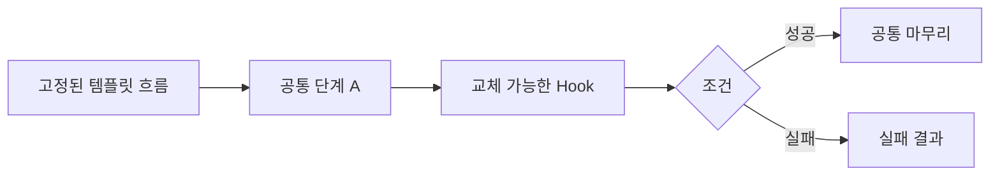

# Template Method

[전체 검토 기준과 학습 순서](../../STUDY_GUIDE.md)

## 핵심 개념

Template Method는 알고리즘의 **큰 순서와 제어 흐름을 고정**하고, 일부 단계만 하위 구현이나 콜백이 바꿀 수 있게 하는 패턴입니다. 호출자는 전체 순서를 다시 조립하지 않고, 정해진 hook만 제공합니다.



### 역할

- **Template**: 단계의 순서, 공통 처리, 성공·실패 흐름을 소유합니다.
- **Hook**: 호출자가 주입하는 세부 단계입니다.
- **Concrete implementation**: 같은 hook 계약에 맞는 구체 동작을 제공합니다.

전통적인 객체지향 구현은 상속과 메서드 오버라이드로 Template Method를 만들지만, Lua에서는 고정 흐름 함수에 콜백을 전달하는 방식이 더 자연스럽습니다.

## Lua에서의 표현

```lua
local function run(load, transform, save)
	local data = load()
	local result = transform(data)
	return save(result)
end
```

`run`이 순서를 통제하므로 콜백은 순서를 바꿀 수 없습니다. hook이 선택적이라면 기본 함수를 제공하거나 `nil`을 안전하게 처리해야 합니다. 각 단계의 입력·출력 계약을 문서화하지 않으면 콜백 조합이 쉽게 깨집니다.

## 예제별 학습 순서

- `example_01.lua`: `load -> parse`의 고정 순서와 두 hook을 확인합니다.
- `example_02.lua`: Asset 로드 후 메뉴 표시라는 게임 시작 흐름을 고정합니다.
- `example_03.lua`: Encode 후 Write 순서를 유지하며 저장 방식을 교체합니다.
- `example_04.lua`: Input -> Move -> Draw 순서를 고정한 게임 업데이트 흐름입니다.
- `example_05.lua`: 사용자 읽기 후 검사, 성공 시 승인이라는 조건부 hook을 보여줍니다.

## Strategy와 Pipeline의 차이

- **Template Method**: 전체 순서는 고정하고 일부 단계만 교체합니다.
- **Strategy**: 알고리즘 전체를 하나의 교체 가능한 전략으로 바꿉니다.
- **Pipeline**: 단계들이 순서대로 값을 변환하며, 단계 구성이 동적으로 바뀌는 경우가 많습니다.

## 게임 개발 시나리오

공통 골격은 고정하고 일부 단계만 하위가 재정의할 때 Template Method가 유용합니다.

- **공통 게임 루프 훅**: 초기화 → 입력 처리 → 업데이트 → 렌더링 골격을 고정하고, 각 씬이 `onUpdate`, `onDraw` 훅만 재정의해 일관된 진행 순서를 보장합니다.
- **적 기본 행동 골격**: "감지 → 이동 → 공격" 흐름은 고정하고, 구체적인 감지 범위·공격 방식만 각 적 타입이 채웁니다.
- **씬 생명주기 템플릿**: `load` → `enter` → `update`/`draw` → `exit` 순서를 고정해, 각 씬이 훅만 구현하면 전환 흐름이 같아집니다.
- **미니게임 공통 진행**: 시작·라운드·정산 골격을 고정하고 규칙 부분만 교체합니다.

## Lua와 LÖVE2D에서의 유용성

- 게임 시작·종료·저장처럼 순서가 중요한 생명주기 흐름
- 입력 읽기 → 게임 상태 갱신 → 렌더링 같은 프레임 처리
- 여러 파일 형식의 로드·변환·저장 과정
- 인증, 검증, 리소스 초기화처럼 성공·실패 순서가 고정된 작업

순서가 자주 바뀌거나 알고리즘 전체를 교체해야 한다면 Strategy나 Pipeline이 더 적절합니다. Lua에서는 콜백이 외부 상태를 암묵적으로 변경하지 않도록 하고, 템플릿 함수가 예외·`nil` 반환을 어떻게 처리할지 명확히 정해야 합니다.
