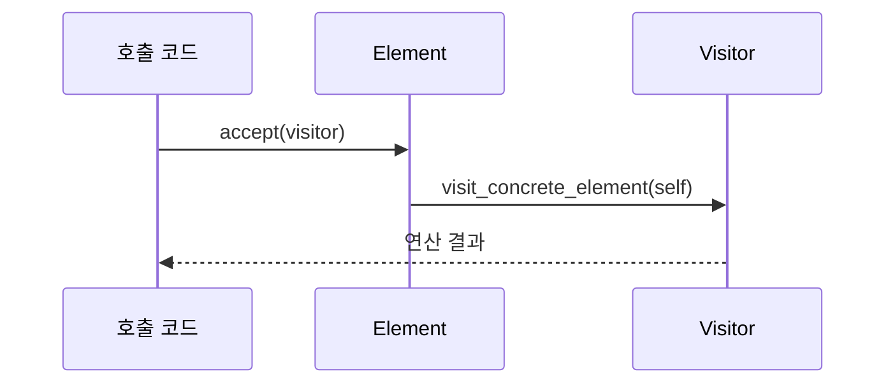

# Visitor

[전체 검토 기준과 학습 순서](../../STUDY_GUIDE.md)

## 핵심 개념

Visitor는 객체 구조와 그 구조에 수행할 연산을 분리하는 패턴입니다. 객체 종류가 안정적이고, 구조에 적용할 연산이 계속 늘어날 때 유용합니다.



이 흐름을 **이중 디스패치**라고 부릅니다. `accept`가 어떤 구체 Element인지 알고 Visitor의 알맞은 `visit_*` 메서드를 호출하기 때문입니다.

### 역할

- **Element**: 자신의 종류에 맞는 Visitor 메서드를 호출하는 `accept`를 제공합니다.
- **Concrete Element**: Enemy, Circle, Weapon처럼 구조에 속한 데이터입니다.
- **Visitor**: 각 Element에 대한 하나의 연산을 모아 둡니다.
- **Client**: Element 구조를 순회하며 Visitor를 적용합니다.

## Lua에서의 표현

Lua에서는 Visitor와 Element를 테이블로 만들고 `accept`와 `visit_*` 함수 계약을 명시합니다.

```lua
local enemy = {
	accept = function(self, visitor)
		return visitor:visit_enemy(self)
	end
}
```

작은 데이터에는 `handlers[element.kind](element)` 형태의 타입 함수 테이블로 축약할 수 있습니다. 이 방식은 실용적이지만 명시적인 `accept`가 없으므로 전통적인 Visitor와는 구분해야 합니다.

## 예제별 학습 순서

- `example_01.lua`: Enemy와 Coin의 `accept`가 조회 Visitor로 이중 디스패치합니다.
- `example_02.lua`: Circle과 Square에 면적 연산 Visitor를 적용합니다.
- `example_03.lua`: Weapon과 Armor의 설명 연산을 구조에서 분리합니다.
- `example_04.lua`: Player와 NPC의 표시 이름 연산을 별도 Visitor로 둡니다.
- `example_05.lua`: Number와 Text 토큰을 직렬화 Visitor로 처리합니다.

## Visitor를 선택하는 기준

Visitor는 **Element 종류는 안정적이고 연산 종류가 늘어나는 경우**에 적합합니다. 새 연산은 Visitor 하나를 추가하면 되지만, 새 Element 종류를 추가할 때는 모든 Visitor에 `visit_new_element`를 추가해야 합니다.

- 종류가 자주 늘어나면 일반 다형성이나 타입별 함수 테이블이 더 편할 수 있습니다.
- 연산이 하나뿐이면 Element 메서드로 두는 편이 단순합니다.
- 타입 종류와 연산이 모두 적다면 Visitor는 과한 추상화입니다.

## Lua와 LÖVE2D에서의 유용성

- 여러 엔티티 종류에 통계 집계, 저장, 디버그 표시를 추가할 때
- AST나 설정 트리에 분석·검증·직렬화 연산을 추가할 때
- 게임 오브젝트 구조는 유지하면서 렌더링·충돌 검사·리플레이 데이터를 별도 처리할 때

Visitor가 Element의 내부 필드를 과도하게 읽으면 캡슐화가 약해집니다. 필요한 데이터 조회 메서드를 제공하고, Visitor가 직접 모든 내부 상태를 조작하지 않도록 주의합니다.
