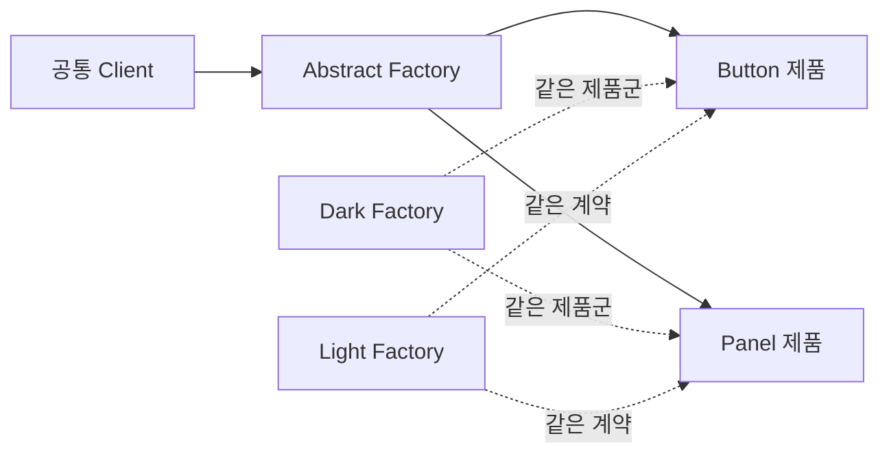
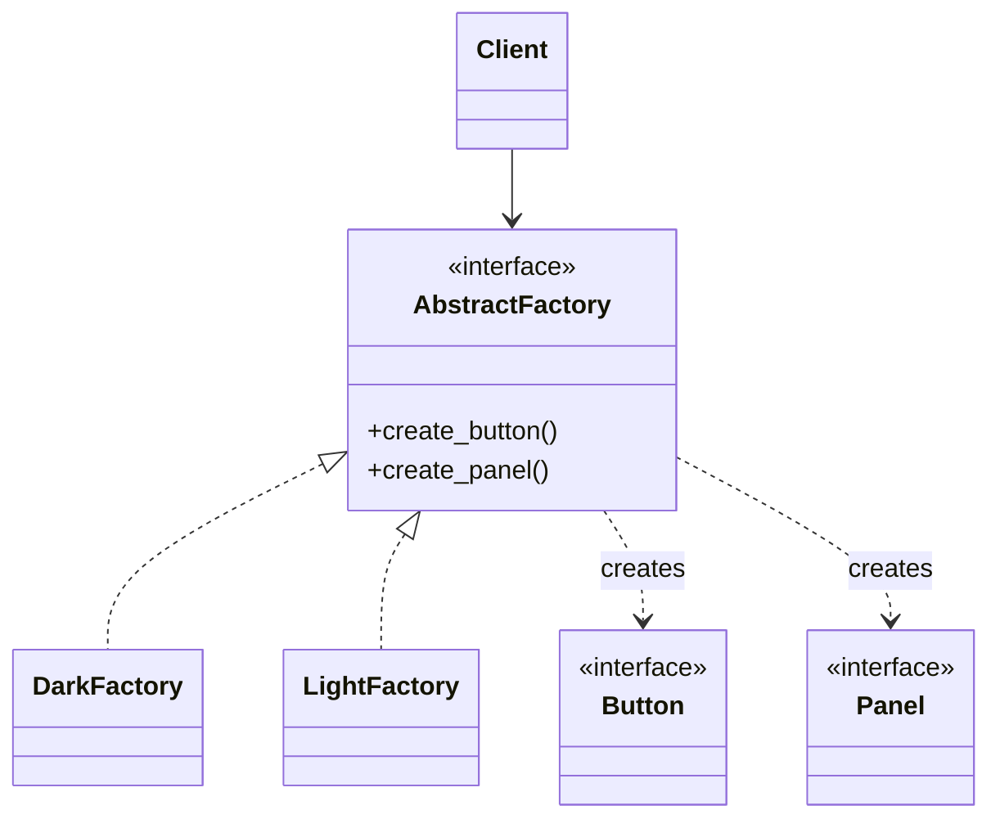

# Abstract Factory

[전체 검토 기준과 학습 순서](../../STUDY_GUIDE.md)

## 핵심 개념

Abstract Factory는 서로 관련 있고 함께 사용해야 하는 **제품군 전체를 생성하는 인터페이스**를 제공합니다. Client는 Dark 테마인지 Light 테마인지 몰라도 Button과 Panel을 같은 제품군에서 받아 호환되게 사용할 수 있습니다.

## 해결하려는 문제

게임의 UI 위젯, 테마 리소스, 적·아이템 세트처럼 여러 종류의 제품이 하나의 변형을 이루고 서로 어울려야 할 때, Client가 제품을 각각 직접 생성하면 Dark Button과 Light Panel 같은 잘못된 조합이 생길 수 있습니다. 제품 종류가 늘어날 때마다 선택 조건과 생성 코드도 Client에 퍼집니다.

Abstract Factory는 제품 종류별 생성 메서드를 하나의 Factory 계약으로 묶고, Concrete Factory 하나가 같은 변형의 제품만 만들도록 합니다. Client는 구체 클래스 대신 Factory와 Abstract Product 계약만 사용하므로 제품군을 한 번에 교체할 수 있습니다.





### 역할

- **Abstract Factory**: 제품군의 생성 함수 계약을 정의합니다.
- **Concrete Factory**: Dark, Light, Fantasy처럼 하나의 제품군을 생성합니다.
- **Abstract Product**: Button, Panel처럼 Client가 기대하는 공통 계약입니다.
- **Client**: 구체 Factory를 몰라도 여러 제품을 함께 사용합니다.

제품군을 `제품 종류 x 변형` 행렬로 생각하면 이해하기 쉽습니다. 예를 들어 `Button x Dark/Light`, `Panel x Dark/Light`의 각 칸을 Concrete Product가 채우고, Dark Factory는 Dark 행 전체를 생성합니다. 한 Factory가 만든 제품들은 함께 사용될 수 있어야 합니다.

## Lua에서의 표현

Lua에서는 추상 클래스 대신 같은 키와 함수 계약을 가진 Factory 테이블을 사용합니다.

```lua
local function build_screen(factory)
	local button = factory.create_button()
	local panel = factory.create_panel()
	return panel:attach(button)
end
```

Factory를 교체해도 Client 코드를 바꾸지 않으려면 모든 Concrete Factory가 같은 생성 함수와 제품 계약을 지켜야 합니다. 제품 하나만 생성한다면 Factory Method나 단순 생성 함수가 더 간단합니다.

Lua에는 정적 인터페이스가 없으므로 생성 함수 이름, 반환 필드, 협력 메서드를 문서와 테스트로 계약합니다. 제품군 선택은 보통 게임 초기화 단계에서 한 번 수행하고, 이후 Client에는 선택된 Factory만 주입합니다.

## 도입 절차

1. 함께 교체되어야 하는 제품 종류와 각 제품의 변형을 행렬로 정리합니다.
2. 제품 종류별 공통 계약을 정하고 모든 Concrete Product가 이를 구현합니다.
3. 모든 제품 생성 메서드를 포함하는 Abstract Factory 계약을 만듭니다.
4. 변형별 Concrete Factory를 만들고 한 Factory가 같은 변형의 제품만 생성하게 합니다.
5. 초기화 코드가 환경·플랫폼·게임 모드에 맞는 Factory를 선택해 Client에 주입합니다.
6. Client의 직접 생성과 혼합 제품 선택을 제거하고 Factory 계약만 사용하게 합니다.
7. 새 변형 추가와 새 제품 종류 추가의 비용을 각각 확인합니다. 제품 종류를 추가하면 모든 Factory 계약과 구현을 수정해야 할 수 있습니다.

## 예제별 학습 순서

- `example_01.lua`: Dark·Light 테마에서 Button과 Panel을 함께 생성합니다.
- `example_02.lua`: Fantasy·Sci-Fi 세계관의 Hero와 Enemy를 함께 교체합니다.
- `example_03.lua`: Small·Large 화면 제품군을 공통 Screen Client에 주입합니다.
- `example_04.lua`: 실제 오디오와 Silent 오디오 제품군의 같은 계약을 비교합니다.
- `example_05.lua`: Test·Game 제품군을 같은 게임 Client에서 교체합니다.

`example_01.lua`는 제품군 호환성을 검증하는 대표 예제입니다. `example_02.lua`와 `example_05.lua`는 게임 세계관·테스트 환경처럼 여러 제품을 한 번에 바꾸는 사례이고, `example_04.lua`는 실제 오디오와 무음 오디오 제품군을 같은 Client 계약으로 교체합니다.

## Factory Method와의 차이

- **Factory Method**: 보통 하나의 제품 생성 방법을 하위 Creator가 바꿉니다.
- **Abstract Factory**: 관련된 여러 제품을 하나의 제품군으로 함께 생성하고 호환성을 보장합니다.

Factory Method가 Creator의 공통 흐름에서 한 제품 생성 단계를 하위 구현으로 바꾸는 데 집중한다면, Abstract Factory는 여러 Factory Method를 하나의 제품군 계약으로 묶어 변형 전체를 일관되게 선택하는 데 집중합니다.

## 장점과 비용

- 같은 Factory에서 얻은 제품들이 호환된다는 보장을 만들 수 있습니다.
- Client를 구체 Product와 Concrete Factory로부터 분리하고, 제품군을 한 곳에서 교체할 수 있습니다.
- 생성 책임을 Factory로 모아 게임 초기화와 실제 사용 로직을 분리합니다.
- 제품군 변형을 추가하기 쉽지만, 새로운 제품 종류를 추가하면 모든 Factory와 계약을 수정해야 할 수 있습니다.
- 제품이 하나뿐이거나 제품 간 호환성이 중요하지 않으면 추상화가 과합니다.

## 관련 패턴과의 차이

- **Builder**는 하나의 복잡한 객체를 단계적으로 조립하고, Abstract Factory는 관련 제품 여러 개를 즉시 생성합니다.
- **Prototype**은 미리 구성한 객체를 복제하고, Abstract Factory는 제품군별 생성 규칙을 제공합니다.
- **Facade**는 기존 하위 시스템 사용 흐름을 단순화하고, Abstract Factory는 제품 생성과 제품군 호환성을 캡슐화합니다.

## 게임 개발 시나리오

서로 어울려야 하는 객체 묶음을 통째로 갈아끼워야 할 때 Abstract Factory가 유용합니다.

- **테마별 스테이지 세트**: 숲·사막·우주 테마마다 적, 장애물, 배경 타일을 한 팩토리군으로 생성해 테마를 바꾸면 세트 전체가 일관되게 교체됩니다.
- **난이도별 적 구성**: Easy·Normal·Hard 팩토리가 각각 다른 체력·속도·드롭 조합의 적 세트를 만들어, 난이도만 선택하면 서로 어울리는 적군이 구성됩니다.
- **플랫폼별 UI 위젯 세트**: 모바일용(큰 터치 버튼)과 데스크톱용(마우스 버튼·툴팁) 위젯 세트를 팩토리로 구분해 한 코드에서 두 입력 환경을 지원합니다.
- **스킨/DLC 팩**: 구매한 스킨 팩에 따라 캐릭터·이펙트·아이콘 세트를 통째로 생성합니다.

## Lua와 LÖVE2D에서의 유용성

- Dark/Light UI 테마 전체 교체
- 모바일·데스크톱 입력 및 렌더링 제품군 교체
- 실제 리소스와 테스트용 가짜 리소스 교체
- 게임 모드별 적·아이템·보상 제품군 구성

제품군 종류가 적거나 제품이 하나라면 테이블 하나나 생성 함수가 더 읽기 쉽습니다. Factory가 반환하는 제품이 서로 섞여 호환되지 않으면 Abstract Factory의 이점이 사라지므로, 제품군 선택을 한 곳에서 하고 Client에는 Factory만 주입하는 편이 안전합니다.
