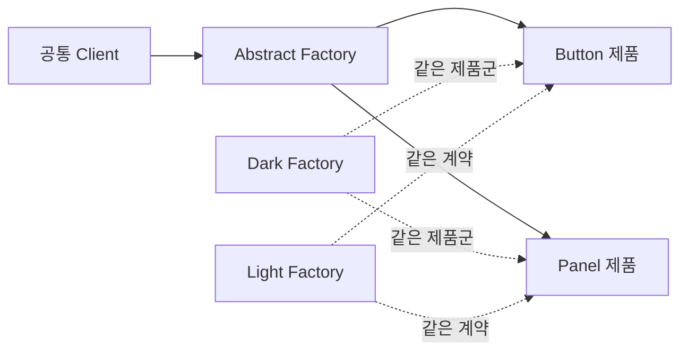

# Abstract Factory

[전체 검토 기준과 학습 순서](../../STUDY_GUIDE.md)

## 핵심 개념

Abstract Factory는 서로 관련 있고 함께 사용해야 하는 **제품군 전체를 생성하는 인터페이스**를 제공합니다. Client는 Dark 테마인지 Light 테마인지 몰라도 Button과 Panel을 같은 제품군에서 받아 호환되게 사용할 수 있습니다.



### 역할

- **Abstract Factory**: 제품군의 생성 함수 계약을 정의합니다.
- **Concrete Factory**: Dark, Light, Fantasy처럼 하나의 제품군을 생성합니다.
- **Abstract Product**: Button, Panel처럼 Client가 기대하는 공통 계약입니다.
- **Client**: 구체 Factory를 몰라도 여러 제품을 함께 사용합니다.

## Lua에서의 표현

Lua에서는 추상 클래스 대신 같은 키와 함수 계약을 가진 Factory 테이블을 사용합니다.

```lua
local function build_screen(factory)
	local button = factory.create_button()
	local panel = factory.create_panel()
	return panel:attach(button)
end
```

Factory를 교체해도 Client 코드를 바꾸지 않으려면 모든 Concrete Factory가 같은 생성 함수와 제품 계약을 지켜야 합니다. 제품 하나만 생성한다면 Factory Method나 단순 생성 함수가 더 간단합니다.

## 예제별 학습 순서

- `example_01.lua`: Dark·Light 테마에서 Button과 Panel을 함께 생성합니다.
- `example_02.lua`: Fantasy·Sci-Fi 세계관의 Hero와 Enemy를 함께 교체합니다.
- `example_03.lua`: Small·Large 화면 제품군을 공통 Screen Client에 주입합니다.
- `example_04.lua`: 실제 오디오와 Silent 오디오 제품군의 같은 계약을 비교합니다.
- `example_05.lua`: Test·Game 제품군을 같은 게임 Client에서 교체합니다.

## Factory Method와의 차이

- **Factory Method**: 보통 하나의 제품 생성 방법을 하위 Creator가 바꿉니다.
- **Abstract Factory**: 관련된 여러 제품을 하나의 제품군으로 함께 생성하고 호환성을 보장합니다.

## Lua와 LÖVE2D에서의 유용성

- Dark/Light UI 테마 전체 교체
- 모바일·데스크톱 입력 및 렌더링 제품군 교체
- 실제 리소스와 테스트용 가짜 리소스 교체
- 게임 모드별 적·아이템·보상 제품군 구성

제품군 종류가 적거나 제품이 하나라면 테이블 하나나 생성 함수가 더 읽기 쉽습니다. Factory가 반환하는 제품이 서로 섞여 호환되지 않으면 Abstract Factory의 이점이 사라지므로, 제품군 선택을 한 곳에서 하고 Client에는 Factory만 주입하는 편이 안전합니다.
