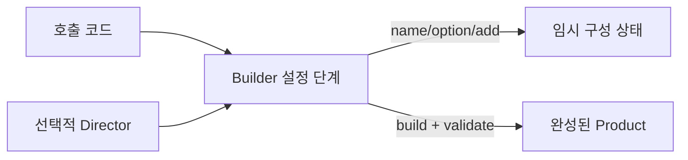

# Builder

[전체 검토 기준과 학습 순서](../../STUDY_GUIDE.md)

## 핵심 개념

Builder는 필드가 많거나 생성 순서가 복잡한 객체를 **여러 단계로 구성한 뒤 `build`에서 완성하는 패턴**입니다. 호출자는 긴 생성자 인자 목록 대신 의미 있는 설정 단계를 읽을 수 있고, Builder는 마지막에 필수값과 조합 규칙을 검증할 수 있습니다.



### 역할

- **Builder**: 설정값을 단계별로 모으고 Product를 완성합니다.
- **Product**: `build` 이후 호출자가 사용하는 최종 객체입니다.
- **Director**: 자주 쓰는 구성 절차를 묶을 때 선택적으로 사용합니다.
- **Client**: Builder를 직접 설정하거나 Director에 구성을 요청합니다.

## Lua에서의 표현

Lua에서는 Builder가 내부 임시 테이블을 클로저로 보관하고, 설정 메서드는 Builder 자신을 반환해 체이닝할 수 있습니다.

```lua
local function new_builder()
	local draft = {}
	local builder = {}
	function builder:name(value) draft.name = value; return self end
	function builder:build() return { name = draft.name } end
	return builder
end
```

`build`는 내부 draft를 그대로 노출할지 새 Product 테이블을 만들지 결정해야 합니다. Product가 완성된 뒤 Builder를 다시 바꿔도 Product가 변하지 않아야 한다면 복사본을 반환하는 편이 안전합니다.

## 예제별 학습 순서

- `example_01.lua`: 체이닝 설정과 `build` 결과를 분리한 최소 Builder입니다.
- `example_02.lua`: 화면 크기 선택값과 기본값을 단계적으로 구성합니다.
- `example_03.lua`: 필수 체력과 선택적 속도를 검증합니다.
- `example_04.lua`: Query의 필터와 제한 조건을 구성합니다.
- `example_05.lua`: 반복 `enemy` 단계로 Level 목록을 구성합니다.

## 다른 패턴과의 차이

- **Builder와 Factory Method**: Factory Method는 어떤 제품을 만들지의 생성 책임을 교체하고, Builder는 하나의 복잡한 제품을 어떤 단계로 조립할지에 집중합니다.
- **Builder와 Prototype**: Prototype은 기존 객체를 복제하고, Builder는 설정을 새로 모아 객체를 만듭니다.
- **Builder와 테이블 리터럴**: 필드가 적고 검증이 필요 없다면 `{ width = 800, height = 600 }`이 더 명확합니다.

## Lua와 LÖVE2D에서의 유용성

- 선택적 옵션이 많은 적·아이템·레벨 데이터 구성
- 타일맵, UI, 파티클 설정을 단계별로 작성
- 테스트용 객체와 실제 객체의 기본 설정을 분리
- 복잡한 저장 요청이나 네트워크 메시지 생성

Builder 객체를 재사용하면 이전 설정이 다음 Product에 섞일 수 있습니다. 기본값, 필수 필드, `nil` 허용 여부를 `build`에서 검증하고, Product 생성 후 draft와 참조를 공유할지 명확히 해야 합니다. 단순한 데이터에는 Builder를 도입하지 않는 것이 Lua답습니다.
