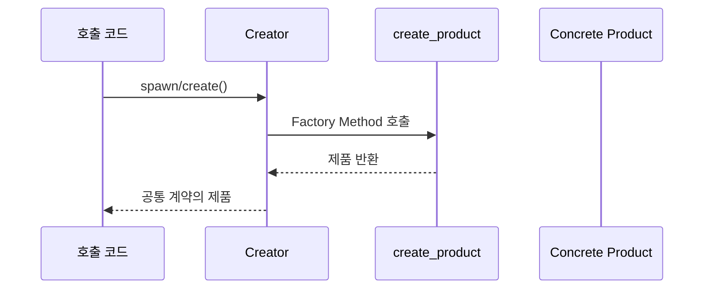

# Factory Method

[전체 검토 기준과 학습 순서](../../STUDY_GUIDE.md)

## 핵심 개념

Factory Method는 객체 생성 코드를 사용하는 코드에서 분리하고, **공통 생성 흐름은 유지한 채 구체 제품을 만드는 메서드만 바꾸는 패턴**입니다.

### 역할

- **Creator**: 제품을 만든 뒤 공통 후처리를 수행하는 흐름을 소유합니다.
- **Factory Method**: 실제 제품 생성을 하위 Creator나 주입된 함수에 맡깁니다.
- **Concrete Creator**: 어떤 Concrete Product를 만들지 결정합니다.
- **Product**: 호출 코드가 사용하는 공통 계약을 제공합니다.

전통적인 구현에서는 Creator를 상속한 Concrete Creator가 Factory Method를 오버라이드합니다. Lua에서는 상속 대신 메타테이블, Creator 생성 함수, 또는 생성 함수 주입으로 같은 의도를 표현할 수 있습니다.

Lua에는 클래스 상속이 필수는 아니므로 두 가지 표현을 구분합니다.

- 명시적 Factory Method: Creator 테이블의 `create_product`를 구체 Creator가 구현하고 공통 흐름이 호출함
- 실용적 Lua 변형: Creator가 생성 함수를 주입받아 공통 후처리와 생성 책임을 분리함

## 읽는 포인트

- 호출 코드는 생성 결과의 공통 인터페이스만 사용합니다.
- Creator와 Product의 책임을 구분합니다.
- 모든 예제는 `create_*` 메서드와 공통 생성 흐름을 분리합니다.
- 제품 종류가 많아질 때 조건문을 호출 코드에 추가하지 않고 Concrete Creator를 추가하는 방향을 보여줍니다.

## 주의

단순 조건문 하나를 Factory Method라고 부르는 것보다, 생성 책임과 사용 책임이 실제로 분리되는지를 먼저 확인합니다. 제품 종류를 선택하는 코드와 제품을 사용하는 코드가 같은 곳에 있다면 아직 분리가 덜 된 것입니다.

## 예제별 학습 순서

- `example_01.lua`: 메타테이블 기반 Concrete Creator가 Enemy를 생성합니다.
- `example_02.lua`: 알림 Creator가 제품 생성 후 공통 알림 형식을 제공합니다.
- `example_03.lua`: 도형 Creator가 구체 도형과 공통 면적 계약을 생성합니다.
- `example_04.lua`: Parser Creator가 입력 종류별 Parser 제품을 생성합니다.
- `example_05.lua`: Weapon Creator가 무기 제품을 생성하고 공통 장비 흐름을 사용합니다.

## Simple Factory와의 차이

Simple Factory는 하나의 함수가 종류를 보고 제품을 선택해 생성합니다. Factory Method는 Creator의 공통 흐름은 유지하면서 구체 Creator가 제품 생성 방법을 바꿉니다. Lua에서는 상속 대신 메타테이블, 생성자 테이블, 또는 함수 주입으로 이 의도를 표현할 수 있습니다.

## Lua와 LÖVE2D에서의 유용성

- 적, 아이템, 투사체, 이펙트 생성 흐름을 공통화할 때
- 파일 형식별 Loader나 입력 장치별 Adapter를 생성할 때
- 테스트 Creator와 실제 Creator를 교체할 때
- 제품 생성 후 공통 초기화·등록·로깅을 항상 수행해야 할 때

제품이 하나뿐이거나 생성 분기가 단순하면 생성 함수 하나가 더 읽기 쉽습니다. Factory Method를 도입했다면 Creator의 공통 흐름과 Product의 계약이 실제로 존재해야 하며, 단순히 `kind`를 받아 조건문으로 반환하는 함수는 Simple Factory로 분류하는 편이 정확합니다.
