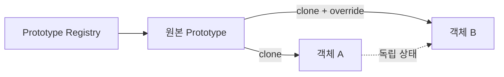
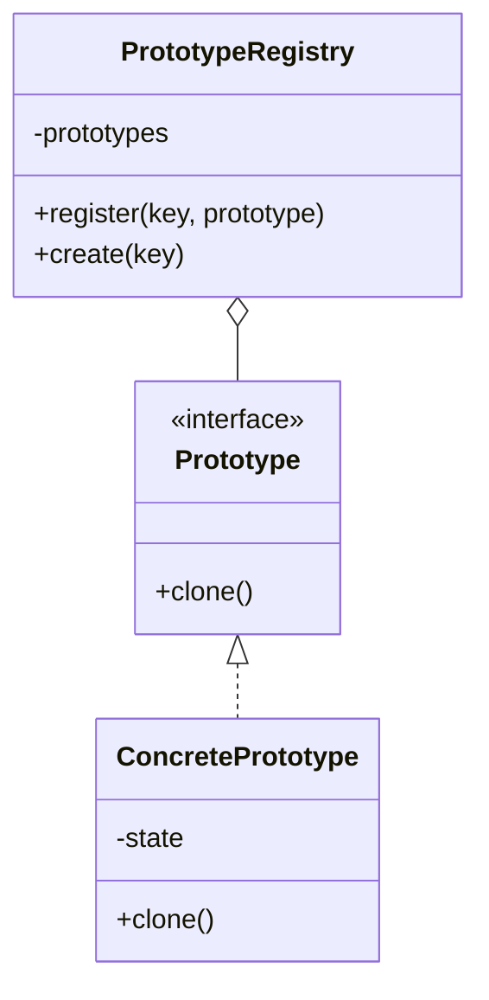

# Prototype

[전체 검토 기준과 학습 순서](../../STUDY_GUIDE.md)

## 핵심 개념

Prototype은 완성에 가까운 기존 객체를 복제하고 필요한 부분만 바꿔 비슷한 객체를 빠르게 생성하는 패턴입니다. 생성자에 모든 설정을 다시 전달하는 대신, 템플릿의 기본값·행동·복잡한 내부 구조를 재사용합니다.

## 해결하려는 문제

복잡한 적·아이템·이펙트를 만들 때 매번 구체 클래스와 긴 초기화 목록을 알아야 하면 생성 코드가 클래스에 결합되고 설정이 여러 곳에 반복됩니다. 외부에서 모든 필드를 복사하면 private 상태나 내부 참조를 놓칠 수도 있습니다.

Prototype은 복제할 객체가 자신의 상태를 복사하도록 `clone` 계약을 제공합니다. Client는 구체 클래스나 내부 필드를 몰라도 Prototype 인터페이스로 복제할 수 있고, 미리 구성한 템플릿을 Registry에서 골라 위치·이름 같은 인스턴스 값만 덮어쓸 수 있습니다.





### 역할

- **Prototype**: 복제할 기본 상태와 행동을 가진 원본 객체입니다.
- **Clone operation**: 원본을 새 객체로 복사합니다.
- **Client**: Prototype을 선택하고 위치·이름 같은 개별 값을 덮어씁니다.
- **Registry**: 이름으로 여러 Prototype을 보관하고 선택하는 저장소입니다.

Prototype의 `clone`은 단순한 표 복사가 아니라 해당 객체가 자신의 내부 구조를 일관되게 복사하는 계약입니다. 복제본의 런타임 상태(위치, 체력, 소유자 등)는 원본과 독립적이어야 하며, 공유해도 되는 불변 정의 데이터와 복사해야 하는 가변 인스턴스 데이터를 구분해야 합니다.

## Lua에서의 표현

Lua에서는 테이블 복사 함수, `clone` 메서드, 또는 `__index` 메타테이블 위임으로 Prototype을 표현할 수 있습니다.

```lua
local function clone(source)
	local copy = {}
	for key, value in pairs(source) do copy[key] = value end
	return copy
end
```

위 코드는 1단계 얕은 복사입니다. 중첩 테이블은 참조만 복사하므로, 복제본의 목록이나 설정을 독립적으로 바꾸려면 필요한 하위 테이블도 복사해야 합니다. 함수와 메타테이블을 복사할지, 공유할지는 Prototype의 계약으로 정해야 합니다.

## 도입 절차

1. 반복 생성되며 설정 비용이 크거나 여러 프리셋이 필요한 객체를 찾습니다.
2. 공통 `clone` 계약을 정하고, 복제본과 원본에서 독립되어야 할 필드를 구분합니다.
3. 각 Prototype이 자신의 상태를 복사하도록 `clone`을 구현합니다.
4. 중첩 테이블은 필요한 깊이까지 복사하고, 함수·메타테이블·외부 리소스는 공유 또는 재연결 정책을 정합니다.
5. 자주 쓰는 프리셋이 많으면 Registry에 등록하고, Client는 키로 Prototype을 선택해 복제합니다.
6. 복제 후 위치·ID·소유자·현재 HP처럼 인스턴스별 값을 덮어씁니다.

Registry는 단순한 `이름 -> Prototype` 맵일 수도 있고, 태그·진영·등급 같은 조건으로 Prototype을 찾는 별도 생성 모듈이 될 수도 있습니다.

## 예제별 학습 순서

- `example_01.lua`: 중첩 Stats를 독립 복사해 원본과 복제본을 분리합니다.
- `example_02.lua`: 발사체 Prototype에서 위치만 덮어써 새 탄환을 만듭니다.
- `example_03.lua`: 아이템 Prototype의 공통 속성을 복제합니다.
- `example_04.lua`: 배열을 깊게 복사해 태그 변경이 원본에 영향을 주지 않게 합니다.
- `example_05.lua`: Registry에서 Prototype을 선택해 여러 위치에 객체를 생성합니다.

## 다른 패턴과의 차이

- **Prototype과 Factory Method**: Factory Method는 생성 방법을 교체하고, Prototype은 이미 구성된 객체를 복제합니다.
- **Prototype과 Builder**: Builder는 설정을 단계별로 조립하고, Prototype은 기존 설정을 재사용합니다.
- **Prototype과 Flyweight**: Prototype은 독립적인 새 객체를 만들고, Flyweight는 공유 가능한 같은 정의를 재사용합니다.
- **Prototype과 Memento**: Prototype은 새 독립 객체를 만들고, Memento는 기존 객체를 과거 상태로 복원합니다.

## 게임 개발 시나리오

비슷한 객체를 원형에서 복제해 대량 생성하거나 조금씩 변형할 때 Prototype이 유용합니다.

- **웨이브 대량 스폰**: 잘 설정된 적 원형을 복제해 수십 마리를 만들고 위치와 체력 배수만 조정해, 매번 처음부터 구성하지 않습니다.
- **총알/파티클 복제**: 기준 총알 프로토타입을 복제해 방향·속도만 바꿔 발사하므로 초기화 비용을 줄입니다.
- **레벨 템플릿 변형**: 기본 스테이지 템플릿을 복제한 뒤 스폰 지점이나 장애물을 바꿔 변주된 스테이지를 빠르게 생성합니다.
- **유닛/카드 카탈로그**: 원형 유닛을 복제해 개별 인스턴스의 버프·레벨만 변경합니다.

## Lua와 LÖVE2D에서의 유용성

- 적·아이템·탄환의 기본 템플릿을 대량 복제할 때
- 레벨 데이터나 UI 위젯의 기본 설정을 재사용할 때
- 스폰 종류별 복잡한 초기 상태를 Registry로 관리할 때
- 테스트 객체를 실제 객체 템플릿에서 파생할 때

테이블을 단순히 대입하면 복제가 아니라 같은 객체 참조를 공유합니다. 중첩 테이블을 깊게 복사할 범위를 정하고, 순환 참조·userdata·함수·메타테이블을 어떻게 처리할지 결정해야 합니다. 객체 수가 적고 생성자가 단순하면 일반 생성 함수가 더 명확합니다.

## 장점과 비용

- 구체 클래스에 결합하지 않고 공통 `clone` 계약으로 객체를 복제할 수 있습니다.
- 복잡한 초기화와 프리셋 설정을 한 번만 수행하고 대량 생성에 재사용할 수 있습니다.
- 상속으로 프리셋별 하위 클래스를 늘리는 대신 Registry와 Prototype 조합을 사용할 수 있습니다.
- 순환 참조와 외부 리소스가 있는 객체의 복제는 어렵고, 깊은 복사는 메모리와 CPU 비용을 발생시킵니다.
- 원본 Prototype을 실수로 변경하면 이후 생성되는 모든 객체의 기본값이 바뀔 수 있으므로 Registry의 Prototype을 읽기 전용 설정으로 관리하는 편이 안전합니다.

게임에서는 적 웨이브나 파티클처럼 생성 빈도가 높은 객체에 적합하지만, 렌더링 리소스·물리 바디·코루틴을 그대로 복제할 수 있는지는 엔진 계약을 확인해야 합니다. 복제 후 월드 등록이나 고유 ID 발급 같은 런타임 초기화 단계를 별도로 수행해야 할 수 있습니다.
