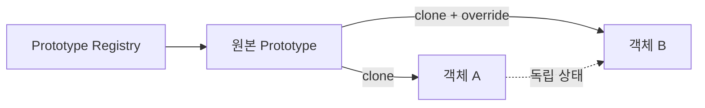

# Prototype

[전체 검토 기준과 학습 순서](../../STUDY_GUIDE.md)

## 핵심 개념

Prototype은 완성에 가까운 기존 객체를 복제하고 필요한 부분만 바꿔 비슷한 객체를 빠르게 생성하는 패턴입니다. 생성자에 모든 설정을 다시 전달하는 대신, 템플릿의 기본값·행동·복잡한 내부 구조를 재사용합니다.



### 역할

- **Prototype**: 복제할 기본 상태와 행동을 가진 원본 객체입니다.
- **Clone operation**: 원본을 새 객체로 복사합니다.
- **Client**: Prototype을 선택하고 위치·이름 같은 개별 값을 덮어씁니다.
- **Registry**: 이름으로 여러 Prototype을 보관하고 선택하는 저장소입니다.

## Lua에서의 표현

Lua에서는 테이블 복사 함수, `clone` 메서드, 또는 `__index` 메타테이블 위임으로 Prototype을 표현할 수 있습니다.

```lua
local function clone(source)
	local copy = {}
	for key, value in pairs(source) do copy[key] = value end
	return copy
end
```

위 코드는 1단계 얕은 복사입니다. 중첩 테이블은 참조만 복사하므로, 복제본의 목록이나 설정을 독립적으로 바꾸려면 필요한 하위 테이블도 복사해야 합니다. 함수와 메타테이블을 복사할지, 공유할지는 Prototype의 계약으로 정해야 합니다.

## 예제별 학습 순서

- `example_01.lua`: 중첩 Stats를 독립 복사해 원본과 복제본을 분리합니다.
- `example_02.lua`: 발사체 Prototype에서 위치만 덮어써 새 탄환을 만듭니다.
- `example_03.lua`: 아이템 Prototype의 공통 속성을 복제합니다.
- `example_04.lua`: 배열을 깊게 복사해 태그 변경이 원본에 영향을 주지 않게 합니다.
- `example_05.lua`: Registry에서 Prototype을 선택해 여러 위치에 객체를 생성합니다.

## 다른 패턴과의 차이

- **Prototype과 Factory Method**: Factory Method는 생성 방법을 교체하고, Prototype은 이미 구성된 객체를 복제합니다.
- **Prototype과 Builder**: Builder는 설정을 단계별로 조립하고, Prototype은 기존 설정을 재사용합니다.
- **Prototype과 Flyweight**: Prototype은 독립적인 새 객체를 만들고, Flyweight는 공유 가능한 같은 정의를 재사용합니다.

## Lua와 LÖVE2D에서의 유용성

- 적·아이템·탄환의 기본 템플릿을 대량 복제할 때
- 레벨 데이터나 UI 위젯의 기본 설정을 재사용할 때
- 스폰 종류별 복잡한 초기 상태를 Registry로 관리할 때
- 테스트 객체를 실제 객체 템플릿에서 파생할 때

테이블을 단순히 대입하면 복제가 아니라 같은 객체 참조를 공유합니다. 중첩 테이블을 깊게 복사할 범위를 정하고, 순환 참조·userdata·함수·메타테이블을 어떻게 처리할지 결정해야 합니다. 객체 수가 적고 생성자가 단순하면 일반 생성 함수가 더 명확합니다.
