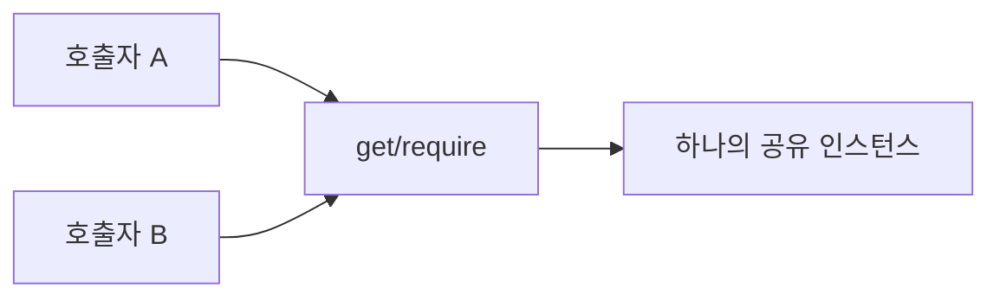

# Singleton

[전체 검토 기준과 학습 순서](../../STUDY_GUIDE.md)

## 핵심 개념

Singleton은 한 프로세스나 특정 범위에서 **인스턴스를 하나만 만들고, 그 인스턴스에 접근할 방법을 제공하는 패턴**입니다. 단순히 테이블 하나를 전역으로 두는 것과 달리 생성 횟수와 접근 경계를 관리하는 것이 목적입니다.



### 역할

- **Singleton module/class**: 인스턴스 생성 시점을 관리하고 같은 인스턴스를 반환합니다.
- **Client**: 접근 함수를 사용하지만 생성자를 직접 호출하지 않습니다.
- **Shared service/state**: Logger, Config, EventBus처럼 하나여야 하는 자원입니다.

## Lua에서의 표현

Lua에서는 별도의 Singleton 클래스를 만들기보다 모듈이 테이블을 반환하고 `require`의 모듈 캐시를 이용하는 방식이 자연스럽습니다.

```lua
-- config.lua
local config = { width = 800 }
return config

-- 두 파일에서 require하면 같은 모듈 값을 받음
local config = require("config")
```

이 폴더의 독립 실행 예제는 외부 파일 모듈을 만들지 않고, 모듈 내부 상태와 지연 생성 함수를 직접 보여줍니다.

## 예제별 학습 순서

- `example_01.lua`: Logger 인스턴스를 지연 생성하고 같은 참조를 반환합니다.
- `example_02.lua`: Config 모듈의 비공개 값에 공유 접근자를 제공합니다.
- `example_03.lua`: 하나의 EventBus에 여러 시스템이 이벤트를 등록합니다.
- `example_04.lua`: 여러 호출자가 같은 Metrics 저장소를 갱신합니다.
- `example_05.lua`: UI와 메뉴 호출자가 같은 GameState를 확인합니다.

## 다른 패턴과의 차이

- **Singleton과 전역 변수**: 전역 변수는 접근과 변경이 무제한일 수 있지만 Singleton은 생성·접근 API를 제한할 수 있습니다. 그래도 공유 상태의 위험은 남습니다.
- **Singleton과 모듈**: Lua에서는 모듈 캐시 자체가 Singleton 역할을 하는 경우가 많아 별도 Singleton 구현이 중복일 수 있습니다.
- **Singleton과 Dependency Injection**: DI는 필요한 객체를 호출자에게 전달해 테스트와 교체를 쉽게 하고, Singleton은 접근을 전역적으로 숨기는 방향입니다.

## Lua와 LÖVE2D에서의 유용성

- 하나의 설정 저장소, EventBus, 리소스 캐시, 로거
- 여러 게임 시스템이 반드시 같은 저장·오디오 서비스에 접근해야 할 때
- `require` 모듈의 상태를 한 애플리케이션 범위에서 공유할 때

Singleton은 테스트 간 상태가 남고 실행 순서에 의존하는 문제를 만들기 쉽습니다. 테스트용 인스턴스를 교체할 수 없으면 DI나 팩토리로 바꾸는 편이 낫습니다. 싱글턴이 정말 하나여야 하는지, 단순히 편리해서 공유하려는 것은 아닌지 먼저 확인합니다.
