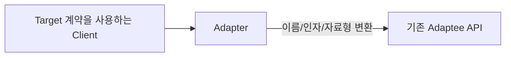
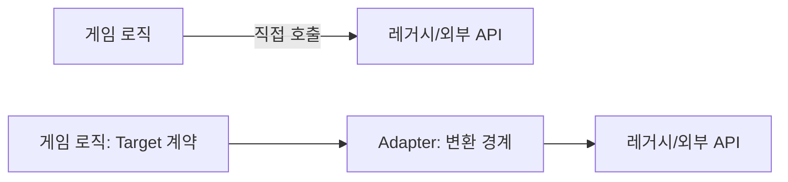

# Adapter

[전체 검토 기준과 학습 순서](../../STUDY_GUIDE.md)

## 핵심 개념

Adapter는 호출 코드가 기대하는 **Target 인터페이스와 기존 객체(Adaptee)의 인터페이스가 다를 때 그 차이를 한 곳에서 변환하는 패턴**입니다. 기존 객체를 수정하지 않고 새 코드와 연결할 수 있습니다.

## 해결하려는 문제

게임 코드가 입력, 오디오, 렌더링, 저장 같은 외부 모듈의 API를 직접 호출하면, 라이브러리 교체나 플랫폼별 API 차이가 게임 로직 곳곳으로 퍼집니다. 레거시 모듈을 수정할 수 없거나 수정하면 기존 사용자를 깨뜨릴 위험이 있을 때도 같은 문제가 생깁니다.

Adapter는 기존 서비스를 바꾸지 않고 게임 코드가 기대하는 계약을 제공합니다. 호출을 받은 Adapter가 메서드 이름, 인자 순서, 자료형, 단위, 오류 규칙을 변환한 뒤 Adaptee에 위임합니다.





### 역할

- **Target**: Client가 기대하는 함수 이름, 인자, 반환값 계약입니다.
- **Adapter**: Target 호출을 Adaptee 호출로 변환합니다.
- **Adaptee**: 이미 존재하지만 Client와 계약이 맞지 않는 객체나 모듈입니다.
- **Client**: Adapter 뒤의 구체적인 Adaptee를 몰라도 Target 계약을 사용합니다.

## Object Adapter와 Class Adapter

- **Object Adapter**는 Adaptee 객체를 필드로 감싸고 Target 메서드를 구현합니다. 합성을 사용하므로 런타임에 다른 Adaptee를 주입하거나 테스트용 가짜 객체로 바꾸기 쉽습니다.
- **Class Adapter**는 상속으로 Target과 Adaptee의 인터페이스를 함께 얻습니다. 다중 상속이 필요한 언어에서 주로 설명되며, Lua에는 일반적인 다중 상속 클래스 모델이 없으므로 직접 옮기기보다 Object Adapter를 사용하는 편이 자연스럽습니다.

이 저장소의 모든 예제는 함수 또는 테이블을 감싸는 Object Adapter 형태입니다.

## Lua에서의 표현

Lua에서는 작은 래퍼 함수나 Target 메서드를 가진 테이블로 Adapter를 만듭니다.

```lua
local adapter = {
	play = function(name)
		return legacy_audio:playSound(name)
	end
}
```

변환해야 하는 것은 메서드 이름뿐일 수도 있고, 단위·인자 순서·반환 자료형·오류 규칙일 수도 있습니다. Adapter는 이 변환만 담당하고, 새로운 기능을 덧붙이는 책임까지 가져서는 안 됩니다.

## 도입 절차

1. 게임 코드가 사용할 Target 계약을 먼저 정합니다. 예를 들어 `input.is_pressed(key)`나 `audio.play(name)`처럼 게임 도메인에 맞는 이름과 반환 규칙을 정합니다.
2. 직접 수정하기 어렵거나 교체 가능성이 있는 Adaptee의 실제 계약을 기록합니다.
3. Adaptee를 감싸는 Adapter를 만들고 Target의 각 메서드를 구현합니다.
4. Adapter 안에서 필요한 이름·인자·자료형·단위 변환만 수행하고 실제 작업은 Adaptee에 위임합니다.
5. Client가 구체 Adaptee가 아닌 Target 계약만 사용하도록 호출부를 바꿉니다.
6. 변환 실패, `nil`, 단위 정밀도, 플랫폼별 오류를 Adapter의 계약으로 테스트합니다.

## 예제별 학습 순서

- `example_01.lua`: `getKey`를 `is_pressed`로 변환하는 함수 Adapter입니다.
- `example_02.lua`: 게임용 `play(name, options)`를 레거시 `playSound` 시그니처와 0~100 볼륨으로 변환합니다.
- `example_03.lua`: CSV 행과 문자열 숫자를 게임 아이템 객체로 변환하고 잘못된 행을 거부합니다.
- `example_04.lua`: 위치·크기 사각형을 레거시 좌표 경계(`left, top, right, bottom`)로 변환합니다.
- `example_05.lua`: 도 단위 값을 라디안 단위 API로 변환하고 숫자 계약을 검증합니다.

`example_01.lua`와 `example_02.lua`는 플랫폼 입력·오디오 교체 경계를, `example_03.lua`는 CSV 같은 외부 데이터 형식을 게임 아이템 모델로 바꾸는 경계를 보여 줍니다. `example_05.lua`의 각도 단위 변환처럼 물리·렌더링·애니메이션에서 단위가 섞이는 문제도 Adapter로 한 곳에 가둘 수 있습니다.

## 다른 패턴과의 차이

- **Adapter와 Decorator**: Adapter는 호환되지 않는 계약을 변환하고, Decorator는 같은 계약을 유지하며 기능을 추가합니다.
- **Adapter와 Facade**: Adapter는 보통 하나의 기존 인터페이스를 Target에 맞추고, Facade는 여러 하위 시스템의 복잡한 흐름을 단순화합니다.
- **Adapter와 Bridge**: Adapter는 이미 존재하는 두 계약을 연결하고, Bridge는 처음부터 추상화와 구현을 독립적으로 설계합니다.
- **Adapter와 Proxy**: Proxy는 보통 같은 인터페이스를 유지하면서 접근 제어·캐시·지연 로딩을 추가하고, Adapter는 호환되지 않는 인터페이스를 바꿉니다.

## 게임 개발 시나리오

서로 맞지 않는 인터페이스를 게임 내부가 기대하는 형태로 맞출 때 Adapter가 유용합니다.

- **입력 통일**: 키보드·터치·게임패드가 제각각 다른 이벤트를 발생시켜도, 공통 입력 인터페이스(`getMoveDirection`, `isFirePressed`)로 감싸 게임 로직이 입력 장치를 구분하지 않게 합니다.
- **외부 라이브러리 래핑**: 타사 물리·사운드 SDK를 게임 내부 API 모양으로 감싸, 나중에 라이브러리를 교체해도 호출부를 바꾸지 않습니다.
- **구버전 세이브 호환**: 이전 버전 세이브 포맷을 어댑터로 감싸 신버 로더가 읽을 수 있는 구조로 변환합니다.
- **광고/결제 SDK**: 플랫폼마다 다른 광고·인앱 결제 SDK를 통일된 인터페이스로 맞춰 호출합니다.

## Lua와 LÖVE2D에서의 유용성

- 레거시 입력·오디오·렌더링 모듈을 새 게임 코드에 연결할 때
- 외부 라이브러리의 자료형이나 단위 체계를 게임 내부 계약으로 바꿀 때
- 플랫폼별 API 차이를 공통 인터페이스로 감쌀 때
- 테스트용 가짜 서비스와 실제 서비스를 같은 Target 계약으로 연결할 때

게임에서는 입력 장치, 플랫폼 오디오, 렌더러, 저장 포맷, 네트워크 SDK처럼 교체 가능성이 높은 외부 경계에 특히 유용합니다. 다만 프레임마다 호출되는 경로에서는 Adapter 안에서 매번 테이블을 새로 만들거나 문자열을 변환하지 말고, 초기화 시 변환하거나 공통 포맷으로 정규화해 할당과 비용을 확인합니다.

Adapter가 변환을 넘어 정책·캐시·로깅까지 맡으면 Proxy나 Decorator와 책임이 섞입니다. 변환 실패, `nil`, 단위 변환의 정밀도, 호출 인자 순서를 명확히 정의하고, Client 코드 곳곳에서 같은 변환을 반복하지 않도록 한 곳에 둡니다.
