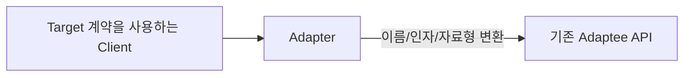

# Adapter

[전체 검토 기준과 학습 순서](../../STUDY_GUIDE.md)

## 핵심 개념

Adapter는 호출 코드가 기대하는 **Target 인터페이스와 기존 객체(Adaptee)의 인터페이스가 다를 때 그 차이를 한 곳에서 변환하는 패턴**입니다. 기존 객체를 수정하지 않고 새 코드와 연결할 수 있습니다.



### 역할

- **Target**: Client가 기대하는 함수 이름, 인자, 반환값 계약입니다.
- **Adapter**: Target 호출을 Adaptee 호출로 변환합니다.
- **Adaptee**: 이미 존재하지만 Client와 계약이 맞지 않는 객체나 모듈입니다.
- **Client**: Adapter 뒤의 구체적인 Adaptee를 몰라도 Target 계약을 사용합니다.

## Lua에서의 표현

Lua에서는 작은 래퍼 함수나 Target 메서드를 가진 테이블로 Adapter를 만듭니다.

```lua
local adapter = {
	play = function(name)
		return legacy_audio:playSound(name)
	end
}
```

변환해야 하는 것은 메서드 이름뿐일 수도 있고, 단위·인자 순서·반환 자료형·오류 규칙일 수도 있습니다. Adapter는 이 변환만 담당하고, 새로운 기능을 덧붙이는 책임까지 가져서는 안 됩니다.

## 예제별 학습 순서

- `example_01.lua`: `getKey`를 `is_pressed`로 변환하는 함수 Adapter입니다.
- `example_02.lua`: 기존 `playSound` 메서드를 새 `play` 계약으로 감쌉니다.
- `example_03.lua`: CSV 행과 문자열 숫자를 게임 아이템 객체로 변환합니다.
- `example_04.lua`: 사각형 크기 인자 이름과 호출 계약을 변환합니다.
- `example_05.lua`: 도 단위 값을 라디안 단위 API로 변환합니다.

## 다른 패턴과의 차이

- **Adapter와 Decorator**: Adapter는 호환되지 않는 계약을 변환하고, Decorator는 같은 계약을 유지하며 기능을 추가합니다.
- **Adapter와 Facade**: Adapter는 보통 하나의 기존 인터페이스를 Target에 맞추고, Facade는 여러 하위 시스템의 복잡한 흐름을 단순화합니다.
- **Adapter와 Bridge**: Adapter는 이미 존재하는 두 계약을 연결하고, Bridge는 처음부터 추상화와 구현을 독립적으로 설계합니다.

## Lua와 LÖVE2D에서의 유용성

- 레거시 입력·오디오·렌더링 모듈을 새 게임 코드에 연결할 때
- 외부 라이브러리의 자료형이나 단위 체계를 게임 내부 계약으로 바꿀 때
- 플랫폼별 API 차이를 공통 인터페이스로 감쌀 때
- 테스트용 가짜 서비스와 실제 서비스를 같은 Target 계약으로 연결할 때

Adapter가 변환을 넘어 정책·캐시·로깅까지 맡으면 Proxy나 Decorator와 책임이 섞입니다. 변환 실패, `nil`, 단위 변환의 정밀도, 호출 인자 순서를 명확히 정의하고, Client 코드 곳곳에서 같은 변환을 반복하지 않도록 한 곳에 둡니다.
