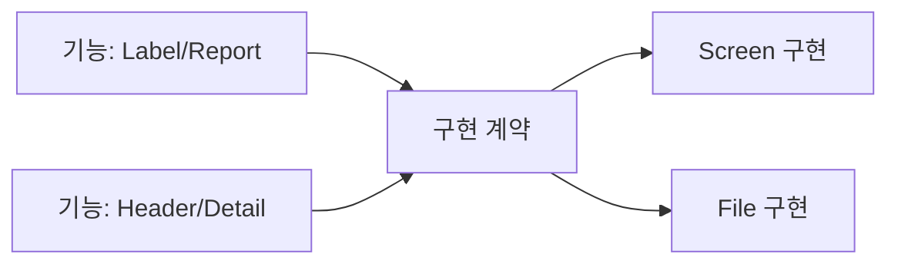

# Bridge

[전체 검토 기준과 학습 순서](../../STUDY_GUIDE.md)

## 핵심 개념

Bridge는 상위 기능인 **Abstraction**과 실제 동작을 담당하는 **Implementation**을 분리해, 두 축을 독립적으로 확장하고 교체하는 패턴입니다. 상속으로 기능 종류와 구현 종류를 조합하면 클래스 수가 폭발할 때 특히 유용합니다.



### 역할

- **Abstraction**: Client가 사용하는 고수준 기능과 구현 위임을 보관합니다.
- **Refined Abstraction**: Label, Report, Spell처럼 기능 축의 변형입니다.
- **Implementor**: Renderer, Storage, Device처럼 저수준 구현의 공통 계약입니다.
- **Concrete Implementor**: Screen/File, JSON/XML처럼 구현 축의 변형입니다.

## Lua에서의 표현

Lua에서는 Abstraction 테이블이 구현 객체를 필드로 보관하고, 같은 메서드 계약을 가진 테이블을 주입합니다.

```lua
local report = { format = json_encoder }
function report:export(value)
	return self.format:encode(value)
end
```

Bridge의 핵심은 구현 객체 하나를 바꾸는 데 있지 않습니다. 기능 종류를 추가해도 기존 구현을 재사용하고, 구현 종류를 추가해도 기존 기능을 재사용할 수 있어야 두 축이 독립적이라고 볼 수 있습니다.

## 예제별 학습 순서

- `example_01.lua`: Label 기능이 Screen·Console 텍스트 구현을 사용할 수 있습니다.
- `example_02.lua`: Report 기능과 JSON·XML 포맷 구현을 독립적으로 조합합니다.
- `example_03.lua`: Controller 기능과 Keyboard·Gamepad 입력 구현을 분리합니다.
- `example_04.lua`: Snapshot 기능과 Low·High 품질 저장 구현을 교체합니다.
- `example_05.lua`: Spell 기능과 Fire·Ice 원소 구현을 조합합니다.

## 다른 패턴과의 차이

- **Bridge와 Adapter**: Adapter는 이미 존재하는 호환되지 않는 계약을 연결하고, Bridge는 두 변경 축을 처음부터 독립적으로 설계합니다.
- **Bridge와 Strategy**: Strategy는 한 알고리즘을 교체하는 데 초점을 두고, Bridge는 고수준 기능과 저수준 구현의 두 계층을 분리합니다.
- **Bridge와 Decorator**: Decorator는 같은 계약을 감싸 기능을 추가하고, Bridge는 기능과 구현을 나란히 확장합니다.

## Lua와 LÖVE2D에서의 유용성

- 렌더링 기능과 Screen·Canvas·Console 구현 분리
- 저장 기능과 파일·메모리·네트워크 저장소 분리
- 입력 처리와 Keyboard·Gamepad·AI 입력 분리
- Spell·무기·UI 같은 기능 축과 플랫폼별 구현 축 분리

변경 축이 하나뿐이면 단순 위임이나 Strategy가 더 읽기 쉽습니다. 구현 계약을 너무 넓게 만들면 모든 구현이 불필요한 메서드를 갖게 되므로 작은 계약을 정의하고, 구현 객체의 수명과 교체 시점을 명확히 해야 합니다.
