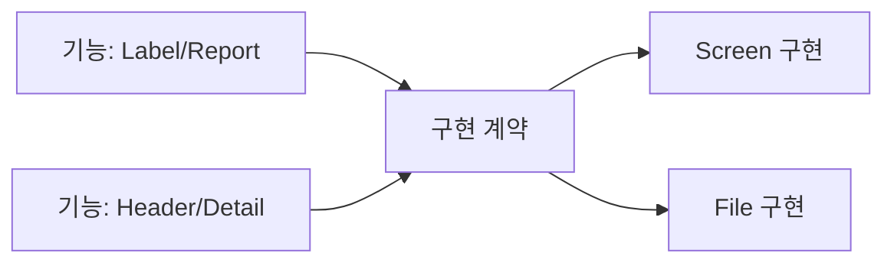
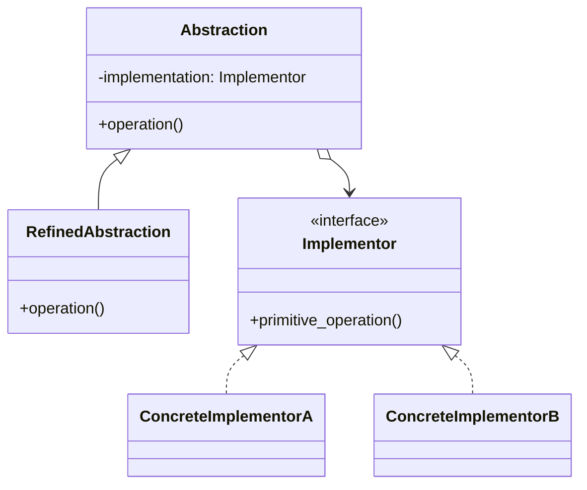

# Bridge

[전체 검토 기준과 학습 순서](../../STUDY_GUIDE.md)

## 핵심 개념

Bridge는 상위 기능인 **Abstraction**과 실제 동작을 담당하는 **Implementation**을 분리해, 두 축을 독립적으로 확장하고 교체하는 패턴입니다. 상속으로 기능 종류와 구현 종류를 조합하면 클래스 수가 폭발할 때 특히 유용합니다.

## 쉽게 이해하기: 두 축을 분리하기

Bridge를 “다리”라고 생각하기 전에, 먼저 두 개의 독립적인 질문을 찾습니다.

- **무엇을 할까?**: Label, HealthBar, Report, Spell처럼 Client가 사용하는 기능 축
- **어떻게 할까?**: Screen, Console, JSON, XML처럼 실제 작업을 수행하는 구현 축

예를 들어 Label과 HealthBar를 Screen과 Console에서 모두 출력해야 한다면 상속만 사용할 때 `ScreenLabel`, `ConsoleLabel`, `ScreenHealthBar`, `ConsoleHealthBar` 네 조합이 필요합니다. Bridge는 기능 객체가 구현 객체를 보관하게 하므로 `Label + Screen`, `Label + Console`, `HealthBar + Screen`, `HealthBar + Console`을 조합으로 만들 수 있습니다.





### 역할

- **Abstraction**: Client가 사용하는 고수준 기능과 구현 위임을 보관합니다.
- **Refined Abstraction**: Label, Report, Spell처럼 기능 축의 변형입니다.
- **Implementor**: Renderer, Storage, Device처럼 저수준 구현의 공통 계약입니다.
- **Concrete Implementor**: Screen/File, JSON/XML처럼 구현 축의 변형입니다.

## Lua에서의 표현

Lua에서는 Abstraction 테이블이 구현 객체를 필드로 보관하고, 같은 메서드 계약을 가진 테이블을 주입합니다.

```lua
local report = { format = json_encoder }
function report:export(value)
	return self.format:encode(value)
end
```

Bridge의 핵심은 구현 객체 하나를 바꾸는 데 있지 않습니다. 기능 종류를 추가해도 기존 구현을 재사용하고, 구현 종류를 추가해도 기존 기능을 재사용할 수 있어야 두 축이 독립적이라고 볼 수 있습니다.

Abstraction은 고수준 흐름을 소유하고 Implementation은 저수준 원시 작업을 제공합니다. 두 인터페이스의 메서드가 똑같을 필요는 없습니다. 오히려 Abstraction의 `draw_health_bar()`가 Implementation의 `draw_rect()`와 `draw_text()`를 조합하는 것처럼, 고수준 작업이 여러 저수준 연산을 사용할 수 있습니다.

## 도입 절차

1. 클래스 조합이 늘어나는 두 개의 독립적인 변경 축을 찾습니다.
2. Client가 사용할 고수준 동작을 Abstraction 계약으로 정합니다.
3. 여러 플랫폼·백엔드에 공통으로 필요한 저수준 연산을 Implementation 계약으로 정합니다.
4. Concrete Implementation을 구현하고, Abstraction이 Implementation 참조를 갖게 합니다.
5. 기능 변형이 필요하면 Refined Abstraction을 추가하고, 구현 변형은 Concrete Implementation으로 추가합니다.
6. Client가 두 구체 계층이 아니라 Abstraction에 접근하도록 초기화 시 조합합니다.

단순히 필드에 객체를 하나 넣었다고 Bridge가 되는 것은 아닙니다. 두 축을 각각 추가할 가능성이 있고, 한 축의 변경이 다른 축의 클래스를 수정하지 않아야 합니다.

## 예제별 학습 순서

- `example_01.lua`: Label 기능이 Screen·Console 텍스트 구현을 사용할 수 있습니다.
- `example_02.lua`: Report 기능과 JSON·XML 포맷 구현을 독립적으로 조합합니다.
- `example_03.lua`: Controller 기능과 Keyboard·Gamepad 입력 구현을 분리합니다.
- `example_04.lua`: Snapshot 기능과 Low·High 품질 저장 구현을 교체합니다.
- `example_05.lua`: Spell 기능과 Fire·Ice 원소 구현을 조합합니다.

## 다른 패턴과의 차이

- **Bridge와 Adapter**: Adapter는 이미 존재하는 호환되지 않는 계약을 연결하고, Bridge는 두 변경 축을 처음부터 독립적으로 설계합니다.
- **Bridge와 Strategy**: Strategy는 한 알고리즘을 교체하는 데 초점을 두고, Bridge는 고수준 기능과 저수준 구현의 두 계층을 분리합니다.
- **Bridge와 Decorator**: Decorator는 같은 계약을 감싸 기능을 추가하고, Bridge는 기능과 구현을 나란히 확장합니다.
- **Bridge와 Abstract Factory**: Abstract Factory는 호환되는 제품군을 생성하고, Bridge는 이미 선택된 추상화가 구현에 작업을 위임합니다.

## 장점과 비용

- 기능 계층과 플랫폼·백엔드 구현을 독립적으로 추가하고 테스트할 수 있습니다.
- Client가 저수준 구현 세부 사항을 몰라도 되고, 런타임에 구현을 교체할 수도 있습니다.
- 클래스 조합 폭발을 막고 고수준 로직과 저수준 로직의 책임을 분리합니다.
- 두 축이 실제로 독립적이지 않거나 클래스가 작고 응집되어 있다면 객체 위임과 인터페이스만 늘어날 수 있습니다.
- Implementation 계약을 너무 넓게 만들면 모든 백엔드가 쓰지 않는 메서드를 구현해야 하므로 작은 원시 연산으로 설계합니다.

## 게임 개발 시나리오

추상과 구현을 따로 확장해야 할 때 Bridge가 유용합니다.

- **렌더링 백엔드 분리**: 도형·엔티티(추상)과 LÖVE 그래픽·디버그 콘솔 출력(구현)을 분리해, 같은 엔티티를 실제 화면과 텍스트 로그 양쪽으로 그릴 수 있습니다.
- **무기와 이펙트 백엔드**: 무기 종류(추상)와 이펙트 출력 방식(파티클·간단 스프라이트)을 독립적으로 조합합니다.
- **저장 구현 분리**: 세이브 로직(추상)과 파일·클라우드·메모리 저장(구현)을 분리해 플랫폼별 백엔드를 교체합니다.
- **UI 위젯과 스킨**: 위젯 동작(추상)과 스킨 그리기(구현)를 분리해 테마를 바꿔도 로직이 유지됩니다.

## Lua와 LÖVE2D에서의 유용성

- 렌더링 기능과 Screen·Canvas·Console 구현 분리
- 저장 기능과 파일·메모리·네트워크 저장소 분리
- 입력 처리와 Keyboard·Gamepad·AI 입력 분리
- Spell·무기·UI 같은 기능 축과 플랫폼별 구현 축 분리

변경 축이 하나뿐이면 단순 위임이나 Strategy가 더 읽기 쉽습니다. 구현 계약을 너무 넓게 만들면 모든 구현이 불필요한 메서드를 갖게 되므로 작은 계약을 정의하고, 구현 객체의 수명과 교체 시점을 명확히 해야 합니다.
