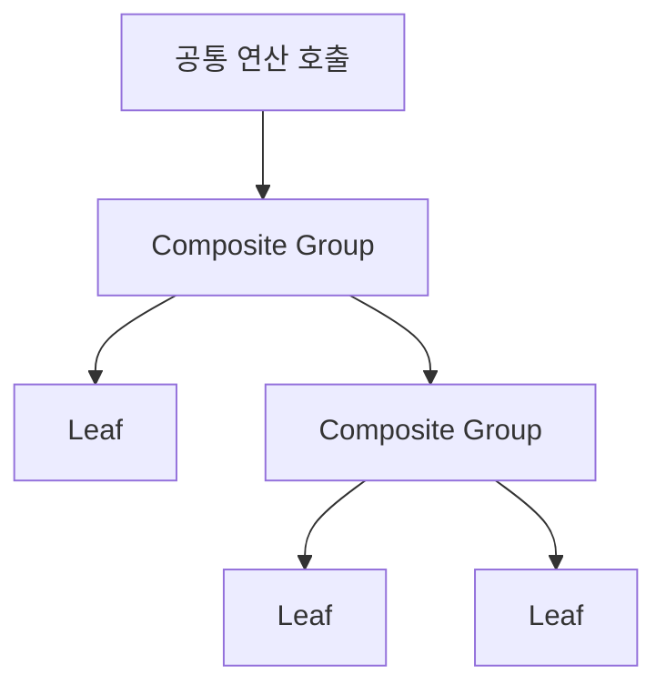

# Composite

[전체 검토 기준과 학습 순서](../../STUDY_GUIDE.md)

## 핵심 개념

Composite는 단일 객체인 **Leaf**와 여러 객체를 담은 **Composite**를 같은 연산 계약으로 다루는 트리 패턴입니다. Client는 현재 노드가 잎인지 그룹인지 몰라도 `draw`, `damage`, `score` 같은 같은 메서드를 호출합니다.



### 역할

- **Component 계약**: Leaf와 Composite가 함께 제공하는 연산입니다.
- **Leaf**: 자식이 없고 실제 작업을 수행합니다.
- **Composite**: 자식을 보관하고 같은 연산을 자식에게 재귀적으로 위임합니다.
- **Client**: 트리의 노드 종류를 검사하지 않고 Component 계약을 사용합니다.

## Lua에서의 표현

Lua에서는 Leaf와 Composite를 생성 함수로 만들고, 양쪽에 같은 이름의 메서드를 제공합니다.

```lua
local leaf = { draw = function() return "leaf" end }
local group = {
	children = { leaf },
	draw = function(self)
		for _, child in ipairs(self.children) do child:draw() end
	end
}
```

이렇게 하면 외부 코드가 `if node.children then ...`을 반복하지 않습니다. 연산이 Leaf와 Composite에서 어떤 의미를 가져야 하는지 먼저 정하고, 빈 그룹·자식 추가·삭제 계약도 결정해야 합니다.

## 예제별 학습 순서

- `example_01.lua`: Leaf와 Group의 공통 `draw` 계약을 가장 작게 보여줍니다.
- `example_02.lua`: Group은 피해를 자식에게 위임하고 Leaf는 자신의 HP를 변경합니다.
- `example_03.lua`: UI Leaf와 Panel Group을 같은 `draw` 호출로 렌더링합니다.
- `example_04.lua`: 하위 Group과 Leaf의 점수를 재귀적으로 합산합니다.
- `example_05.lua`: Leaf와 Group을 같은 `count` 메서드로 셉니다.

## 투명성과 안전성

투명한 Composite는 Leaf와 Group에 거의 같은 메서드를 제공해 Client를 단순하게 합니다. 대신 Leaf에 `add_child` 같은 의미 없는 메서드가 생길 수 있습니다. 안전한 Composite는 Group 전용 메서드를 분리하지만 Client가 노드 종류를 알아야 할 수 있습니다. Lua에서는 학습 단계에서는 투명한 공통 연산을 우선하고, 잘못된 연산을 조기에 검증해야 하는 시스템에서는 안전한 계약을 선택합니다.

## Lua와 LÖVE2D에서의 유용성

- 씬 그래프와 UI 계층
- 엔티티 그룹에 대한 충돌·피해·업데이트 전파
- 메뉴와 패널의 공통 렌더링
- 폴더·리소스 트리의 크기 계산

트리에 순환 참조를 넣으면 재귀가 끝나지 않으므로 부모를 자식으로 추가하지 않도록 합니다. 깊은 트리는 Lua 호출 스택 비용이 커질 수 있고, 순회 중 자식을 수정하면 누락이나 중복이 생길 수 있으므로 변경을 별도 목록에 모으는 것이 안전합니다.
