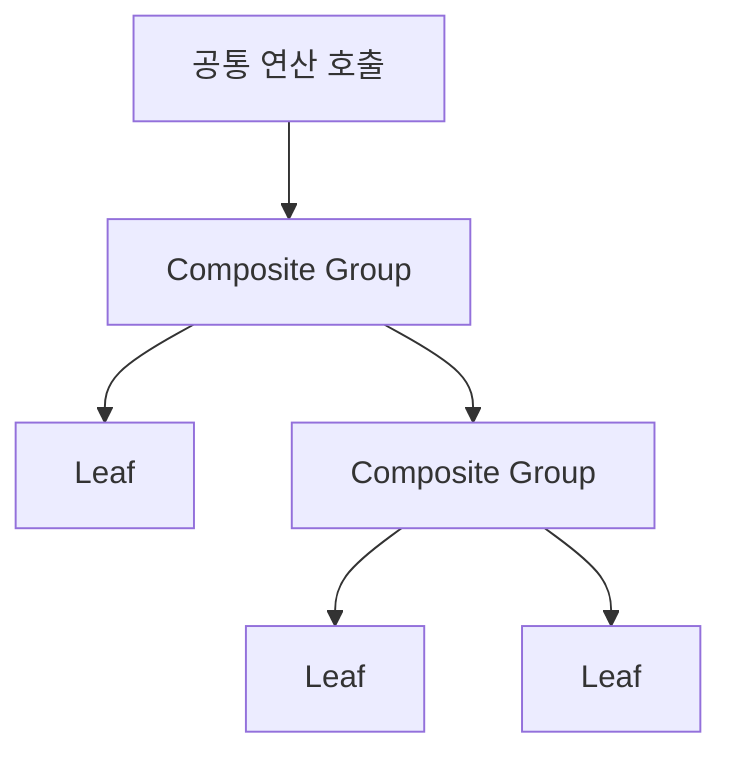
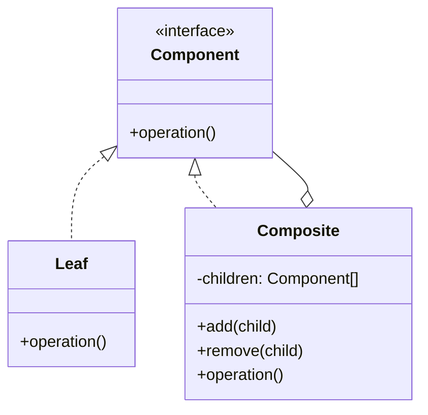

# Composite

[전체 검토 기준과 학습 순서](../../STUDY_GUIDE.md)

## 핵심 개념

Composite는 단일 객체인 **Leaf**와 여러 객체를 담은 **Composite**를 같은 연산 계약으로 다루는 트리 패턴입니다. Client는 현재 노드가 잎인지 그룹인지 몰라도 `draw`, `damage`, `score` 같은 같은 메서드를 호출합니다.

## 해결하려는 문제

씬 그래프, UI 계층, 엔티티 그룹처럼 객체가 객체를 담고 그 안에 다시 그룹이 들어가는 구조에서는 Client가 모든 중첩 깊이와 구체 타입을 직접 순회하기 쉽지 않습니다. Leaf와 Group을 별도로 검사하면 `if node.children then ...`가 여러 곳에 반복되고, 새 그룹 타입을 추가할 때마다 순회 코드도 바뀝니다.

Composite는 Leaf와 Composite 모두에 의미 있는 Component 계약을 정하고, Composite가 자식에게 연산을 재귀적으로 위임하게 합니다. Composite는 자식 결과를 합산하거나 전체에 명령을 전달할 수 있으므로 Client는 단일 객체와 복합 트리를 같은 방식으로 다룹니다.





### 역할

- **Component 계약**: Leaf와 Composite가 함께 제공하는 연산입니다.
- **Leaf**: 자식이 없고 실제 작업을 수행합니다.
- **Composite**: 자식을 보관하고 같은 연산을 자식에게 재귀적으로 위임합니다.
- **Client**: 트리의 노드 종류를 검사하지 않고 Component 계약을 사용합니다.

Composite는 반드시 트리 모델이 필요한 경우에만 사용합니다. 자식의 결과를 합산하는 `score`, 전체에 전달하는 `damage`, 계층을 따라 호출하는 `draw`처럼 Leaf와 Composite 양쪽에 의미 있는 공통 연산이 있어야 합니다.

## Lua에서의 표현

Lua에서는 Leaf와 Composite를 생성 함수로 만들고, 양쪽에 같은 이름의 메서드를 제공합니다.

```lua
local leaf = { draw = function() return "leaf" end }
local group = {
	children = { leaf },
	draw = function(self)
		for _, child in ipairs(self.children) do child:draw() end
	end
}
```

이렇게 하면 외부 코드가 `if node.children then ...`을 반복하지 않습니다. 연산이 Leaf와 Composite에서 어떤 의미를 가져야 하는지 먼저 정하고, 빈 그룹·자식 추가·삭제 계약도 결정해야 합니다.

Composite의 `operation`은 보통 다음 세 방식 중 하나입니다.

- Leaf가 실제 작업을 수행하고 Composite는 모든 자식에 위임합니다.
- Composite가 자식의 반환값을 합산·병합해 상위 결과를 만듭니다.
- Composite가 공통 명령을 하위 트리 전체에 전파합니다.

`add`와 `remove`를 Component 계약에 넣으면 Leaf에서도 의미 없는 메서드를 제공해야 하는 투명한 Composite가 됩니다. Group 전용으로 분리하면 계약은 안전해지지만 Client가 Group 여부를 알아야 할 수 있으므로, 게임의 편집 도구인지 런타임 순회인지에 따라 선택합니다.

## 도입 절차

1. 핵심 모델이 Leaf와 Composite가 섞인 트리로 표현되는지 확인합니다.
2. Leaf와 Composite 양쪽에 실제로 의미 있는 Component 연산을 정합니다.
3. 공통 계약을 구현하는 Leaf를 만듭니다.
4. Component 자식 목록을 보관하고 자식에게 연산을 위임하는 Composite를 만듭니다.
5. 필요한 경우 Composite에 `add`와 `remove`를 제공하고 빈 그룹의 결과를 정의합니다.
6. Client가 구체 타입 대신 Component 계약으로 루트부터 연산하도록 바꿉니다.

## 예제별 학습 순서

- `example_01.lua`: Leaf와 Group의 공통 `draw` 계약을 가장 작게 보여줍니다.
- `example_02.lua`: Group은 피해를 자식에게 위임하고 Leaf는 자신의 HP를 변경합니다.
- `example_03.lua`: UI Leaf와 Panel Group을 같은 `draw` 호출로 렌더링합니다.
- `example_04.lua`: 하위 Group과 Leaf의 점수를 재귀적으로 합산합니다.
- `example_05.lua`: Leaf와 Group을 같은 `count` 메서드로 셉니다. Leaf와 Group을 포함한 전체 노드 수를 재귀적으로 집계합니다.

## 투명성과 안전성

투명한 Composite는 Leaf와 Group에 거의 같은 메서드를 제공해 Client를 단순하게 합니다. 대신 Leaf에 `add_child` 같은 의미 없는 메서드가 생길 수 있습니다. 안전한 Composite는 Group 전용 메서드를 분리하지만 Client가 노드 종류를 알아야 할 수 있습니다. Lua에서는 학습 단계에서는 투명한 공통 연산을 우선하고, 잘못된 연산을 조기에 검증해야 하는 시스템에서는 안전한 계약을 선택합니다.

## 장점과 비용

- 재귀와 다형성으로 중첩된 트리를 단일 객체처럼 다룰 수 있습니다.
- 새 Leaf나 Composite를 추가해도 Component 계약을 사용하는 Client의 순회 코드를 바꾸지 않아도 됩니다.
- 반대로 서로 다른 기능을 억지로 하나의 Component 계약에 넣으면 의미 없는 메서드와 과도하게 일반적인 인터페이스가 생깁니다.
- 순환 참조, 깊은 트리, 순회 중 자식 변경은 재귀 오류·호출 스택 부담·누락을 만들 수 있습니다.

## 관련 패턴과의 차이

- **Composite와 Decorator**: 둘 다 재귀 조합을 사용하지만, Composite는 여러 자식의 결과를 합치고 Decorator는 보통 하나의 자식에 책임을 추가합니다.
- **Composite와 Facade**: Composite는 트리의 모든 노드를 같은 Component 계약으로 다루고, Facade는 여러 하위 시스템에 대한 단순한 진입점을 제공합니다.
- **Composite와 Iterator**: Composite는 트리 구조와 공통 연산을 정의하고, Iterator는 구조를 노출하지 않고 순회하는 방법을 제공합니다.
- **Composite와 Visitor**: Visitor는 트리 구조를 바꾸지 않고 여러 연산을 추가할 때 유용합니다.

## Lua와 LÖVE2D에서의 유용성

- 씬 그래프와 UI 계층
- 엔티티 그룹에 대한 충돌·피해·업데이트 전파
- 메뉴와 패널의 공통 렌더링
- 폴더·리소스 트리의 크기 계산

트리에 순환 참조를 넣으면 재귀가 끝나지 않으므로 부모를 자식으로 추가하지 않도록 합니다. 깊은 트리는 Lua 호출 스택 비용이 커질 수 있고, 순회 중 자식을 수정하면 누락이나 중복이 생길 수 있으므로 변경을 별도 목록에 모으는 것이 안전합니다.

게임에서는 씬 그래프의 `draw`, UI 패널의 입력 전파, 적 부대의 피해 전파처럼 계층 전체에 같은 연산을 적용할 때 유용합니다. 매 프레임 업데이트되는 큰 엔티티 트리라면 재귀 호출과 테이블 순회 비용을 측정하고, 비활성 그룹은 하위 순회를 건너뛰거나 평탄화된 업데이트 목록을 별도로 유지하는 방식을 고려합니다.
