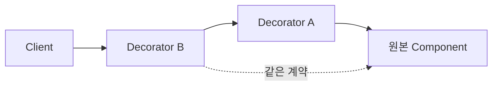
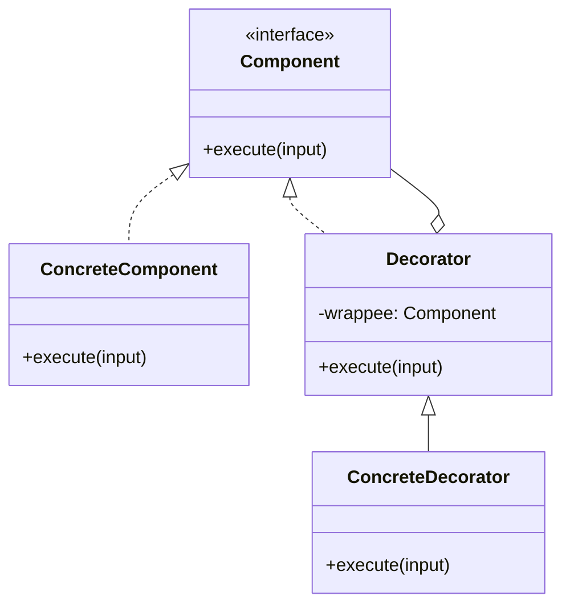

# Decorator

[전체 검토 기준과 학습 순서](../../STUDY_GUIDE.md)

## 핵심 개념

Decorator는 원본 객체나 함수와 **같은 사용 계약을 유지하면서**, 원본을 수정하지 않고 기능을 겹쳐 추가하는 패턴입니다. 래퍼는 요청을 전후로 가공하거나, 원본 호출을 생략하거나, 결과를 보강할 수 있습니다.

## 해결하려는 문제

기본 공격에 화염·치명타·독·관통을 조합하거나, 저장에 압축·암호화·로깅을 선택적으로 추가해야 할 때 모든 조합을 상속으로 만들면 클래스 수가 조합 수만큼 늘어납니다. 한 객체에 기능을 하나만 고정하면 런타임에 효과를 더하거나 제거하기도 어렵습니다.

Decorator는 기본 Component를 같은 계약을 가진 래퍼 안에 넣고, 래퍼가 요청 전후에 한 가지 책임을 추가하게 합니다. 여러 Decorator를 다시 감쌀 수 있으므로 Client는 마지막 객체만 사용하면서 필요한 기능 조합을 런타임에 구성할 수 있습니다.





### 역할

- **Component**: Client가 기대하는 원래 계약입니다.
- **Concrete Component**: 실제 기본 동작을 제공합니다.
- **Decorator**: 같은 계약을 지키며 Component를 감쌉니다.
- **Concrete Decorator**: 로깅, 캐시, 색상, 버프 같은 한 가지 확장 기능을 추가합니다.

Decorator와 Concrete Component는 Client 관점에서 같은 Component입니다. Base Decorator는 보통 받은 요청을 `wrappee`에 그대로 위임하고, Concrete Decorator가 위임 전후에 추가 행동을 수행합니다. 따라서 래퍼가 원본의 인자·반환값·오류 계약을 깨면 Decorator가 아니라 별도의 변환기나 다른 추상화가 될 수 있습니다.

## Lua에서의 표현

Lua에서는 함수를 받아 같은 입력·출력 계약을 가진 새 함수를 반환하는 클로저 Decorator가 가장 간단합니다.

```lua
local function with_logging(action, log)
	return function(value)
		log[#log + 1] = value
		return action(value)
	end
end
```

Decorator를 다시 Decorator에 넣으면 기능을 조합할 수 있습니다. 래퍼 순서가 바뀌면 결과가 달라질 수 있으므로 조합 순서를 명시해야 합니다.

## 도입 절차

1. 기본 동작과 런타임에 선택적으로 추가할 책임을 구분합니다.
2. 기본 객체와 모든 래퍼가 지킬 Component 계약을 정합니다.
3. 기본 동작을 Concrete Component로 옮깁니다.
4. Component를 보관하고 요청을 위임하는 Base Decorator를 만듭니다.
5. 로깅·캐시·버프·압축처럼 한 가지 책임을 가진 Concrete Decorator를 추가합니다.
6. Client가 필요한 순서로 래퍼를 조합하고, 조합 순서가 결과와 비용에 미치는 영향을 테스트합니다.

## 예제별 학습 순서

- `example_01.lua`: 기본 문자열 함수에 Prefix Decorator를 추가합니다.
- `example_02.lua`: 공격 함수에 Critical과 Logging Decorator를 조합합니다.
- `example_03.lua`: 저장 입력을 암호화한 뒤 원본 저장 함수에 전달합니다.
- `example_04.lua`: 렌더링 결과를 색상 태그로 감쌉니다.
- `example_05.lua`: Loader 앞에 캐시를 추가하고 실제 로딩 횟수를 줄입니다.

`example_02.lua`와 `example_03.lua`는 여러 래퍼를 겹치는 핵심을, `example_05.lua`는 원본 Loader를 수정하지 않고 캐시를 선택적으로 추가하는 모습을 보여 줍니다.

## 다른 패턴과의 차이

- **Decorator와 Adapter**: Decorator는 같은 계약을 유지하고 기능을 추가하며, Adapter는 다른 계약을 호환시킵니다.
- **Decorator와 Proxy**: Decorator는 보통 기능 조합과 확장에 초점을 두고, Proxy는 접근 제어·지연 로딩·원격 경계처럼 실제 객체 접근을 통제합니다.
- **Decorator와 Strategy**: Decorator는 여러 동작을 겹쳐 기존 동작을 확장하고, Strategy는 한 알고리즘을 다른 알고리즘으로 교체합니다.
- **Decorator와 Composite**: Decorator는 보통 하나의 Component를 감싸 책임을 추가하고, Composite는 여러 자식의 결과를 합치거나 하위 트리에 연산을 전파합니다.
- **Decorator와 Chain of Responsibility**: Decorator는 요청을 일관되게 다음 래퍼로 전달해야 하지만, Chain of Responsibility의 처리자는 요청을 처리한 뒤 전달을 중단할 수 있습니다.

## 게임 개발 시나리오

객체에 책임을 런타임에 겹쳐 추가할 때 Decorator가 유용합니다.

- **무기 효과 중첩**: 기본 무기에 화염·얼음·관통 효과를 런타임에 겹쳐 적용해, 조합마다 클래스를 만들지 않고 공격 데미지와 이펙트를 누적합니다.
- **버프/디버프 스택**: 캐릭터에 공격력 증가·이동 속도 감소를 감싸 적용하고, 효과가 끝나면 장식을 벗겨 원래 스탯으로 돌립니다.
- **UI 장식**: 버튼·패널에 테두리·그림자·툴팁을 하나씩 더해 베이스 위젯을 수정하지 않고 표현을 확장합니다.
- **발사체 행동 추가**: 총알에 분열·유도·반동 행동을 감싸 추가합니다.

## Lua와 LÖVE2D에서의 유용성

- 공격에 Critical, 독, 버프를 조합할 때
- 리소스 로더에 캐시·로깅·검증을 추가할 때
- 렌더링 결과에 색상·UI 효과를 추가할 때
- 저장·네트워크 함수에 직렬화·암호화·재시도 기능을 겹칠 때

래퍼가 너무 깊어지면 호출 흐름과 오류 위치를 찾기 어려워집니다. 각 Decorator는 한 가지 책임만 갖게 하고, 원본의 반환값·오류·인자 계약을 보존해야 합니다. 특정 래퍼를 중간에서 제거하기도 어려우므로 조합을 구성한 Client가 수명과 해제 방법을 관리해야 합니다. 상태를 캡처하는 Decorator는 수명과 메모리 사용도 확인해야 합니다.

## 장점과 비용

- 상속 없이 객체의 책임을 런타임에 추가·제거할 수 있습니다.
- 여러 기능을 조합해 조합별 하위 클래스를 만들지 않아도 됩니다.
- 각 Decorator를 한 가지 책임으로 나누어 큰 클래스를 작게 유지할 수 있습니다.
- 래퍼 순서가 동작을 바꾸고, 깊은 래퍼 스택은 디버깅·성능·해제를 어렵게 만들 수 있습니다.
- 게임의 프레임 경로에서는 래퍼 호출과 임시 할당을 측정하고, 변하지 않는 조합은 미리 구성해 두는 편이 좋습니다.
