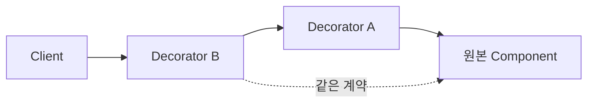

# Decorator

[전체 검토 기준과 학습 순서](../../STUDY_GUIDE.md)

## 핵심 개념

Decorator는 원본 객체나 함수와 **같은 사용 계약을 유지하면서**, 원본을 수정하지 않고 기능을 겹쳐 추가하는 패턴입니다. 래퍼는 요청을 전후로 가공하거나, 원본 호출을 생략하거나, 결과를 보강할 수 있습니다.



### 역할

- **Component**: Client가 기대하는 원래 계약입니다.
- **Concrete Component**: 실제 기본 동작을 제공합니다.
- **Decorator**: 같은 계약을 지키며 Component를 감쌉니다.
- **Concrete Decorator**: 로깅, 캐시, 색상, 버프 같은 한 가지 확장 기능을 추가합니다.

## Lua에서의 표현

Lua에서는 함수를 받아 같은 입력·출력 계약을 가진 새 함수를 반환하는 클로저 Decorator가 가장 간단합니다.

```lua
local function with_logging(action, log)
	return function(value)
		log[#log + 1] = value
		return action(value)
	end
end
```

Decorator를 다시 Decorator에 넣으면 기능을 조합할 수 있습니다. 래퍼 순서가 바뀌면 결과가 달라질 수 있으므로 조합 순서를 명시해야 합니다.

## 예제별 학습 순서

- `example_01.lua`: 기본 문자열 함수에 Prefix Decorator를 추가합니다.
- `example_02.lua`: 공격 함수에 Critical과 Logging Decorator를 조합합니다.
- `example_03.lua`: 저장 입력을 암호화한 뒤 원본 저장 함수에 전달합니다.
- `example_04.lua`: 렌더링 결과를 색상 태그로 감쌉니다.
- `example_05.lua`: Loader 앞에 캐시를 추가하고 실제 로딩 횟수를 줄입니다.

## 다른 패턴과의 차이

- **Decorator와 Adapter**: Decorator는 같은 계약을 유지하고 기능을 추가하며, Adapter는 다른 계약을 호환시킵니다.
- **Decorator와 Proxy**: Decorator는 보통 기능 조합과 확장에 초점을 두고, Proxy는 접근 제어·지연 로딩·원격 경계처럼 실제 객체 접근을 통제합니다.
- **Decorator와 Strategy**: Decorator는 여러 동작을 겹쳐 기존 동작을 확장하고, Strategy는 한 알고리즘을 다른 알고리즘으로 교체합니다.

## Lua와 LÖVE2D에서의 유용성

- 공격에 Critical, 독, 버프를 조합할 때
- 리소스 로더에 캐시·로깅·검증을 추가할 때
- 렌더링 결과에 색상·UI 효과를 추가할 때
- 저장·네트워크 함수에 직렬화·암호화·재시도 기능을 겹칠 때

래퍼가 너무 깊어지면 호출 흐름과 오류 위치를 찾기 어려워집니다. 각 Decorator는 한 가지 책임만 갖게 하고, 원본의 반환값·오류·인자 계약을 보존해야 합니다. 상태를 캡처하는 Decorator는 수명과 메모리 사용도 확인해야 합니다.
