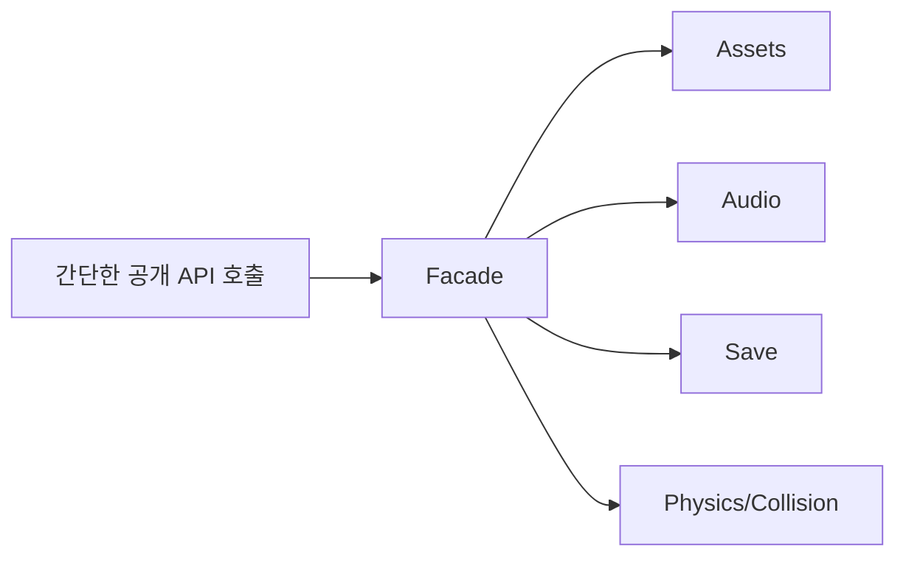

# Facade

[전체 검토 기준과 학습 순서](../../STUDY_GUIDE.md)

## 핵심 개념

Facade는 여러 하위 시스템의 복잡한 호출 순서와 세부 API를 **하나의 단순하고 안정적인 진입점** 뒤에 숨기는 패턴입니다. Facade가 하위 객체를 없애는 것은 아니며, Client가 자주 쓰는 흐름만 조정해 제공합니다.



### 역할

- **Client**: 여러 하위 시스템의 내부 순서를 몰라도 됩니다.
- **Facade**: 초기화·저장·요청 같은 자주 쓰는 유스케이스를 조정합니다.
- **Subsystem**: 각자의 전문 기능과 세부 API를 그대로 유지합니다.

## Lua에서의 표현

Lua에서는 내부 모듈을 `local`로 숨기고, 공개 함수만 반환하는 모듈 테이블로 Facade를 만들 수 있습니다.

```lua
local assets = require("assets")
local audio = require("audio")

local facade = {}
function facade.start_stage(name)
	local stage = assets.load(name)
	audio.play("stage_music")
	return stage
end

return facade
```

Facade의 공개 함수는 내부 하위 시스템을 대체하지 않고 호출 순서와 공통 오류 처리를 조정합니다. 필요한 경우 Client가 하위 시스템에 직접 접근할 수도 있지만, 일반적인 흐름은 Facade를 통하는 것이 결합도를 낮춥니다.

## 예제별 학습 순서

- `example_01.lua`: Scene 시작 Facade가 Asset 로딩을 감쌉니다.
- `example_02.lua`: Game Facade가 Audio 재생과 HUD 표시 순서를 묶습니다.
- `example_03.lua`: Save Facade가 Encode 후 File 저장 순서를 숨깁니다.
- `example_04.lua`: Network Facade가 연결 확인 후 전송합니다.
- `example_05.lua`: World Facade가 Physics와 Collision 업데이트를 조정합니다.

## 다른 패턴과의 차이

- **Facade와 Adapter**: Facade는 여러 하위 시스템의 흐름을 단순화하고, Adapter는 한 기존 인터페이스를 다른 Target 계약으로 변환합니다.
- **Facade와 Proxy**: Facade는 사용 목적에 맞는 상위 작업을 제공하고, Proxy는 실제 객체와 같은 계약을 유지하며 접근을 통제합니다.
- **Facade와 Mediator**: Facade는 Client의 진입점을 단순화하고, Mediator는 여러 참가자의 상호작용 규칙을 지속적으로 조정합니다.

## Lua와 LÖVE2D에서의 유용성

- 게임 시작 시 리소스 로드·오디오·HUD 초기화
- 저장 전 직렬화·압축·파일 쓰기 조정
- 네트워크 연결·인증·요청·응답 변환
- 한 프레임의 물리·충돌·게임 상태 업데이트 조정

Facade에 모든 하위 API를 그대로 재노출하면 공개 경계가 넓어지고 Facade가 단순한 전달 객체가 됩니다. 유스케이스 단위의 함수만 공개하고, 실패한 하위 단계의 오류와 부분 완료 상태를 어떻게 처리할지 명시해야 합니다.
