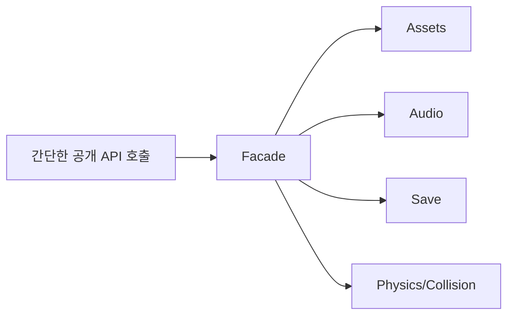
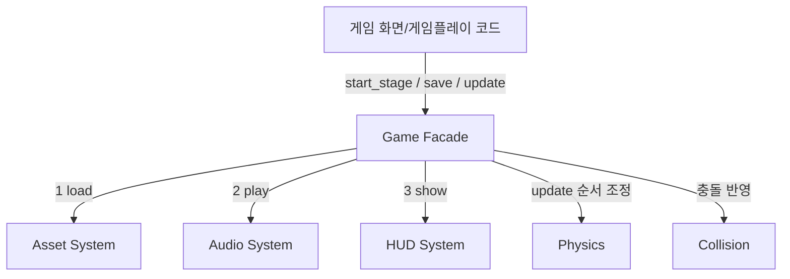

# Facade

[전체 검토 기준과 학습 순서](../../STUDY_GUIDE.md)

## 핵심 개념

Facade는 여러 하위 시스템의 복잡한 호출 순서와 세부 API를 **하나의 단순하고 안정적인 진입점** 뒤에 숨기는 패턴입니다. Facade가 하위 객체를 없애는 것은 아니며, Client가 자주 쓰는 흐름만 조정해 제공합니다.

## 해결하려는 문제

게임의 스테이지 시작, 저장, 네트워크 요청, 한 프레임 업데이트 같은 흐름은 여러 시스템을 정해진 순서로 호출해야 합니다. Client가 Assets, Audio, HUD, Physics 같은 하위 시스템을 직접 초기화하고 연결하면 구현 세부 사항과 의존성이 화면·게임플레이 코드 곳곳에 퍼집니다. 하위 라이브러리를 교체하거나 호출 순서를 바꿀 때 수정 범위도 커집니다.

Facade는 자주 사용하는 유스케이스만 단순한 메서드로 노출하고, 내부 시스템의 초기화·호출 순서·오류 처리를 한 곳에서 조정합니다. Facade가 제공하지 않는 고급 기능까지 없애는 것은 아니므로, 필요한 전문 기능은 하위 시스템이 계속 직접 제공할 수 있습니다.





### 역할

- **Client**: 여러 하위 시스템의 내부 순서를 몰라도 됩니다.
- **Facade**: 초기화·저장·요청 같은 자주 쓰는 유스케이스를 조정합니다.
- **Subsystem**: 각자의 전문 기능과 세부 API를 그대로 유지합니다.

하위 시스템은 Facade의 존재를 알 필요가 없습니다. Facade가 하위 시스템 사이의 통신 자체를 독점하는 것이 아니라, Client가 반복해서 사용하는 상위 작업의 진입점과 순서를 제공합니다.

## Lua에서의 표현

Lua에서는 내부 모듈을 `local`로 숨기고, 공개 함수만 반환하는 모듈 테이블로 Facade를 만들 수 있습니다.

```lua
local assets = require("assets")
local audio = require("audio")

local facade = {}
function facade.start_stage(name)
	local stage = assets.load(name)
	audio.play("stage_music")
	return stage
end

return facade
```

Facade의 공개 함수는 내부 하위 시스템을 대체하지 않고 호출 순서와 공통 오류 처리를 조정합니다. 필요한 경우 Client가 하위 시스템에 직접 접근할 수도 있지만, 일반적인 흐름은 Facade를 통하는 것이 결합도를 낮춥니다.

## 도입 절차

1. Client가 반복해서 여러 하위 시스템을 호출하는 유스케이스를 찾습니다.
2. Client가 정말 필요한 최소한의 상위 작업 API를 정합니다.
3. Facade가 하위 시스템을 초기화하고 필요한 호출 순서와 데이터 전달을 조정하게 합니다.
4. 하위 단계의 실패를 `nil, error` 또는 프로젝트의 공통 결과 형식으로 변환합니다.
5. Client가 하위 시스템을 직접 호출하지 않고 Facade의 유스케이스 API를 사용하도록 바꿉니다.
6. Facade가 너무 커지면 저장·네트워크·월드 업데이트처럼 책임별로 추가 Facade를 나눕니다.

Facade는 하위 시스템에 새로운 기능을 추가하는 패턴이 아닙니다. 단순화된 공개 API와 내부 조정 흐름 사이의 경계를 만드는 패턴입니다.

## 예제별 학습 순서

- `example_01.lua`: Scene 시작 Facade가 Asset·Audio·HUD의 초기화 순서를 감쌉니다.
- `example_02.lua`: Game Facade가 Audio 재생과 HUD 표시 순서를 묶습니다.
- `example_03.lua`: Save Facade가 Encode 후 File 저장 순서를 숨깁니다.
- `example_04.lua`: Network Facade가 연결 확인 후 전송합니다.
- `example_05.lua`: World Facade가 Physics와 Collision 업데이트를 조정합니다.

예제는 모두 게임의 상위 유스케이스를 기준으로 구성했습니다. 특히 `example_01.lua`는 한 번의 `scene:start()`가 여러 시스템을 순서대로 준비하고, `example_05.lua`는 한 번의 `world:update(dt)`가 물리·충돌·게임 상태 반영의 프레임 순서를 숨깁니다.

## 다른 패턴과의 차이

- **Facade와 Adapter**: Facade는 여러 하위 시스템의 흐름을 단순화하고, Adapter는 한 기존 인터페이스를 다른 Target 계약으로 변환합니다.
- **Facade와 Proxy**: Facade는 사용 목적에 맞는 상위 작업을 제공하고, Proxy는 실제 객체와 같은 계약을 유지하며 접근을 통제합니다.
- **Facade와 Mediator**: Facade는 Client의 진입점을 단순화하고, Mediator는 여러 참가자의 상호작용 규칙을 지속적으로 조정합니다.
- **Facade와 Abstract Factory**: Abstract Factory는 하위 시스템 객체의 생성을 숨기고, Facade는 여러 객체를 조정하는 상위 작업을 숨깁니다.

## Lua와 LÖVE2D에서의 유용성

- 게임 시작 시 리소스 로드·오디오·HUD 초기화
- 저장 전 직렬화·압축·파일 쓰기 조정
- 네트워크 연결·인증·요청·응답 변환
- 한 프레임의 물리·충돌·게임 상태 업데이트 조정

Facade에 모든 하위 API를 그대로 재노출하면 공개 경계가 넓어지고 Facade가 단순한 전달 객체가 됩니다. 유스케이스 단위의 함수만 공개하고, 실패한 하위 단계의 오류와 부분 완료 상태를 어떻게 처리할지 명시해야 합니다.

게임에서는 Facade를 화면 전환, 스테이지 시작, 저장, 네트워크 요청, 프레임 업데이트의 경계로 사용할 수 있습니다. 다만 모든 시스템을 하나의 `GameFacade`에 넣으면 God Object가 되므로, 기능 영역별 Facade와 명확한 `update`/`draw` 책임을 유지해야 합니다.
