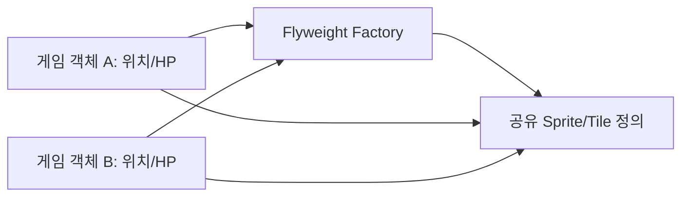
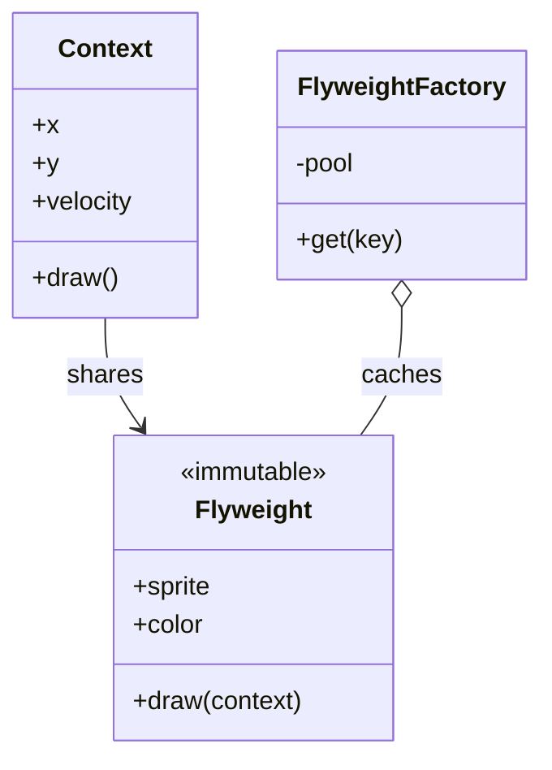

# Flyweight

[전체 검토 기준과 학습 순서](../../STUDY_GUIDE.md)

## 핵심 개념

Flyweight는 많은 객체가 공유할 수 있는 **본질적(intrinsic) 상태**를 하나의 객체로 캐시하고, 위치·HP·소유자 같은 **외부(extrinsic) 상태**를 각 인스턴스에 따로 둬 메모리와 중복 데이터를 줄이는 패턴입니다.

## 왜 구조 패턴인가

Flyweight Factory가 공유 객체를 생성하고 캐시하기 때문에 생성 패턴처럼 보일 수 있습니다. 하지만 Factory는 보조 구현일 뿐이고, Flyweight의 핵심 문제는 **어떻게 생성할까**가 아니라 **많은 객체가 가진 중복 상태를 어떻게 분리하고 공유할까**입니다. 그래서 GoF 분류와 Refactoring.Guru에서는 Flyweight를 구조 패턴으로 봅니다.





### 역할

- **Flyweight**: 여러 객체가 공유하는 이미지 경로, 충돌 규칙, 폰트 정의입니다.
- **Context/Instance**: 위치, 체력, 회전처럼 각 객체만의 외부 상태를 보관합니다.
- **Flyweight Factory**: 키로 Flyweight를 찾아 재사용하고 없으면 한 번만 만듭니다.
- **Client**: 공유 정의와 외부 상태를 함께 사용해 실제 객체를 구성합니다.

Flyweight는 공유 정의를 읽기 전용으로 다뤄야 합니다. `sprite`, `color`, `collision_shape` 같은 intrinsic state는 모든 Context가 함께 보므로 한 인스턴스의 위치·HP·속도를 여기에 넣거나 실행 중 수정하면 다른 객체의 동작까지 바뀝니다.

## Lua에서의 표현

Lua에서는 키 기반 캐시 테이블과 생성 함수를 Flyweight Factory로 사용할 수 있습니다.

```lua
local definitions = {}
local function get_sprite(name)
	definitions[name] = definitions[name] or { name = name }
	return definitions[name]
end

local coin = { x = 10, sprite = get_sprite("coin") }
```

`coin.x`는 인스턴스의 외부 상태이고 `sprite.name`은 공유 상태입니다. 공유 Flyweight에 `x`나 `hp`를 넣으면 한 객체의 변경이 다른 객체에 보이므로 안 됩니다. Lua 테이블은 참조 타입이므로 동일 테이블인지 `==`로 확인할 수 있습니다.

Flyweight는 먼저 메모리 사용량을 측정한 뒤 적용합니다. 객체 수가 많고 반복되는 큰 데이터가 있으며, 일반적인 자료구조 개선만으로 문제가 해결되지 않을 때 효과가 큽니다. 객체 수가 적거나 공유 이득보다 Pool 관리 비용이 크면 일반 객체나 Prototype이 더 단순합니다.

## 도입 절차

1. 메모리 프로파일링으로 대량 객체와 중복 데이터가 실제 병목인지 확인합니다.
2. 각 필드를 모든 객체가 공유할 수 있는 intrinsic state와 객체마다 달라지는 extrinsic state로 나눕니다.
3. intrinsic state만 Flyweight에 남기고 생성 후 변경하지 않는 계약을 정합니다.
4. extrinsic state를 Context나 게임의 배열·컴포넌트에 둡니다.
5. 같은 intrinsic key의 Flyweight를 재사용하는 Factory/Pool을 만듭니다.
6. 렌더링·충돌 같은 메서드에는 필요한 extrinsic state를 인자로 전달하거나 Context가 호출하도록 합니다.
7. 공유 객체 변경, 캐시 키 충돌, 리소스 해제, 실제 메모리 감소를 테스트합니다.

## 예제별 학습 순서

- `example_01.lua`: Coin 인스턴스의 위치는 다르고 Sprite 정의는 같습니다.
- `example_02.lua`: Tile 종류별 충돌 정의를 캐시하고 타일 위치를 인스턴스에 둡니다.
- `example_03.lua`: 같은 Font 정의를 서로 다른 Text 인스턴스가 공유합니다.
- `example_04.lua`: 색상 정의를 공유하면서 각 파티클의 위치를 분리합니다.
- `example_05.lua`: Sound 정의를 공유하고 Factory 생성 횟수를 확인합니다.

## 다른 패턴과의 차이

- **Flyweight와 Prototype**: Flyweight는 같은 정의 객체를 공유하고, Prototype은 독립적인 새 객체를 복제합니다.
- **Flyweight와 Singleton**: Singleton은 인스턴스 자체를 하나로 제한하고, Flyweight는 키마다 여러 공유 정의를 캐시합니다.
- **Flyweight와 Factory**: Factory는 생성 책임을 추상화할 수 있고, Flyweight Factory는 공유·재사용을 보장하는 캐시가 핵심입니다.

- **Flyweight와 Object Pool**: Object Pool은 사용이 끝난 객체를 재사용하고, Flyweight는 여러 객체가 동시에 공유할 수 있는 불변 상태를 분리합니다.

Flyweight Factory는 생성 패턴처럼 보이지만, 생성보다 공유와 메모리 절감이 목적입니다. Factory Method가 생성 알고리즘을 확장하는 것과 달리 Flyweight Factory는 같은 intrinsic key의 객체를 찾아 재사용합니다.

## 게임 개발 시나리오

반복되는 데이터를 공유해 메모리를 아낄 때 Flyweight가 유용합니다.

- **타일맵**: 수천 개의 타일이 각자 이미지를 들지 않고, 타일 종류별 원본(그래픽·재질)을 공유하고 위치만 개별로 가집니다.
- **파티클·발사체**: 수백 개의 총알·파티클이 스프라이트와 메쉬 같은 불변 데이터를 공유하고, 위치·속도·수명만 개별 상태로 둡니다.
- **적 스프라이트/애니메이션 공유**: 같은 종류의 적 수십 마리가 애니메이션 프레임 데이터를 하나의 원본으로 공유합니다.
- **폰트 글리프**: 반복되는 문자 글리프 메쉬·메트릭을 공유해 텍스트 렌더링 비용을 줄입니다.

## Lua와 LÖVE2D에서의 유용성

- 많은 타일·스프라이트·폰트·사운드 정의 공유
- 대량의 파티클이나 총알에서 반복되는 정적 설정 재사용
- 같은 적 종류의 AI 설정과 충돌 규칙 공유
- 리소스 로딩과 메모리 사용량을 줄이는 캐시

객체 수가 적으면 캐시 관리 비용이 이득보다 클 수 있습니다. Flyweight 내부에 외부 상태를 넣지 말고, 캐시 키가 충분히 구체적인지 확인해야 합니다. Lua의 `#table`은 문자열 키가 있는 map의 항목 수를 안정적으로 알려주지 않으므로, 캐시 개수는 별도 카운터나 키 목록으로 관리합니다.

## 장점과 비용

- 같은 정의를 수천 개의 Context가 공유해 메모리를 줄일 수 있습니다.
- 리소스 로딩과 캐시를 중앙화하고, 새 intrinsic 변형을 키로 추가할 수 있습니다.
- extrinsic state를 매번 전달하거나 조회해야 하므로 CPU 비용과 코드 복잡도가 늘 수 있습니다.
- 공유 Flyweight를 수정하면 모든 Context에 영향을 주므로 불변성·캐시 수명을 명확히 관리해야 합니다.
