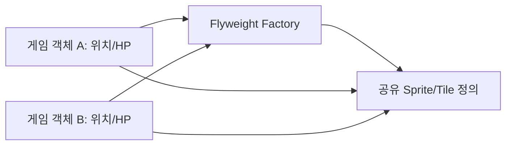

# Flyweight

[전체 검토 기준과 학습 순서](../../STUDY_GUIDE.md)

## 핵심 개념

Flyweight는 많은 객체가 공유할 수 있는 **본질적(intrinsic) 상태**를 하나의 객체로 캐시하고, 위치·HP·소유자 같은 **외부(extrinsic) 상태**를 각 인스턴스에 따로 둬 메모리와 중복 데이터를 줄이는 패턴입니다.



### 역할

- **Flyweight**: 여러 객체가 공유하는 이미지 경로, 충돌 규칙, 폰트 정의입니다.
- **Context/Instance**: 위치, 체력, 회전처럼 각 객체만의 외부 상태를 보관합니다.
- **Flyweight Factory**: 키로 Flyweight를 찾아 재사용하고 없으면 한 번만 만듭니다.
- **Client**: 공유 정의와 외부 상태를 함께 사용해 실제 객체를 구성합니다.

## Lua에서의 표현

Lua에서는 키 기반 캐시 테이블과 생성 함수를 Flyweight Factory로 사용할 수 있습니다.

```lua
local definitions = {}
local function get_sprite(name)
	definitions[name] = definitions[name] or { name = name }
	return definitions[name]
end

local coin = { x = 10, sprite = get_sprite("coin") }
```

`coin.x`는 인스턴스의 외부 상태이고 `sprite.name`은 공유 상태입니다. 공유 Flyweight에 `x`나 `hp`를 넣으면 한 객체의 변경이 다른 객체에 보이므로 안 됩니다. Lua 테이블은 참조 타입이므로 동일 테이블인지 `==`로 확인할 수 있습니다.

## 예제별 학습 순서

- `example_01.lua`: Coin 인스턴스의 위치는 다르고 Sprite 정의는 같습니다.
- `example_02.lua`: Tile 종류별 충돌 정의를 캐시하고 타일 위치를 인스턴스에 둡니다.
- `example_03.lua`: 같은 Font 정의를 서로 다른 Text 인스턴스가 공유합니다.
- `example_04.lua`: 색상 정의를 공유하면서 각 파티클의 위치를 분리합니다.
- `example_05.lua`: Sound 정의를 공유하고 Factory 생성 횟수를 확인합니다.

## 다른 패턴과의 차이

- **Flyweight와 Prototype**: Flyweight는 같은 정의 객체를 공유하고, Prototype은 독립적인 새 객체를 복제합니다.
- **Flyweight와 Singleton**: Singleton은 인스턴스 자체를 하나로 제한하고, Flyweight는 키마다 여러 공유 정의를 캐시합니다.
- **Flyweight와 Factory**: Factory는 생성 책임을 추상화할 수 있고, Flyweight Factory는 공유·재사용을 보장하는 캐시가 핵심입니다.

## Lua와 LÖVE2D에서의 유용성

- 많은 타일·스프라이트·폰트·사운드 정의 공유
- 대량의 파티클이나 총알에서 반복되는 정적 설정 재사용
- 같은 적 종류의 AI 설정과 충돌 규칙 공유
- 리소스 로딩과 메모리 사용량을 줄이는 캐시

객체 수가 적으면 캐시 관리 비용이 이득보다 클 수 있습니다. Flyweight 내부에 외부 상태를 넣지 말고, 캐시 키가 충분히 구체적인지 확인해야 합니다. Lua의 `#table`은 문자열 키가 있는 map의 항목 수를 안정적으로 알려주지 않으므로, 캐시 개수는 별도 카운터나 키 목록으로 관리합니다.
