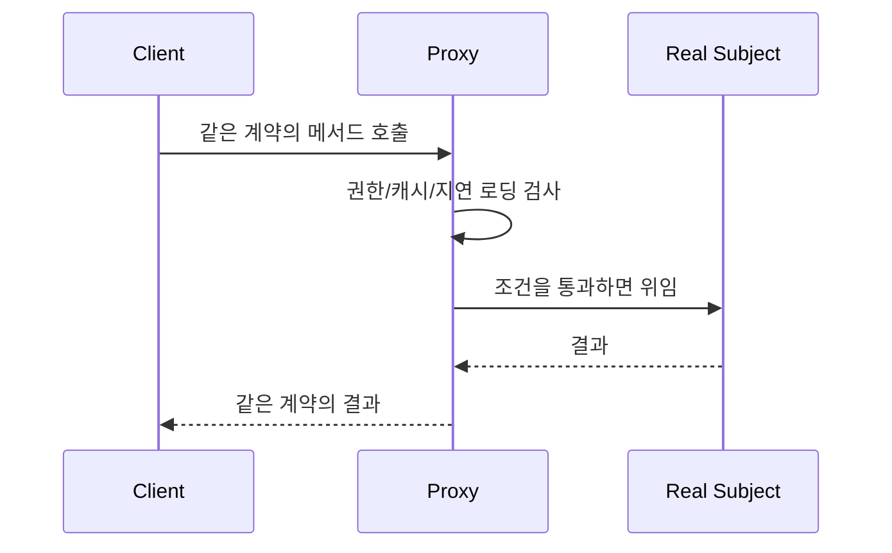
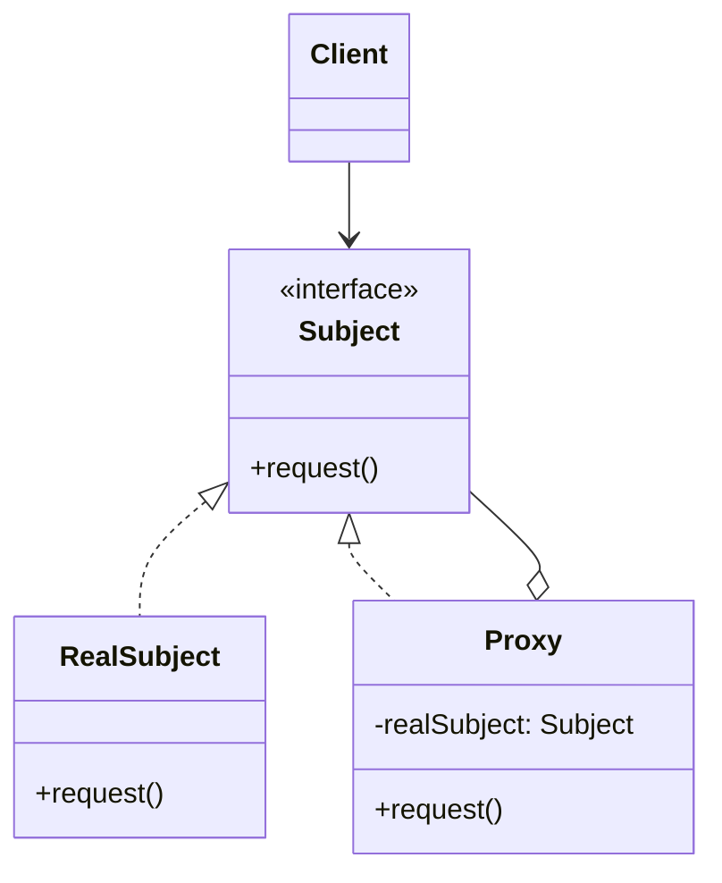

# Proxy

[전체 검토 기준과 학습 순서](../../STUDY_GUIDE.md)

## 핵심 개념

Proxy는 실제 객체와 **같은 사용 계약을 유지하는 대리 객체**를 앞에 두고, 실제 객체에 도달하기 전 접근 제어·캐시·지연 로딩·원격 호출 같은 부가 책임을 처리하는 패턴입니다.

## 해결하려는 문제

무거운 에셋, 느린 네트워크 서비스, 권한이 필요한 저장소처럼 실제 객체의 생성·호출 비용이나 접근 조건을 모든 Client가 직접 처리하면 지연 초기화 코드와 검증 코드가 여러 곳에 복제됩니다. 실제 서비스가 외부 라이브러리라 내부를 수정할 수 없을 때는 이 로직을 서비스 안에 넣기도 어렵습니다.

Proxy는 실제 객체와 같은 계약을 구현해 Client가 대리 객체인지 알지 못하게 하면서, 호출 전후에 접근 제어·생명주기·캐시·네트워크 처리를 수행합니다. Proxy가 필요한 시점에 Real Subject를 만들거나 연결하므로 Client는 준비 비용과 세부 구현을 직접 관리하지 않습니다.

### 역할

- **Subject 계약**: Client와 Proxy와 Real이 함께 지키는 메서드·반환값 계약입니다.
- **Real Subject**: 실제 데이터 로드나 외부 서비스 호출을 수행합니다.
- **Proxy**: 실제 객체 접근 전후에 통제·캐시·대기·검증을 수행합니다.
- **Client**: Real인지 Proxy인지 몰라도 같은 메서드를 호출합니다.

Proxy는 보통 Real Subject의 생명주기를 관리합니다. 지연 생성, 연결 종료, 캐시 만료, 오프라인 큐 정리 같은 정책을 Proxy에 모으되, Client가 알아야 하는 Subject 계약은 바꾸지 않습니다.

## Proxy 종류와 Lua 표현

Lua에서는 실제 객체를 캡처한 래퍼 테이블을 사용합니다.

- **Protection Proxy**: 권한이나 입력을 검사한 뒤 호출합니다.
- **Virtual Proxy**: 무거운 리소스를 실제 사용 시점까지 로드하지 않습니다.
- **Caching Proxy**: 같은 요청의 결과를 저장합니다.
- **Remote Proxy**: 로컬 메서드 호출을 네트워크 요청으로 감쌉니다.

Proxy는 실제 객체와 같은 메서드 이름, 인자, 반환값, 오류 규칙을 지켜야 합니다. Proxy만 별도의 `load_if_needed` 같은 관리 메서드를 가질 수 있지만, Client가 주로 사용하는 계약은 일치해야 합니다.

## 도입 절차

1. 무겁거나 느리거나 접근 통제가 필요한 Real Subject와 그 Client를 찾습니다.
2. Real Subject와 Proxy가 함께 지킬 Subject 계약을 정합니다.
3. Real Subject를 감싸는 Proxy를 만들고, 필요하면 생명주기와 캐시 저장소를 둡니다.
4. Proxy 메서드에서 접근 검사·지연 생성·캐시·원격 전송 같은 정책을 수행한 뒤 조건에 따라 Real Subject에 위임합니다.
5. Client가 Real Subject 대신 Subject 계약으로 Proxy를 사용하도록 구성합니다.
6. 캐시 무효화, 권한 거부, 네트워크 단절, 로딩 실패, 자원 해제 정책을 테스트합니다.

## 예제별 학습 순서

- `example_01.lua`: Protection Proxy가 비밀 키 접근을 차단합니다.
- `example_02.lua`: Caching Proxy가 실제 Loader 호출을 한 번으로 줄입니다.
- `example_03.lua`: Remote/Offline Proxy가 연결 전송과 큐 flush를 대리합니다.
- `example_04.lua`: Virtual Proxy가 첫 draw 시점까지 Image 로딩을 미룹니다.
- `example_05.lua`: Validation Proxy가 잘못된 입력을 실제 서비스 전에 거부합니다.

## 다른 패턴과의 차이

- **Proxy와 Decorator**: Proxy는 실제 객체에 대한 접근·생명주기·경계를 통제하고, Decorator는 같은 계약에 기능을 조합해 확장합니다.
- **Proxy와 Adapter**: Proxy는 계약을 유지하고, Adapter는 호환되지 않는 계약을 변환합니다.
- **Proxy와 Facade**: Proxy는 보통 하나의 Real Subject를 대리하고, Facade는 여러 하위 시스템의 유스케이스를 단순화합니다.

**Proxy와 Decorator**는 구조가 비슷하지만 의도가 다릅니다. Decorator는 Client가 선택한 여러 래퍼를 조합해 책임을 확장하고, Proxy는 실제 객체 접근이나 생명주기를 통제하는 하나의 경계로 동작하는 경우가 많습니다.

## 게임 개발 시나리오

실제 객체 접근을 대리객체로 감싸 지연 로딩·캐싱·접근 제어를 넣을 때 Proxy가 유용합니다.

- **에셋 지연 로딩**: 큰 텍스처를 처음부터 로드하지 않고, 처음 그려질 때 로드하는 가상 프로시로 감싸 로딩 중엔 플레이스홀더를 보여줍니다.
- **리더보드 캐시 프로시**: 원격 리더보드 접근을 캐시 프로시로 감싸, 매번 네트워크 요청 대신 일정 시간 동안 캐시된 값을 반환합니다.
- **접근 권한/치트 방지**: 상점 구매·저장값 변경 요청을 검증 프로시로 통과시켜, 비정상적 값이나 권한 없는 접근을 차단합니다.
- **무거운 객체 플레이스홀더**: 복잡한 맵이나 모델이 준비되기 전까지 가벼운 대리객체를 보여줍니다.

Proxy 종류를 게임 흐름에 맞게 선택합니다. 에셋은 Virtual Proxy, 리더보드·패치 데이터는 Caching/Remote Proxy, 상점·개발자 명령은 Protection Proxy, 디버그 기록은 Logging Proxy에 가깝습니다.

## Lua와 LÖVE2D에서의 유용성

- 이미지·사운드·셰이더 같은 무거운 리소스의 지연 로딩
- 저장·네트워크 서비스의 캐시와 오프라인 큐
- 개발자·플레이어 권한에 따른 디버그 API 제한
- 외부 라이브러리 호출 전 인자 검증과 오류 표준화

Proxy가 실제 객체와 다른 반환값이나 오류를 내면 Client가 Proxy 사용 여부에 따라 달라집니다. 캐시 무효화, 큐가 무한히 커지는 문제, 지연 로딩 실패, 권한 검사 위치를 명시해야 합니다. 단순 로깅만 필요하면 Decorator가 더 적절할 수 있습니다.

## 장점과 비용

- Client를 바꾸지 않고 접근 제어·캐시·지연 로딩·원격 경계를 추가할 수 있습니다.
- Real Subject가 아직 준비되지 않았거나 일시적으로 연결되지 않아도 Proxy가 대체 정책을 제공할 수 있습니다.
- Real Subject의 생성과 해제를 한 곳에서 관리할 수 있습니다.
- Proxy 계층이 늘면 호출 지연과 디버깅 복잡도가 증가하고, 캐시·오프라인 큐의 일관성 문제가 생깁니다.
- 매 프레임 경로의 Proxy는 호출 비용을 측정하고, 불필요한 테이블 생성·문자열 변환을 피해야 합니다.
