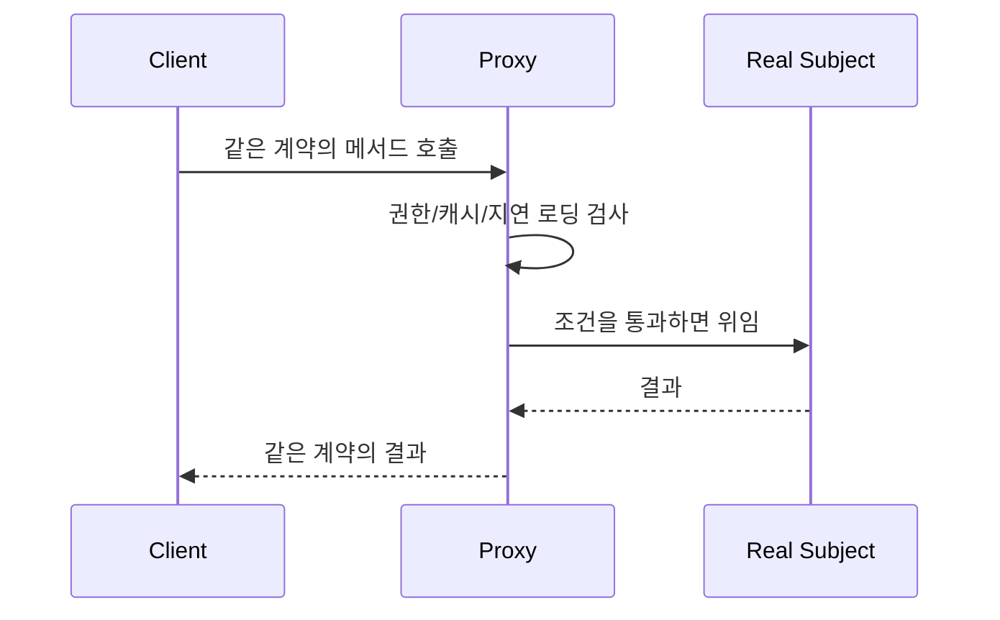

# Proxy

[전체 검토 기준과 학습 순서](../../STUDY_GUIDE.md)

## 핵심 개념

Proxy는 실제 객체와 **같은 사용 계약을 유지하는 대리 객체**를 앞에 두고, 실제 객체에 도달하기 전 접근 제어·캐시·지연 로딩·원격 호출 같은 부가 책임을 처리하는 패턴입니다.

### 역할

- **Subject 계약**: Client와 Proxy와 Real이 함께 지키는 메서드·반환값 계약입니다.
- **Real Subject**: 실제 데이터 로드나 외부 서비스 호출을 수행합니다.
- **Proxy**: 실제 객체 접근 전후에 통제·캐시·대기·검증을 수행합니다.
- **Client**: Real인지 Proxy인지 몰라도 같은 메서드를 호출합니다.

## Proxy 종류와 Lua 표현

Lua에서는 실제 객체를 캡처한 래퍼 테이블을 사용합니다.

- **Protection Proxy**: 권한이나 입력을 검사한 뒤 호출합니다.
- **Virtual Proxy**: 무거운 리소스를 실제 사용 시점까지 로드하지 않습니다.
- **Caching Proxy**: 같은 요청의 결과를 저장합니다.
- **Remote Proxy**: 로컬 메서드 호출을 네트워크 요청으로 감쌉니다.

Proxy는 실제 객체와 같은 메서드 이름, 인자, 반환값, 오류 규칙을 지켜야 합니다. Proxy만 별도의 `load_if_needed` 같은 관리 메서드를 가질 수 있지만, Client가 주로 사용하는 계약은 일치해야 합니다.

## 예제별 학습 순서

- `example_01.lua`: Protection Proxy가 비밀 키 접근을 차단합니다.
- `example_02.lua`: Caching Proxy가 실제 Loader 호출을 한 번으로 줄입니다.
- `example_03.lua`: Remote/Offline Proxy가 연결 전송과 큐 flush를 대리합니다.
- `example_04.lua`: Virtual Proxy가 첫 draw 시점까지 Image 로딩을 미룹니다.
- `example_05.lua`: Validation Proxy가 잘못된 입력을 실제 서비스 전에 거부합니다.

## 다른 패턴과의 차이

- **Proxy와 Decorator**: Proxy는 실제 객체에 대한 접근·생명주기·경계를 통제하고, Decorator는 같은 계약에 기능을 조합해 확장합니다.
- **Proxy와 Adapter**: Proxy는 계약을 유지하고, Adapter는 호환되지 않는 계약을 변환합니다.
- **Proxy와 Facade**: Proxy는 보통 하나의 Real Subject를 대리하고, Facade는 여러 하위 시스템의 유스케이스를 단순화합니다.

## Lua와 LÖVE2D에서의 유용성

- 이미지·사운드·셰이더 같은 무거운 리소스의 지연 로딩
- 저장·네트워크 서비스의 캐시와 오프라인 큐
- 개발자·플레이어 권한에 따른 디버그 API 제한
- 외부 라이브러리 호출 전 인자 검증과 오류 표준화

Proxy가 실제 객체와 다른 반환값이나 오류를 내면 Client가 Proxy 사용 여부에 따라 달라집니다. 캐시 무효화, 큐가 무한히 커지는 문제, 지연 로딩 실패, 권한 검사 위치를 명시해야 합니다. 단순 로깅만 필요하면 Decorator가 더 적절할 수 있습니다.
